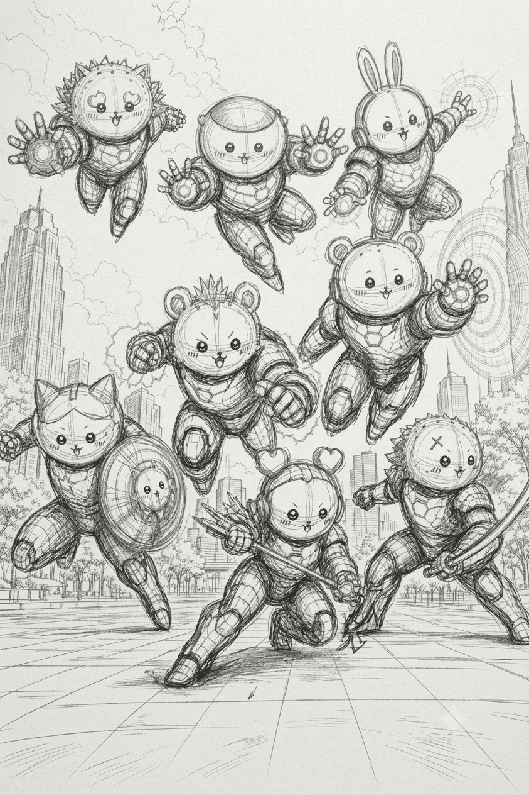
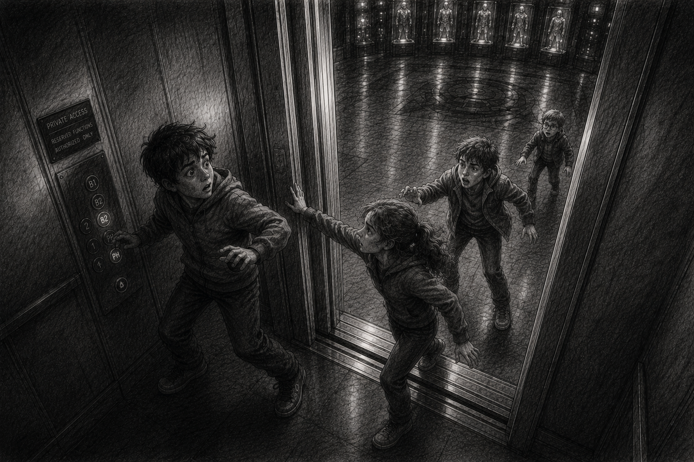
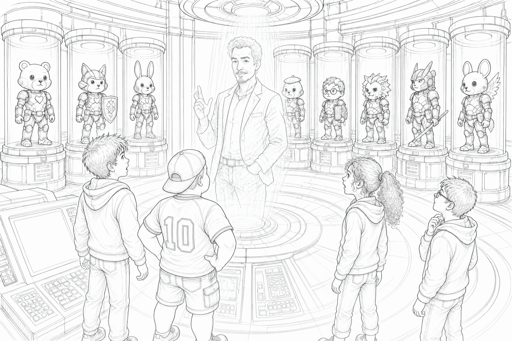
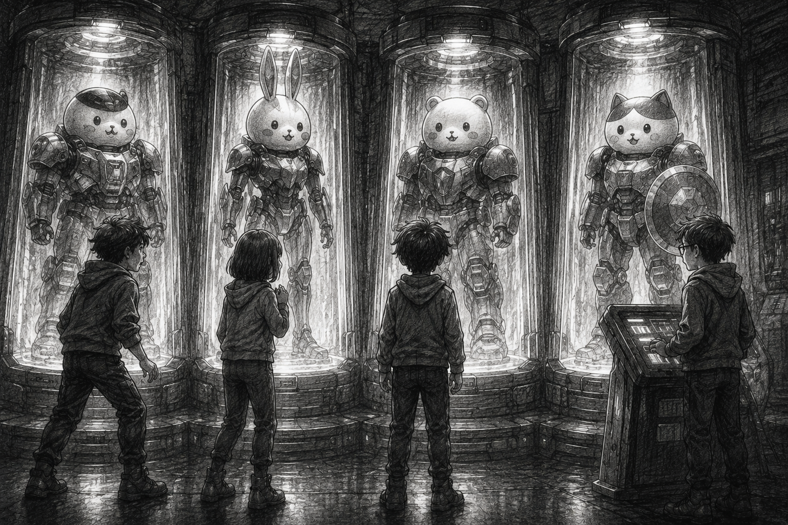
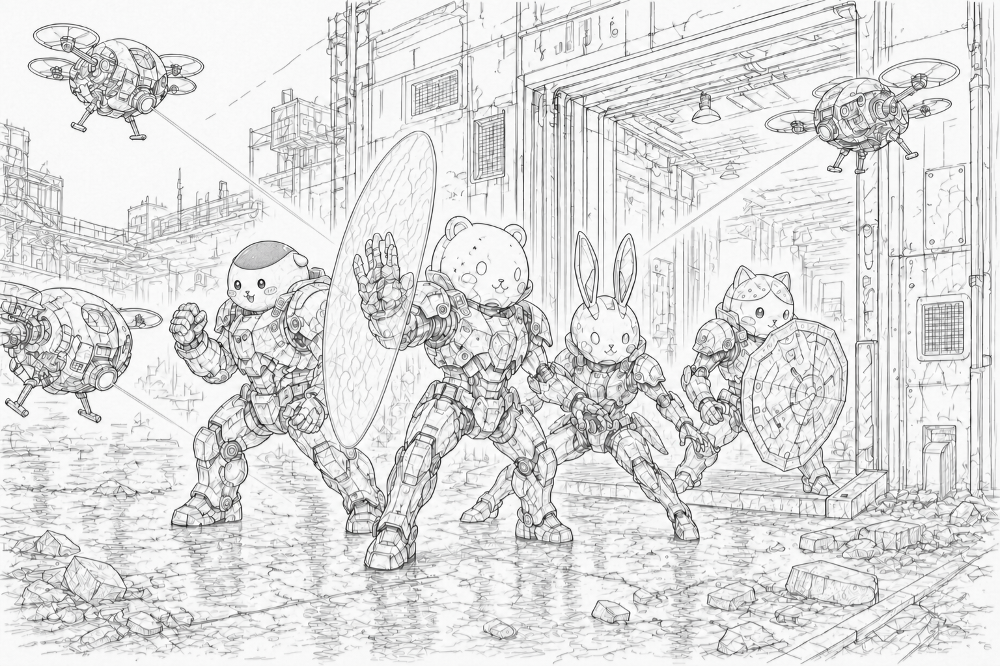
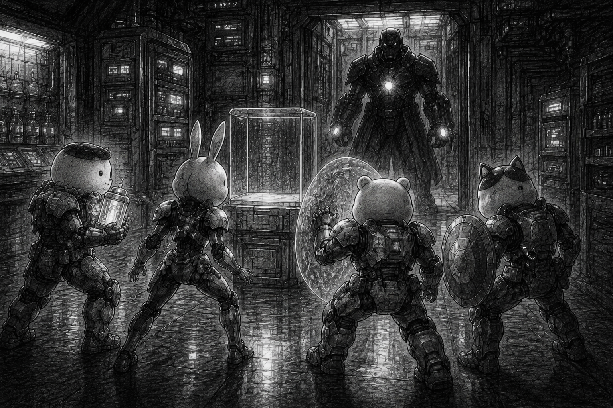
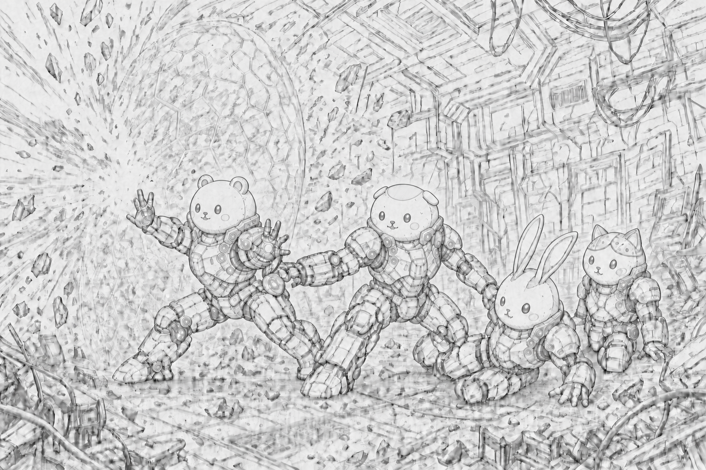
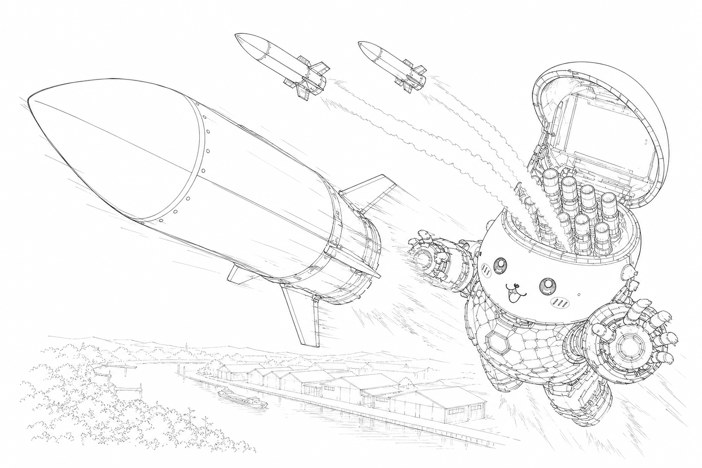

# 小さな鎧さんたちの冒険

<figure class="book-cover">

</figure>

## はじめに

これは、小さな鎧さんたちの冒険のお話です。

鎧は強そうに見えます。

空を飛べて、光を出せて、とても遠くまで手が届きます。

けれど、その中にいるのは、まだ小さな子どもたちです。

怖い時には怖いと言い、分からない時には立ち止まり、それでも大切な人のために前へ進みます。

ひとりではできないことも、となりに誰かがいれば、なんとかなるかもしれません。

さあ、小さな鎧さんたちの冒険をはじめましょう。

…といきたいところですが、その前にお願いしたいことがあります。

このお話は書いた人が愛してやまないものがたくさん登場します。

読み進めることであなたもきっとお気づきになることでしょう。

しかしそれをすぐにお咎めになることはどうか待っていただきたいのです。

もちろん何らかの大切なものを傷つけるきもちなど、これっっっっぽっちもありません。

これはいちファンが愛と妄想を膨らませて個人的に楽しむために生み出したアート作品です。

誰にでも楽しんでいただきたく、そろりそろりと公開させていただきました。

このお話は書いた人のものになるのでしょうが、そこに登場する、もしかしたら、いやもしかしなくても、これは…というものは、もちろんはじめに生み出した方々のものであることにかわりありません。書いた人のものだなんてことはぜったいにありません。

どうかやさしい心で最後まで楽しく読んでいただければ幸いです。

敬愛する原作者様および関係者の方々様におかれましては、予め深く深くお詫びさせていただきます。

それでは、はじまりはじまり〜

## 第一部 父の残した部屋

### 第1章 8歳の誕生日

エドワード・アーノ・リードは、その日、8歳になった。

母は毎年、小さなちいかわのケーキを買ってくれた。箱を開ける前から少しクリームの匂いがして、白く丸い顔の飾りが崩れないように、母はいつも箱を両手でそっと持って帰ってきた。ろうそくは、年の数だけ立てるのではなく、いつも1本だけだった。8本立てると顔が穴だらけになるから、と母は笑った。

エドは母とふたりで暮らしていた。

窓際には母の仕事用の机があり、棚の端には、エドが大事にしているちいかわのぬいぐるみが3つ、いつも同じ向きで座っていた。

裕福ではなかったが、暮らしに困ったことはなかった。

それどころか、エドは学費の高い学校に通っていた。母の仕事だけでどうして通えているのかは分からなかった。

奨学金だと母は言ったことがある。けれど、その話をする時だけ、母はいつも少し早口になった。

父と何か関係があるのかもしれないと、エドは時々思った。

エドは何度か聞いたことがある。

「僕の父さんって、どんな人？」

そのたびに母は、少しだけ困った顔をした。

「遠くにいる人よ。」

遠く。

地図で探せる遠さなのか、どこを探しても会えないという意味なのか。エドには分からなかった。

分からないまま、8歳になった。

その日の母は、朝から少し変だった。

ケーキの箱はテーブルにある。ろうそくも1本、箱の横に置かれている。けれど母は、何度も時計を見た。窓の外を見て、玄関の方を見て、また時計を見た。

「今日、誰か来るの？」

エドが聞くと、母は手を止めた。

「ええ。」

「誰？」

母は答える前に、ゆっくり息を吸った。

その時、玄関のチャイムが鳴った。

エドは母を見た。母はうなずいた。

「出て。」

ドアを開けると、黒いスーツを隙なく着た男が立っていた。背筋はまっすぐで、白い手袋をした手は体の前で静かに重ねられている。アパートの細い廊下にいるには、少し現実味がなかった。

「エドワード・アーノ・スターク様。」

男は、エドの名前を知っていた。

「……スターク？」

男は深く頭を下げた。

「エリアス・ヴェイルと申します。スターク家に仕えております。」

スターク。

その名前を聞いた瞬間、エドは母の方を見た。

母は玄関の奥に立っていた。顔色は悪くなかった。しかし、泣くのを我慢しているように見えた。

「スタークって……トニー・スタークの？」

エドは聞いた。

トニー・スタークなら知っている。ニュースの中では何度も見た。世界を救った男。空を飛ぶ男。派手な会見で冗談を言う男。

けれど、その名前が自分の玄関に来る理由は、ひとつも思いつかなかった。

エリアスは、まばたきひとつ分の間を置いた。

「はい。トニー様から、お誕生日の贈り物をお預かりしております。」

「なんで？」

エドの声は、自分でも驚くほど小さかった。

「なんで、僕に？」

母が近づいてきた。

エドの肩に手を置く。その手は少し震えていた。

「エド。」

母は言った。

「今まで黙っていて、ごめんね。」

エドは逃げたくなった。しかし、足は動かなかった。

「あなたのお父さんは、トニー・スタークなの。」

冷蔵庫の低い音も、外を走る車の音も、どこか遠くへ行った。

エドの視線が、母とエリアスの間を往復した。

「うそ。」

それしか言えなかった。

母は首を振った。

「嘘じゃない。」

「あなたのこと、知らなかったわけじゃないの。好きなものも、学校のことも、誕生日のことも、私が少しずつ話していた。ちいかわが大好きなことも。」

「だって、そんなの……」

エドは言いかけて、何を言えばいいのか分からなくなった。

エリアスは、母を急かすことも、エドをなだめることもせず、静かに立っていた。

トニー・スターク。

父さん。

ふたつの言葉は、どうしても同じ場所に並ばなかった。

「来てるの？」

エドはエリアスに聞いた。

エリアスの表情は動かなかった。

「いいえ。」

自分はこないで、知らない人に父親だと告げさせたことが、ひどく腹立たしかった。

「じゃあ、プレゼントだけ？」

エリアスは否定しなかった。

エドは母の手を振りほどかなかった。けれど、見上げることもできなかった。

「いらないって言ったら？」

「それでも、見ていただきたいのです。」

「その人がそう言ったの？」

父さん、とはまだ呼べなかった。

エリアスはすぐには答えなかった。

アパートの外廊下を、誰かの足音が通り過ぎていった。

「旦那様は、あなたを忘れたことなどありません。」

エドは顔を上げた。

エリアスの声は、落ち着いていた。けれど、その言葉だけは、狭い玄関の空気をまっすぐに切った。

本当にそうなら、どうして今まで教えてくれなかったのか。どうして会いに来なかったのか。

けれど、聞けば母が泣いてしまう気がした。

「どこにあるの？」

エリアスは、開いたドアの脇へ静かに身を寄せた。

「郊外の別宅です。」

エリアスは少しだけ声を落とした。

「表向きには、旦那様のお名前は出ておりません。」

エドは、初めて母の顔を見上げた。

母は小さくうなずいた。

「行っておいで。」

「お母さんは？」

「私は、ここで待ってる。」

「なんで？」

母は、困ったように笑った。

「これは、あなたが受け取るものだから。」

エドは分からなかった。

分からないことが多すぎた。

しかし、トニー・スタークが父親だと言われたばかりの頭で、ひとつだけ分かったことがある。

今日、このままケーキを食べても、味なんかしない。

エドは靴を履いた。

＊

エリアスに続いて、アパートの外へ出た。

黒い車の窓に、8歳になった自分の顔が映っていた。知らない顔に見えた。

車は街を抜け、広い道へ出て、やがて木々に囲まれた細い私道へ入った。門は高かったが、そこにスタークの名前はなかった。車が中に進むと、写真でしか見たことのないような古い洋館が見えた。

けれど、まだ知らない人の家にしか見えなかった。

中へ入ると、磨かれた廊下には知らない画家の絵が並び、その中でひどく小さくなった気がした。

エリアスは廊下の奥へ進んだ。

秘密の研究室か、空を飛ぶための何かか。そう思ったが、エリアスが立ち止まったのは、普通の古い木の扉の前だった。

真鍮の取っ手。何の札もない。

エリアスは白い手袋をしたまま、内ポケットから小さな鍵を取り出した。

鍵は古く見えた。だが鍵穴へ差し込まれた瞬間、扉の奥で低い電子音が鳴った。

木の扉だと思っていたものの内側で、何か重いものが動き出す。

エドは一歩下がった。

「今の音、なに？」

「安全確認です。」

「安全確認って、何から守るための？」

エリアスは答えなかった。

代わりに、扉を開いた。

その先には、見慣れない金属のエレベーター扉があった。

古い洋館の奥には似合わない、まっすぐで継ぎ目のない扉だった。

エリアスが壁のパネルに手をかざすと、光が走った。低い機械音とともに、扉が開く。

中は暗く、床の中央だけに薄い光が落ちていた。地下から、冷たい空気が上がってくる。エドは思わず腕をさすった。

「怖いですか。」

エリアスが聞いた。

「別に。」

エドはすぐに答えた。

怖かった。

しかし、そう言うのはもっと怖かった。

エレベーターが下がり始めると、屋敷の音が遠ざかった。狭い箱の中に、低い機械音だけが響く。エリアスは黙って立ち、エドは自分の呼吸だけが大きく聞こえた。

エレベーターが止まると、そこにはまた扉があった。

今度は、壁と一体になった黒い金属の扉だった。

エリアスは壁のパネルに手をかざした。

光が走り、低い機械音とともに空気が震えた。

扉が左右に開いていく。

扉の向こうに、光と広い部屋、そして8つの影が見えた。

部屋は、地下にあるとは思えないほど大きかった。天井は高く、壁には何本ものケーブルが走っている。

<figure>
	
	<figcaption>ポッドルーム初起動</figcaption>
</figure>

円を描くように並んだ8つの透明なポッドの中に、アーマーが眠っていた。

エドは息を忘れた。

ニュースで見たアイアンマンのスーツとは違う。もっと小さく、丸く、エドの好きなちいかわたちに似ていた。

ちいかわが大好きなことも。

母の言葉を思い出した瞬間、悲しさより先に、目の奥がぱっと熱くなった。泣きそうなのとは少し違う。見たことのない扉が、急に目の前で開いたみたいだった。

ただかわいいだけではない。装甲の隙間には本物の機械が見え、白く丸い顔、長い耳、盾、重そうな装備など、形も色も違うアーマーが並んでいた。

全部が、エドの方を向いていた。

「ここは……？」

エリアスは、エドの少し後ろで立ち止まった。

「アーマーズルームです。」

「アーマーズ……」

エドは一番近くのポッドへ歩いた。

透明な壁の向こうに、小さなアーマーがある。シーサーのような飾りを持つ装甲だった。エドが近づくと、ポッドの下部に細い光が走った。

起きたのかと思った。だがアーマーは眠ったまま、淡く光った。

エドはそっと手を伸ばした。

指先が透明なポッドに触れる。

冷たかった。

その冷たさの奥に、父の手が残っているような気がした。

「これ……」

エドはポッドから目を離せなかった。

「これぜんぶ父さんが僕のために？」

エリアスは、すぐには答えなかった。

彼はポッドの列を見ていた。エドではなく、アーマーを見ていた。

その横顔に、ほんの一瞬だけ、影が落ちた。

悲しそうにも見えた。怒っているようにも見えた。祈っているようにも見えた。

だが次の瞬間には、いつものエリアスに戻っていた。

「はい。」

彼は静かに言った。

「あなたのために、旦那様が残されたものです。」

その言葉で、エドは初めて振り返った。

エリアスは静かに立っていた。

エドはゆっくりポッドへ向き直った。

うれしかった。けれど、それだけではなかった。

どうして今まで教えてくれなかったのか。どうして本人はここにいないのか。どうして8つもあるのか。どうして、こんなものを自分に残したのか。

それでも、目の前の光から目を離せなかった。

エリアスが横の操作盤に触れると、部屋の中央に青い光が立ち上がった。小さな画面が空中に開き、文字と図形がゆっくり流れる。

「本日は、見学用のモードだけを開きます。」

エリアスが言った。

「見学？」

「ポッドの明かりと、名前の表示。旦那様からの短いメッセージもございます。」

「着られるの？」

エドは思わず聞いた。

「はい。今日は、この部屋の中で少しだけ。」

エリアスはポッドを見た。

「旦那様は、まず贈り物として受け取ってほしいとお考えでした。」

贈り物。

でもエドは、それ以上聞けなかった。

空中の画面に、父の名前が表示されたからだ。

TONY STARK.

文字だけなのに、心臓が強く鳴った。

画面が少し乱れたあと、男の声が流れた。

「やあ、エド。」

エドは動けなくなった。

本人はいない。

それでも、その声は確かに自分の名前を呼んだ。

「これを見ているってことは、君は8歳になったわけだ。おめでとう。8歳はいいぞ。7歳より数字が強そうだし、9歳ほど期待もされない。」

エドはぽかんとした。

エリアスが小さく咳払いをした。笑ったのかもしれない。しかし、いつものように顔には出さなかった。

「さて。」

声は続いた。

「本当なら、直接渡すべきだった。そこは分かってる。私はたぶん、いや、かなり、父親としては問題がある。」

エドの喉が詰まった。

「でも、君に何も残さないことだけは、どうしてもできなかった。」

部屋の8つのポッドが、順番に淡く光った。

「これは、私の着るアイアンアーマーとは少し違う。君がこれを見て、どんな顔をするのか。それを想像するだけで、私はずいぶん救われた。今日はただ、知ってほしい。君を忘れていないこと。君がここにいることを、私はちゃんと知っていること。」

エドはポッドに触れたまま、画面を見つめた。

だったら来てよ、それならどうして会いに来ないの、と叫びたかった。

胸の中で怒りと喜びがぶつかり、どちらも形にならなかった。

「エド。」

声が、少しだけ柔らかくなった。

「誕生日おめでとう。」

映像はそこで終わった。

エドはしばらく動けなかった。やがてポッドから手を離すと、指先に冷たさが残っていた。

「父さん、僕の名前知ってたんだ。」

父親が子どもの名前を知っているのは当たり前のはずなのに、エドはそれも初めて知ることだった。

エリアスは、エドの少し後ろで沈黙を守っていた。

エドはもう一度、8つのポッドを見た。

父が自分のために残した、まだ知らない何か。

秘密基地。

「では、ひとつだけ、試してみますか。」

エリアスが言った。

エドは目を上げた。

「着ていいの？」

「ええ。この部屋の中だけですが。」

エリアスが操作盤に触れると、白く丸い顔のアーマーが入ったポッドの前面が静かに開いた。冷たい空気が流れ、胸の奥で眠っていた小さな光が、ゆっくり強くなった。

床に細い線が走り、エドの足元で円を描いた。

「そのまま立っていてください。」

エリアスの声は、いつもより少し慎重だった。

足首から銀色の装甲が伸び、すね、膝、腕、胸を順番に包んだ。重そうに見えるのに痛くはなく、体の形を覚えられているみたいだった。最後に白く丸いヘルメットが頭上から降り、視界が一瞬暗くなってから明るくなった。

内側の画面に、小さな文字が浮かぶ。

EDWARD A. REED.

SIZE ADJUSTMENT COMPLETE.

「サイズが……」

エドは自分の手を見た。

自分の手なのに、少しだけ大きい。少しだけ強そうで、少しだけ丸い。

「旦那様は、成長に合わせて調整されるよう設計されています。」

エリアスは説明した。

「成長に合わせて、関節部の装甲が伸縮します。」

「大きくなっても？」

「はい。あなたが大きくなっても。」

父は、今日のエドだけではなく、明日のエドも、来年のエドも想像していた。

部屋の壁の一部が光り、鏡のようにエドの姿を映した。

エドは息をのんだ。

そこに立っていたのは、白くて丸くて、小さくて、でもちゃんとヒーローみたいな自分だった。

「……かっこいい。」

言ってから、少し照れた。

それから我慢できなくなった。

鏡の中の白いヒーローは、かっこいいのにどこかおかしかった。

エドはとうとう笑った。

「今の、ちょっと変だった？」

エリアスはほんの少しだけ間を置いた。

「大変、堂々としておいででした。」

「絶対うそだ。」

エドは笑いながら、アイアンマンのようなポーズや、両手を小さく丸めるちいかわらしいポーズを取った。

やがて、アーマーは装着された時と逆の順番で開き、エドの体から離れていった。

床に戻った時、足が少し軽すぎる気がした。

エドは鏡に映る、普通の服を着た8歳の自分を見た。けれど、鏡の中の顔は、着る前とは少し違って見えた。

その時、エリアスが操作盤に触れた。ポッドの光が少しずつ弱くなっていく。8つのアーマーは、また眠りに戻るように静かになった。

最後の光が消える直前、エドはエリアスの横顔を見た。

エリアスは、ポッドではなく、ポッドに映ったエドの姿を見ていた。

その目は優しかった。

けれど、ひどく遠かった。

エドはもう一度、部屋を見渡した。

「また来てもいい？」

エドは聞いた。

エリアスはうなずいた。

「もちろんです。ここは、あなたのために開かれた部屋です。」

エドは、今度こそ笑った。

それから、エリアスに連れられてエレベーターに乗り込んだ。

扉が閉まる直前、エドはもう一度だけ振り返った。ポッドはもう暗く、さっきまで自分を映していた壁も、ただの壁に戻っていた。

けれど、さっき見た光は、まだ胸の奥で消えきらずにいた。

＊

家に戻ると、母はテーブルの前で待っていた。小さなちいかわのケーキは、箱から出されないまま、まだそこにあった。

エドは何を話せばいいのか分からなかった。

だからまず、母に言った。

「ケーキ、まだ食べてないよね。」

母は微笑みながら目を潤ませて、そして「もちろん」と頷いた。

8歳の誕生日。

父はいなかった。

それでも、父の残した光が、地下の部屋で眠っていた。

エドはその日、自分が忘れられていなかったことを知った。

### 第2章 秘密基地の4年間

それから、エドは何度も郊外の別宅へ通った。

毎週ではなかった。母の仕事が遅くなる日もあったし、学校の宿題が多い日もあった。何より、その場所は普通の遊び場ではなかった。

それでも、月に1度か2度、エリアスから短い連絡が来た。

「本日、地下の部屋を開けられます。」

それは、新しいメッセージが届いたという知らせではなかった。エドが入ってもよい日を知らせるだけの連絡だった。

「行きたい？」

母に聞かれる前から答えは決まっていた。

「行きたい。」

そう言う時だけ、エドは自分の声が少し幼くなるのを感じた。

エリアスは、いつも同じ黒いスーツ、白い手袋、まっすぐな背筋で迎えに来た。

「お迎えに上がりました、エドワード様。」

「エドでいいよ。」

エドは何度かそう言った。

そのたびにエリアスは、ほんの少しだけ頭を下げた。

「承知いたしました。」

けれど、次に会う時にはまた、エリアスは丁寧に名前を呼んだ。

エドワード様。

その呼び方は少しくすぐったかった。学校で呼ばれる名前とも、母が呼ぶ「エド」とも違い、地下の部屋に入る時だけ別の誰かになるみたいだった。

別宅へ向かう車の中で、エドは窓の外を見ているふりをした。

今日はどのポッドが光るのか。

今日は、少しだけ長く着られるのか。

扉が開き、エレベーターが地下へ下り、空気が少し冷たくなる。それだけで胸の中が静かに弾んだ。

アーマーズルームには、円を描く8つの透明なポッドがあり、小さなアーマーたちが眠っていた。

エリアスが操作盤に触れると、白、ピンク、青、金色に近いポッドの明かりが順番に灯った。

「今日は、こちらです。」

エリアスが選ぶのは、いつも1体だけだった。

エドはそれが少し不満だった。

「全部はだめ？」

「一度にすべて起こす必要はございません。」

「起こすって言うんだ。」

「眠っておりますので。」

エリアスは真顔で言った。

エドは笑った。

2度目に着たのは、耳の長いピンクのアーマーだった。ヘルメットをかぶると、視界の端にぴょんと跳ねるような小さなマークが浮かんだ。

「これ、僕が動かしてるの？」

「あなたの動きに合わせて、内部の補助機構が反応しています。」

「補助機構？」

「転びにくくする仕組みです。」

エドは試しに、その場で軽く跳ねた。

高くは跳べなかったが、着地しても足がぐらつかなかった。

「すごい。」

「室内では、それ以上跳ねないでください。」

「まだ何もしてないよ。」

「何かをなさる前に申し上げております。」

エドは口を尖らせた。

しかし、鏡に映る自分を見ると、すぐに笑ってしまった。

3度目は、盾を抱いた青白いアーマーだった。腕の丸い板は、エドが動くと少し遅れて位置を合わせた。

「これ、なんで盾みたいなのがあるの？」

「転倒時に体を守るためです。」

エリアスは迷わず答えた。

「ほんとに？」

「はい。」

転んでも痛くないなら、それでいいとエドは思った。

別の日には、ポッドの横に小さな画面が開いた。

そこには、父の声が残っていた。

「エド、宿題はやったか。私は8歳の頃、宿題というものを非常に合理的に処理していた。つまり、怒られる直前にやった。」

エドは吹き出した。

エリアスは咳払いをした。

「旦那様の教育方針としては、推奨いたしかねます。」

「今の父さんが言ったんじゃん。」

「記録映像でございます。」

「ずるい。」

父の声は、いつも数分だけだった。

普段聞ける記録は何気ない話ばかりで、誕生日用だけは年に1度、その日にだけ開いた。

「正直に言うと、あの顔をどこから食べ始めるべきか、私はいまだに分かっていない。」

それを聞いた時、エドは思わず画面に向かって言った。

「耳からだよ。」

もちろん、返事はなかった。

録音された父は、エドの声を聞けない。

それでも、エドは時々返事をした。

「それは違うよ。」

「母さんはそんなこと言ってない。」

「僕、もう9歳だよ。」

9歳になった日、エドはまた地下の部屋へ行った。

アーマーは少しだけ形を変えた。

足首の金属も胸の装甲も、去年とは違う場所で止まった。

「大きくなったから？」

エドが聞くと、エリアスはうなずいた。

「はい。記録されています。」

「誰に？」

エリアスは操作盤を見た。

「この部屋に。」

部屋が自分の成長を覚えている。

それは少し気味が悪くて、少し嬉しかった。

父も、覚えているのだろうか。

そう思ってから、エドは画面を見た。

その日のメッセージは、1年に1度だけ開く誕生日用だった。

「9歳おめでとう。9はいい数字だ。10の直前で、まだ1桁にしがみついている感じがある。」

父は、9歳になった自分を想像していた。それがうれしくて、見には来ないことが苦しかった。

10歳になっても、11歳になっても、それは同じだった。

エドはその別宅へ通い続けた。

学校では、そのことを誰にも言わなかった。

言えるはずがなかった。

けれど、学校に友達がいなかったわけではない。

むしろ、エドのまわりには、いつも3人がいた。

マックスと、ロキシーと、サイモン。

3人は、秘密基地とは何の関係もないところで、ちゃんと3人だった。

＊

10歳の秋、学校で小さな発表会があった。

体育館で低学年に見せる、小さな発表会だった。エドたちのクラスは短い劇を担当していた。

題名は「月までとどいた王冠」。

王様の紙の王冠が風で月まで飛び、森の動物たちが協力して取り戻す話だった。月まで飛ぶ王冠なんてあるわけがないとエドは思ったが、低学年の子たちは好きらしかった。

エドの係は、背景の星を貼ることだった。

エドは金色の折り紙で作った星を、黒い画用紙にひとつずつ貼っていった。

「そこ、ずれてる。」

サイモンが横から言った。

「どこが。」

「右から三番目。ほら、他の星より少し下。」

「これくらいいいだろ。」

「いいならいいけど、月がこっちにあるから、視線が下に落ちる。」

エドは手を止めた。

「何の視線？」

「見る人の。」

サイモンは、当たり前のことみたいに言った。

エドは少し悔しかったが、星を貼り直した。貼り直すと、たしかに前よりよく見えた。

サイモンは、黒い画用紙を斜めから見て小さくうなずいただけだった。

マックスは、体育館の端で段ボールの木を運んでいた。

ひとりで2本持とうとして、先生に止められていた。

「1本ずつでいいの。」

「2本の方が早いです。」

「早いけど危ないの。」

「じゃあ1本半。」

「半分にしない。」

ロキシーはその横で、森の動物役の耳を試し、鏡を見て変な歩き方をつけていた。

「それ、本番でやるの？」

エドが聞くと、ロキシーはうさぎの耳をつけたまま振り返った。

「ウラ。」

ロキシーは、気分が跳ねるとよくこういう変な声を出した。

「やったら怒られるかな。」

「怒られると思う。」

「じゃあ本番前だけ。」

そう言って、ロキシーはセットの脇を跳ねるように走った。先生が名前を呼ぶと、彼女はすぐに止まったが、顔だけは少しも反省していなかった。

発表会の前日、雨が降った。

校庭が使えず、昼休みの子どもたちは体育館へ集まった。

劇で使う飾りは、ほとんどそろっていた。

紙の月と黒い背景、段ボールの木、青い布の川は、翌日の本番で前方の舞台へ運ぶため、体育館の床にまとめて置かれていた。

問題は、王冠だった。

劇の最後で月から戻ってくる王冠は、厚紙に銀紙を貼り、先端に小さな星をつけたものだった。

それを持っていた下級生が、昼休みに体育館の端で泣き出した。

王冠がなくなったのだ。

最初に気づいたのはマックスだった。

「どうした？」

マックスは、誰よりも先にしゃがみ込んでいた。

エドは、少し離れた場所でそれを見ていた。先生も近くにいる。下級生の友達もいる。自分が行く必要はないと思った。

しかし、マックスはそういうふうには考えなかった。

「泣いてたら分かんない。息して。どこでなくした？」

下級生は、ひっく、ひっくと喉を鳴らしながら、紙の月の飾りの方を指した。

「月に、かえしたの。」

「月？」

マックスが顔を上げた。

ロキシーが耳をぴくりと動かすみたいに反応した。

「月に返したって、なにそれ、かわいい。」

「かわいいけど泣いてる。」

マックスは真面目に言った。

サイモンは何も言わず、体育館の壁の方へ歩いた。

下級生は、紙の月へ返すつもりで王冠を高く放り上げたらしい。王冠は、少し離れた壁の得点板の下縁に引っかかっていた。

得点板は重い。子どもだけで動かしてはいけないものだった。

「先生が来るまで待ってればいいじゃん。」

エドが言うと、サイモンはうなずいた。

「待つのが正しい。でも、待ってる間に考えるのは別にいい。」

近くにはモップ、養生テープ、糸巻き、青い布の川があった。

「得点板は触らない。星の飾りを下から引っかけて外す。」

マックスはすぐにモップを持ち、ロキシーは青い布の川を指した。

「落ちても受ければいい。」

「王冠、つぶれるかもしれない。」

「じゃあ、つぶれないように受ける。」

ロキシーは近くのマットに足をかけた。マックスはすぐ横で、彼女を支えられる位置に立った。

「ヤハ、見えた。右の角がひっかかってる。」

サイモンは糸の先に養生テープを丸めてつけ、モップの先に固定した。

「全員、一回止まって。」

床に指で位置を描き、順番に言う。

「マックスはモップを少し下げて。ロキシーは王冠が動いたら言って。エドは、布を広げて。落ちたら上げて。」

「僕が一番地味じゃない？」

「一番大事。」

サイモンは即答した。

養生テープを丸めた先が、王冠の星に触れた。

「もう少し上。……そこ。」

ロキシーの声で、マックスがモップを引く。

王冠は得点板の下縁から外れた。

エドは青い布を持ち上げた。王冠は、ふわりと回って布の上に落ちた。

紙の星は少し曲がっていた。しかし、王冠はつぶれていなかった。

下級生は、涙のあとが残った顔で、それを見た。

「月から、かえってきた。」

ロキシーがマットの上で大きくうなずいた。

「そう。月、近かった。」

マックスが王冠を拾い、曲がった星を指で直した。

「次から月に返す時は、先生に言ってからな。」

「うん。」

サイモンはモップから養生テープを外し、丁寧に糸を巻き直した。

「楽しかった？」

エドが聞くと、サイモンは少し考えた。

「緊張した。でも、王冠は戻った。」

<figure>
	
	<figcaption>雨の体育館で、4人はまだ秘密基地とは関係のない友達だった。</figcaption>
</figure>

あとから先生に見つかって、4人はまとめて注意された。

得点板を動かしてはいない。ロキシーが乗ったのもマットの上だけ。モップも壊していない。王冠も無事だった。

それでも先生は言った。

「困っている子を助けようとしたのはいいことです。でも、大人を呼びなさい。」

マックスは、納得していない顔をした。

「呼ぶ前に泣いてました。」

「泣いていても、です。」

「でも、泣いてました。」

同じことを二回言ったので、先生は少し困った顔になった。

ロキシーは反省した顔を作っていた。

作っているだけだと、エドにはすぐ分かった。

先生が背を向けた瞬間、彼女は小さく舌を出した。

「怒られたね。」

「怒られた。」

マックスは言った。

「でも戻った。」

ロキシーも言った。

「王冠、戻った。」

ふたりはそこで、なぜか少し笑った。

サイモンだけは、まだ先生の言葉を考えているようだった。

「次は、先に大人を呼んで、その間に方法を考える。」

「次がある前提なの？」

エドが言うと、サイモンは真面目にうなずいた。

「物はまた落ちる。」

「名言っぽく言うな。」

「名言ではない。事実。」

ロキシーが笑った。

マックスも笑った。

エドも、少し遅れて笑った。

発表会当日、王冠はちゃんと月から戻ってきた。

低学年の子たちは拍手をした。

劇の最後、王冠をかぶった小さな王様役の子が、客席へ向かって深くおじぎをした。その王冠の星は、まだ少しだけ曲がっていた。

しかし、その曲がった星を見るたびに、4人だけが笑いそうになった。

＊

マックスは、何かが起きると最初に立ち上がる。

ロキシーは、痛くても怖くても、面白そうな方へ一歩出る。

サイモンは、黙って見て、考えて、最後まで答えを探す。

エドは、その3人と一緒にいると、自分まで何かできるような気がした。

だから余計に、秘密を話せなかった。

「週末、何してた？」

友達に聞かれると、エドは肩をすくめた。

「別に。」

「別にって何？」

マックスはいつも食い下がった。

「別には別にだよ。」

「怪しい。」

ロキシーは笑った。

「エドって、時々どっか行ってるよね。」

サイモンは何も言わなかった。

ただ、週末の話になるとエドの返事が急に短くなることだけを、静かに覚えているようだった。

「何？」

エドが聞くと、サイモンは首を振った。

「別に。」

その言い方が、自分と同じだったので、エドは少し嫌だった。

＊

秘密を持っていることは、最初は誇らしかった。

父の声が残り、8つのポッドが眠る、誰にも全部は話せない特別な部屋だった。

けれど、特別は少しずつ重くなった。

楽しいことがあっても、誰にも言えない。

変なポーズを取って笑ったことも。

アーマーが成長に合わせて少しずつ形を変えることも。

父の録音に向かって、返事をしてしまったことも。

言えないことが増えるたびに、エドの中の秘密基地は、少しずつ遠くなっていった。

エリアスは、その間も変わらなかった。

いつも同じ手袋で、同じ手順で、部屋を開ける。

ポッドの表面を拭く。

操作盤に指を置き、表示された細かな文字列を確認する。

一度だけ、エドはその画面をのぞき込んだ。

並んでいる文字のほとんどは読めなかった。

ただ、いくつかの項目の横に、同じ言葉が表示されていた。

LOCKED.

「ロック？」

エドが聞くと、エリアスはすぐに画面を閉じた。

「未使用の機能でございます。」

「使えないの？」

「今のあなたには、必要のないものです。」

エリアスの声はいつも通りだった。

やさしくて、丁寧で、少しだけ固い。

「ふうん。」

エドはそれ以上聞かなかった。

聞かない方がいい気がした。

エリアスは、閉じた画面にしばらく手を置いていた。

父の残した部屋を、誰にも汚されないように守っているように見えた。

エドは、そういうエリアスを信じていた。

11歳の終わり頃、エドは地下の部屋で父の声を聞きながら、ふと思った。

自分は、父のことを好きなのだろうか。

嫌いなのだろうか。

好きでいたい、とは思った。声は面白く、贈り物も、ちいかわのことを知っていたのも嬉しかった。

しかし、会いに来ない。

何度誕生日が来ても、画面の中でしか笑わない。

録音された父は、いつもエドの年齢に追いついてくるのに、本物の父はどこにもいなかった。

その日、エドはポッドの前で小さく言った。

「父さんって、ずるいよ。」

画面の中のトニーは、返事をしなかった。

エリアスも、何も言わなかった。

ただ、エドの少し後ろで静かに立っていた。

8つのポッドは、いつものように眠っていた。

秘密基地は、まだそこにあった。

けれどエドは、もうそこにいることを、ただうれしいだけではいられなくなっていた。

### 第3章 12歳の知らせ

12歳になったエドは、父の声に返事をしなくなっていた。

画面の中のトニーが、あまりにもおかしなことを言った時だけ、つい言い返してしまう。

「いや、それは怒られるだろ。」

とか。

「母さんはそんな笑い方しない。」

とか。

しかし、前みたいに何でも話しかけることはなくなった。父の声は録音で、こちらの声は届かない。そのことに、エドはもう慣れてしまっていた。

12歳の春、学校の廊下には進級したばかりのざわめきが残っていた。

先生たちは、今年からはもう少し自分で考えて行動しなさい、と言った。

しかし、エドがいちばん考えたいことは、誰にも言えない場所にあった。

その日も、学校ではいつも通りだった。

マックスは昼休みに、購買の列が長すぎると言いながら、結局いちばん混んでいる方へ並んだ。

「なんでそっち行くの。」

ロキシーが聞くと、マックスは真剣な顔で答えた。

「進みが速そうな気配がする。」

「気配で並ぶな。」

サイモンは列を見比べて、静かに言った。

「右から二番目が速い。」

「なんで？」

エドが聞くと、サイモンは列の先を指した。

「注文が決まっている人が多い。左は迷ってる。」

マックスは、もう別の列に入っていた。

「早く言って！」

「聞かれてなかった。」

ロキシーが笑った。

何でもない昼休みだった。焼きそばパン、落ちた消しゴム、誰かの笑い声。エドは、そういう普通は勝手に続くものだと思っていた。

＊

放課後、エドの携帯が鳴った。

画面には、母の名前が出ていた。

母がこの時間に電話をかけてくることは、ほとんどなかった。仕事中のはずだった。

エドは、廊下の端へ歩いた。

「もしもし？」

1拍、返事がなかった。

「母さん？」

電話の向こうで、息を吸う音がした。

「エド。今、どこ？」

「学校。もう終わったけど。」

「迎えに行くから、正門で待ってて。」

「今日、別宅の日じゃないよ。」

言ってから、エドは自分の声が少し固くなったことに気づいた。

母はすぐには答えなかった。

「エリアスさんが来てる。」

「何かあったの？」

母は、今度もすぐには答えなかった。

「車で話す。」

通話は切れた。

エドは画面を見つめた。手の中の携帯だけが急に重くなった。

「エド？」

振り返ると、マックスがいた。ロキシーとサイモンも、その後ろにいた。

「帰んの？」

「うん。」

エドは携帯をポケットに入れた。

「今日、用事できた。」

「また別にってやつ？」

ロキシーが言った。

いつもなら、何か返せていたエドが言葉を失っていた。

ロキシーの軽い表情が消えた。マックスは眉をひそめ、サイモンは何も言わずにエドを見ていた。

「じゃあ、また明日。」

エドはそう言って、3人の前を通り過ぎた。

＊

正門の外には、母の車ではなく、黒い車が停まっていた。

エリアスが、後部座席のドアのそばに立っていた。

黒いスーツ。白い手袋。まっすぐな背筋。

いつもと同じだった。

けれど、その顔だけが少し違った。

母は車の中にいた。

膝の上で、両手を組んでいた。指先が白くなっている。

エドが乗り込むと、車はすぐに動き出した。

「どこに行くの。」

誰も答えなかった。

「別宅？」

母は、エリアスを見た。

エリアスは前を向いたまま言った。

「いえ。本日は、別の場所へ参ります。」

「別の場所って？」

「医療施設です。」

エドの胸の奥が、いやな形に縮んだ。

「どうして？」

エリアスは、ゆっくりと振り返った。

「旦那様がお倒れになり、運ばれました。」

エドは喉の奥で、小さく息を飲んだ。

「旦那様の体内に、極めて特殊なナノマシンが確認されています。」

エドは、ナノマシンという言葉を知っていた。

父の録音にも何度か出てきた。小さな機械。血液の中を流れるほど小さく、病気を見つけたり、傷を直したり、時にはもっと危険なこともできるもの。

「通常の治療では、抑え込むことしかできておりません。」

「旦那様は、現在、意識が安定しておりません。」

それは、父が自分で自分を助けられないという意味だった。

車は表通りから外れ、低いビルの並ぶ地区へ入った。やがて、看板のない地下駐車場へ滑り込んだ。

そこは病院には見えなかった。

白い壁も受付も待合室もなく、ただ静かで、警備員の目と不自然なくらい磨かれた床があった。

エリアスは母とエドを、誰にも会わせないように奥へ進ませた。

エレベーターの中で、エドは自分の靴の先を見ていた。

母が隣にいる。

エリアスが前にいる。

それなのに、ひとりでどこかへ連れて行かれているような気がした。

扉が開くと、空気の匂いが変わった。

消毒液の匂い。

冷たい金属の匂い。

機械が熱を持っている匂い。

廊下の先に、ガラス張りの部屋があった。

その中で、トニー・スタークが眠っていた。

ベッドのまわりには、透明な管、青白く光る画面、細かい波形を映す機械が並んでいた。

写真やニュースや録音ではない、本物の父は、思っていたより痩せ、静かで、遠かった。

<figure>
	
	<figcaption>ガラス越しに見た父は、画面の中の声よりずっと遠かった。</figcaption>
</figure>

「入れます。」

エリアスが言った。

エドは首を振りそうになった。

しかし、母が背中に手を置いた。

押したわけではない。

ただ、そこに手があった。

エドはドアをくぐった。

部屋の中は、廊下よりさらにヒンヤリとしていた。

もし本物の父に会えたら、どうして来なかったのか、母を泣かせたことを怒ろうと決めていた。

なのに、ベッドの上の父を前にすると、どの言葉も出てこなかった。

怒る相手は目を開けず、画面の中ではあれだけよくしゃべるのに、今は何も言わない。

エドは父の手を見たまま言った。

「ずるいよ。」

声は、ほとんど息みたいだった。

「また返事しないんだ。」

モニターの音だけが返ってきた。

ピッ。

ピッ。

ピッ。

母が、口元を押さえた。

エリアスは部屋の隅に立っていた。

その手は、胸の前で静かに組まれていた。

白い手袋の指が、ほんの少しだけ震えているように見えた。

エドは、それを見た。

「祈ってるの？」

エリアスは、ゆっくり目を開けた。

「はい。」

「祈ったら治るの？」

意地悪な言い方だと、自分でも分かった。

エリアスは怒らなかった。

「祈りとは、奇跡を待つことではありません。」

静かな声だった。

「人がすべきことを見失わないためのものです。」

エドはその言葉の意味をすぐには分からなかった。ただ、エリアスは悲しんでいるのに、止まっていない顔をしていた。

「すべきことって何。」

エドが聞くと、エリアスはすぐには答えなかった。

ベッドの上のトニーを見た。

それから、エドを見た。

「旦那様は、もしもの時のために、スターク・コードを残しておられます。」

「スターク・コード？」

「アーマーズルームの全機能を開放するための、全開放コードでございます。」

「あれは、父さんのプレゼントでしょ。」

エリアスは、目を伏せた。

「その一部です。」

「一部？」

「あなたが8歳の時に触れていたのは、安全な範囲だけでございます。」

「何をすればいいの。」

エリアスは、少しだけ声を低くした。

「旦那様の体内にあるAI毒ナノマシンを駆逐するには、対応する治療ナノマシンが必要です。」

エリアスは、白い手袋の手をほどいた。

「治療ナノマシンの現物が、存在します。」

エドは顔を上げた。

「どこに。」

「旦那様を襲った者につながる施設です。」

部屋の機械音が、急に大きくなった気がした。

見えない砂時計が、どこかで落ちている。

エドは、ベッドの上の父を見た。

「父さんは、僕にあれを使えって言ったの？」

エリアスは、すぐに答えなかった。

その沈黙はほんの数秒だったがエドには長く感じた。

「旦那様なら、あなたを信じるはずです。」

エドは、胸の奥が冷たくなるのを感じた。

今の答えは、少し違う。

しかし、エリアスの顔はまっすぐだった。

母が、そこで初めて口を開いた。

「エド。」

母はエドの背中を抱き寄せながら小さく震えていた。

怒りたいのか、好きでいたいのか、そんな相手が二度としゃべらないかもしれないことに急にエドは怖くなった。

まだ一度も、本物の父に名前を呼ばれていないのに。

「考えさせて。」

エドは言った。

それが精一杯だった。

エリアスは深く頭を下げた。

「もちろんでございます。」

しかし、その声は、時間がないことを隠せていなかった。

＊

帰りの車で、母はずっとエドの手を握っていた。

エドは握り返すことも、振りほどくこともできなかった。窓の外の街は、来た時と同じように普通だった。

家に帰っても、エドは夕食をほとんど食べられなかった。

母は無理に食べろとは言わなかった。

ただ、スープの器をテーブルに置いて、冷めたら温め直すから、と言った。

エドは自分の部屋へ行った。

机の上には、学校のノートが開いたままになっていた。

端に、ロキシーが描いた変なうさぎの落書きがあった。耳が長すぎて、ほとんど触角みたいになっている。

その隣には、マックスが書いた「1本半」という文字があった。なぜ書いたのか分からない。たぶん本人も分からない。

さらに下には、サイモンの小さな字で「物はまた落ちる」と書いてあった。

エドは、それを見て少しだけ笑った。笑った瞬間、胸が痛くなった。

3人には、何も言えない。

父のことも、アーマーズルームも、全開放コードも、治療ナノマシンも言えない。

エドはベッドに倒れ込んだ。

目を閉じると、モニターの音が聞こえる気がした。

父の手が動かなかった。

エリアスの声がした。

人がすべきことを見失わないためのものです。

すべきこと。

エドには、まだ分からなかった。

＊

翌朝、学校へ行くと、マックスがすぐに言った。

「顔、ひどいぞ。」

「うるさい。」

ロキシーが、エドの顔をのぞき込んだ。

「今日、なんか変。」

「別に。」

言った瞬間、3人の空気が少し変わった。

別に。

その言葉は、もう便利な返事ではなくなっていた。

マックスが口を開きかけた。

「ほんとに別に。」

エドはそう言って、教室へ向かった。

背中に、3人の視線を感じた。

振り返らなかった。

振り返ったら、何か言ってしまいそうだった。

言ってはいけないことを。

助けて、と。

言ってしまいそうだった。

## 第二部 ひとりでは続かない

### 第4章 見つかった秘密

次の日も、エドは何も話さなかった。

父のことを話せば、父が誰なのか、8歳の誕生日、郊外の別宅、地下の部屋、全開放コード、治療ナノマシンのことまで話さなければならない。父が死ぬかもしれないことも。

ひとつ話したら、全部こぼれる。

昼休み、マックスが購買で買ったホットドッグを2本、紙袋から出した。

「食え。」

そのうち1本を、エドの前に置く。

「いらない。」

「じゃあ1本半。」

マックスは自分の分まで半分に割ろうとした。

「増やすな。」

「細かいこと言えるなら食える。」

エドは笑わなかった。

マックスの顔から、冗談の部分だけが消えた。

ロキシーは、ストローで紙パックの底をつつきながら言った。

「病気？」

「違う。」

「けんか？」

「違う。」

エドは立ち上がった。

「もういい。」

「エド。」

マックスが呼んだ。

エドは聞こえないふりをした。

廊下へ出ると、胸の奥が熱かった。3人は悪くないと分かっているから、余計に腹が立った。

＊

その日の放課後、エドは正門ではなく、裏門へ向かった。

母には、図書館で宿題をしてから帰るとメッセージを送ってあった。本当は図書館へ行くつもりなどなかった。

別宅へ行く。

父を助けることも、アーマーを使うことも決めていない。しかし、知らないまま怖がっていることには、もう耐えられなかった。

バスを降りてから、細い道を歩いた。

郊外の別宅は相変わらず静かで、表札にも門柱にもスタークの名前はない。誰かの家というより、誰にも見つからないための箱みたいだった。

エドは門の横の小さなパネルに手を当てた。

短い電子音が鳴る。

鍵が開いた。

その時、背後で植え込みが鳴った。

かさり。

エドは振り返った。

誰もいない。

道路の向こうで、風に葉が揺れているだけだった。

門をくぐり、建物の中へ入る。誰かが住む気配は薄いのに、玄関の床にほこりはなかった。

「エリアス？」

呼んでも返事はなかった。

真鍮の取っ手をエドが握ると、奥から電子音が鳴る。

つづいて重い音が響くと同時に扉が開いた。

中へ進み、壁の一部に手を当てる。

壁が開いた。

エレベーターの中は暗く、床の中央だけに薄い光が落ちていた。

エドは乗り込んだ。

扉が閉まりかけた時、細い手が差し込まれた。

「待って！」

ロキシーが、隙間から顔を出した。

「ヤハ。間に合った。」

その後ろから、マックスが息を切らして入ってきた。

「おまえ、歩くの速すぎ。」

最後にサイモンが、申し訳なさそうな顔で入った。

「ごめん。」

エドは、声が出なかった。

<figure>
	
	<figcaption>扉が閉まる直前、秘密は3人の手で止められた。</figcaption>
</figure>

扉が閉まり、エレベーターが下がり始めた。

＊

「なんでいるの。」

やっと出た声は、自分でも驚くほど低かった。

マックスが肩で息をしながら言った。

「尾行した。」

エドは3人を見た。

「帰って。」

「無理。」

ロキシーが即答した。

エドは歯を食いしばった。

「普通の家じゃないから、帰ってって言ってる。」

マックスが、いつもの勢いで言い返そうとして、やめた。

狭いエレベーターの中に、機械の低い音だけが響いた。

やがて扉が開き、地下の光が、3人の顔を白く照らした。

アーマーズルーム。高い天井、壁を走るケーブル、円を描く8つの透明なポッド。その中で小さなアーマーたちが眠っていた。

ちいかわ。

ハチワレ。

うさぎ。

くりまんじゅう。

古本屋。

シーサー。

らっこ。

モモンガ。

8歳のエドが初めて見た時と同じように、ポッドの光は静かだった。

「なにこれ。」

ロキシーの声は、いつもより小さかった。

「僕の。」

「僕のだから、見るな。」

マックスが一歩、前に出かけた。

エドはその腕をつかんだ。

「触るな！」

3人が止まった。

「勝手についてきて、勝手に入って、勝手に見るなよ。」

言葉が次々に出てきた。

「ここは見せてはいけないんだ。誰にも言っちゃいけないんだよ。学校にも、先生にも、誰にも。」

父が残し、父を助けるかもしれず、父のせいで自分が何かを決めなければならなくなった部屋。秘密基地だった場所は、もう秘密基地ではなかった。

「帰れよ。頼むから。」

最後の言葉だけ、弱くなった。

マックスが、ポッドではなくエドを見た。

「帰ったら、おまえひとりだろ。」

エドは顔を上げた。

「秘密を見ちゃったのは悪かった。でも、見ちゃったからには、見なかったふりはしない。」

エドは胸の奥が少し温かくなるのを感じた。

サイモンが、ゆっくり部屋を見回した。

「8つある。同じ距離で並んでる。」

エドはサイモンを見た。

「何が言いたいの。」

サイモンは首を振った。

「まだ分からない。ただ、ひとつだけのために作った感じがしない。」

エドは返事をしなかった。

全開放コード。

その言葉が、頭の奥で光った。

「ねえ。」

ロキシーが、ちいかわアーマーのポッドを見上げていた。

「これ、着られるの？」

「だめ。」

マックスの目が、分かりやすく輝いた。

ロキシーが笑った。

久しぶりに聞く、いつもの笑い方だった。

「ほら、少し元気出た。」

「出てない。」

「怒れるなら、まだ大丈夫。」

その言葉に、エドは黙った。

父はベッドで動かず、エリアスは時間がないと言った。自分は何をすべきか分からず、何ひとつ大丈夫ではない。

しかし、3人が目の前にいる。

勝手についてきて、勝手に秘密を見つけて、勝手に帰らないと言っている。本当に腹が立つのに、胸の奥の息苦しさはほんの少しだけ薄くなっていた。

「誰にも言うな。」

エドは言った。

3人の顔が、同時にこちらを向いた。

「絶対に。」

「言わない。」

マックスが言った。

「約束する。」

ロキシーが言った。

サイモンは少し考えてから言った。

「聞かれても、知らないって言う。」

「それ、嘘つくってこと？」

「秘密を守るってこと。」

エドは、小さく息を吐いた。

「……見るだけだから。」

サイモンはポッドの前で立ち止まり、ガラスに指を触れないぎりぎりのところで手を止めた。

「でも、エド。」

「何。」

「これ、たぶん、誰かがひとりで見るためだけの部屋じゃない。」

エドは、8つのポッドを見た。

8歳の時には、ただ多いと思った。12歳の今は、その多さが怖い。しかし、その怖さの中に、ひとりではないという感覚も混じっていた。

エドは、3人に背を向けたまま言った。

「ほんとに、見るだけだからな。」

### 第5章 最後のメッセージ

8つのポッドは何も答えず、薄い光を内側からにじませていた。

マックスは、うさぎアーマーの前で腕を組んだ。

「8体あるなら、8人用ってことだろ。」

「勝手に決めるな。」

エドはすぐに言った。

「じゃあ何用。」

「知らない。」

「自分の部屋なのに？」

「僕の部屋じゃない。」

言ってから、エドは少しだけ黙った。

父が残し、自分にだけ開いた部屋。でも自分のものだと言われると違う気がした。

ロキシーは、ポッドを順番に見ていた。

「全部、顔が違う。」

「見れば分かる。」

「形も違う。耳とか、肩とか、足とか。」

サイモンは、まだポッドの配置を見ていた。

円。

同じ距離。

同じ高さ。

しかし、中身は全部違う。

「同じものを8体作ったんじゃない。」

サイモンが言った。

「だから？」

「同じなら、予備だと思う。壊れた時の代わり。でもこれは違う。予備じゃない。」

マックスが、ハチワレアーマーのポッドをのぞき込んだ。

「じゃあ、チームじゃん。」

「違う。」

エドは言った。

「何が。」

「違う。これは、そういうものじゃない。」

「じゃあどういうものなんだよ。」

マックスの声も少しだけ強くなった。

エドは答えられなかった。

答えられないことばかりだった。スターク・コード、治療ナノマシン、父の体内にある毒、そしてエリアスの「旦那様なら、あなたを信じるはずです」という声。父が本当にそう言ったのか、エドには分からなかった。

「帰って。」

エドはもう一度言った。

さっきより、声は弱かった。

「これ以上、知らなくていい。」

「もう知ってる。」

マックスが言った。

「見ただけだろ。」

「おまえがひとりでここに来たことは知ってる。」

ロキシーが続けた。

「顔がひどい理由も、たぶんここにあるって分かった。」

サイモンは、少し遅れて言った。

「そして、8つある。」

「それはもう聞いた。」

エドが言った時だった。

低い電子音が鳴った。

ピッ。

4人が同時に黙った。

部屋の中央にある操作盤が、薄く光っていた。

エドは息を止めた。

「何した。」

「何もしてない。」

マックスが首をぶんぶん振りながら両手を上げた。

「私も何もしてない。」

ロキシーも両手を上げた。

サイモンは、手を上げる代わりに一歩下がった。

操作盤の表示が変わった。

白い文字が、黒い画面に浮かぶ。

STARK CODE

FULL RELEASE: LOCKED.

COMPANION PRESENCE: CONFIRMED.

MESSAGE ACCESS: UNLOCKED.

エドは、最後の一行を見つめた。

何かが開いた。

しかし、全部ではない。

「全開放じゃない。」

サイモンが言った。

「でも、何か開いた。」

ロキシーの声は、いつもより小さかった。

部屋の中央に、青白い光が集まった。

空気が細かく震えた。

エドは一歩下がった。

光は人の形になっていく。

腕。

肩。そしてニュースで何度も見た顔。

画面の向こうでよくしゃべっていた男。

アイアンマンと呼ばれた人。

青いホログラムのトニー・スタークが、そこに立っていた。

<figure>
	
	<figcaption>全開放ではなく、父からの記録だけが立ち上がった。</figcaption>
</figure>

「やあ。」

軽い声だった。

あまりにも軽くて、エドは一瞬、怒りそうになった。

マックスが、口を開けたまま固まっていた。

ロキシーは、声を出さずにサイモンの袖をつかんだ。

サイモンは操作盤を見て、それからホログラムを見た。

3人は、いま目の前にいるのがトニー・スタークだと分かっていた。けれど、なぜエドの秘密基地にその記録があるのかは、まだ分からなかった。

ホログラムのトニーは、周りを見回すように目を動かした。

録画なのかAIなのか、エドには分からない。それでも、まるでこちらを見ているようだった。

「君がこれを見ているということは。」

トニーは少しだけ笑った。

「私は、君に直接説明できていない。」

エドは息をのんだ。

「最悪の導入だ。星1つ。いや、父親レビューなら星ゼロだな。」

ホログラムのトニーは、少し真面目な顔になった。

「まず言っておく。」

エドは、身構えた。

「そのアーマー、絶対に学校へ着ていくな。」

ホログラムのトニーは、そこで笑うのをやめた。

「違う違う。」

声が静かになった。

「君にアイアンマンになってほしいわけじゃない。」

アイアンマン。その名前で3人の顔は、目の前の有名人がエドへ何かを残している意味を考え始めた顔に変わった。

「私は長い間、それが何を意味するのか分からないまま、そう呼ばれてきた。かっこいい日もあった。最悪の日もあった。どちらかというと、後者の方が人には見えにくい。」

マックスも、ロキシーも、サイモンも、もう何も言わなかった。

8つのポッドの光だけが、静かに息をしているみたいだった。

「ヒーローは、ひとりでは続かない。」

その一文だけ、部屋の温度が変わったように聞こえた。

「ひとりでいると、正しいことをしているつもりで、間違った場所まで行けてしまう。強い人間ほどそうだ。賢い人間もそうだ。私のことだね。ここは笑うところだ。」

誰も笑わなかった。

トニーは、少しだけ間を置いた。

まるで、本当に誰も笑わなかったことを知っているみたいだった。

「だから、ひとつだけにはしなかった。君がひとりで何かを背負わないように。」

エドは、全部違うポッドを見ながら唇をかんだ。

「もし君のそばに誰かがいるなら、その人たちをよく見てほしい。強いかどうかじゃない。役に立つかどうかでもない。君が怖い時に、そこに残る人かどうかだ。」

マックスは照れくさそうに床を見た。

ロキシーは、いつものように茶化さなかった。

サイモンは、ポッドではなくエドを見ていた。

「エド。仲間を信じろ。」

ホログラムのトニーは言った。

「ただし、何でも頼めという意味じゃない。信じることと、全部を押しつけることは違う。ここは大事だ。テストに出る。」

ロキシーが、少しだけ息をもらした。

泣きそうなのか、笑いそうなのか分からない音だった。

「君は、私の息子だ。でも、私の代わりじゃない。」

エドの胸の奥で、何かが痛んだ。

3人が、同時にエドを見た。

トニー・スターク。その息子。その言葉が、地下の部屋でようやくひとつにつながった。

けれど、誰も声には出さなかった。

エドが、ホログラムから目をそらさなかったからだ。

「でも、もし君が何かを選ばなければならない時が来たら。」

トニーは、8つのポッドの方を見たように見えた。

「私の影を追うのではなく、君のそばにいる人を見ろ。」

ホログラムの後ろに並んだポッドがより強く光ったように感じた。

「そして、できれば。」

トニーは、最後に少しだけ笑った。

「学校にアーマーを着ていかない判断力も持っていてほしい。」

ロキシーが、とうとう小さく笑った。

青いホログラムは、ゆっくり薄れていった。

最後に残ったのは、短い文字だった。

MESSAGE COMPLETE.

FULL RELEASE: LOCKED.

FINAL CONSENT: PENDING.

エドは、その文字を見つめた。

まだ、開いていない。

まだ、決めていない。

＊

誰も、すぐにはしゃべらなかった。

地下の部屋は、さっきより広く感じた。

「本物じゃない。」

エドは言った。

「うん。」

マックスが言った。

サイモンが、操作盤の消えた画面を見ていた。

「ひとりではない時。」

「何。」

「さっきのことば。」

エドは顔をそむけた。

サイモンは少し考えた。

「条件。」

その言葉に、エドの背中が冷たくなった。

「何の。」

「分からない。でも、この部屋は、誰がここにいるかを見ている。」

サイモンは、すぐにそう付け足した。

「話せないことがある。」

エドは言った。

3人が静かになった。

「全部は、まだ言えない。」

「じゃあ、言えるところだけ。」

マックスが言った。

「無理に聞かない。」

ロキシーが言った。

サイモンは、少し考えてから言った。

「でも、危ないなら言って。」

エドは答えなかった。

危ない。

その言葉は、もう部屋のどこかにあった。

ポッドの内側にも、操作盤の消えた画面にも、自分の胸の中にも。

「父さんが倒れた。」

エドは言った。

それだけで、喉が痛くなった。

3人の顔が変わった。

父さん。その言葉と、さっきのホログラムが3人の中で重なった。

「父さんって。」

ロキシーが、小さく聞いた。

エドはうなずいた。

その言い方が、少し変な感じだった。

さっきの青い光の人。

父さん。

同じ人なのに、まだ同じにならなかった。

「死ぬかもしれない。」

言った瞬間、部屋の音が遠くなった。

口に出したことで、それが本当になった気がした。

マックスが、すぐに何か言おうとした。

しかし、言わなかった。

ロキシーも、今度は冗談を言わなかった。

サイモンは、床を見て、それからエドを見た。

「それで、ここに来た。」

エドはうなずいた。

「何ができるのか、分からないから。」

「分からないなら、一緒に考える。」

マックスが言った。

「僕は、みんなを巻き込みたくない。」

エドは言った。

「もう巻き込まれてる。」

マックスが言った。

「勝手に来たから。」

ロキシーが言った。

「尾行したし。」

サイモンが言った。

「そこは反省して。」

エドは言った。

3人は、少しだけうなずいた。

少しだけだった。

「でも帰らない。」

マックスが言った。

「まだ何も決めてない。」

「決めるまでいる。」

「勝手すぎる。」

「おまえもひとりで勝手に来ただろ。」

エドは黙った。

それは、たしかにそうだった。

操作盤の画面は暗く、ポッドも何も言わない。しかし、最後の言葉だけが残っていた。ひとりで抱えるな。

「今日は、見るだけ。」

エドは言った。

「分かった。」

ロキシーが言った。

エドはため息をついた。

父への怒りも、勝手についてきた3人への怒りも、自分が少しほっとしていることへの怒りも、まだ消えていなかった。

全部、残っていた。

## 第三部 奪還作戦

### 第6章 アーマーを選ぶ

FINAL CONSENT: PENDING.

その文字は、消えなかった。

ホログラムと父の声が消えても、その文字は地下の部屋に残っていた。決めていないエドの胸の内を、そのまま読まれたみたいだった。

マックスが、操作盤の表示へゆっくり近づいた。

「この表示、何をすれば変わるんだ？」

エドは答えなかった。

ロキシーが、画面を見上げた。

「行くって言わないと変わらないってことじゃない？」

「言わなくていい。」

エドはすぐに言った。

自分でも驚くくらい、声が強かった。

「僕が言わなければいい。そうすれば、何も起きない。」

「何も起きないって。」

マックスの声が低くなった。

「おまえの父さんは？」

その言葉で、部屋の空気が少し冷えた。

エドはマックスを見た。

マックスは、言ってからしまったという顔をしていた。しかし、取り消さなかった。

ロキシーも、止めなかった。

サイモンは、操作盤の文字を見つめていた。

「時間は、あまりないと思う。」

「分かってる。」

エドは言った。

「分かってるよ。」

父は眠り、毒は進み、治療ナノマシンはここにはない。行くということは、3人をさらに巻き込むことだった。

「帰って。」

エドは言った。

さっきと同じ言葉だった。

しかし、今度は怒鳴るためではなかった。

「ここから先は、本当に危ないかもしれない。さっきまでは、僕も分かってなかった。でも、たぶん、本当に危ない。」

マックスが眉を寄せた。

「だから？」

「だから帰って。」

「おまえは？」

「僕は。」

エドは言葉を切った。

僕は。

僕は、どうする。

会いに行けず、録音とホログラムの中でだけよくしゃべり、病室で何も言わずに眠っていた父。まだ怒っている。しかし、いなくなっていいとは思えなかった。

「僕は行く。」

声に出すと、手が少し震えた。

「でも、みんなは関係ない。」

マックスが、鼻で短く笑った。

「それ、今言う？」

マックスは一歩前に出た。

「エレベータに乗った時点で遅い。あの青い人見た時点で遅い。おまえが泣きそうな顔で、でも泣かないの見た時点で、もう遅い。」

「泣きそうじゃない。」

「そこじゃない。」

ロキシーが、少しだけ笑った。

すぐに真顔に戻った。

「私は行く。」

「ロキシー。」

「行く。怖いけど。」

ロキシーは、ポッドのガラスに映る自分を見た。

「怖くないふりしても、たぶんバレるし。でも、怖いから行かないって決めたら、あとでずっと嫌になる。」

「あとでがあるか分からない。」

エドが言うと、ロキシーは少し黙った。

それから、うなずいた。

「うん。だから、今言ってる。」

サイモンは、ずっと黙っていた。

エドは、彼の方を見た。

「サイモンは帰れ。」

「なんで僕だけ名指し。」

「一番ちゃんと考えるから。」

「それは、帰る理由にはならないと思う。」

サイモンは、操作盤から目を離した。

「僕は怖い。すごく怖い。たぶん、みんなの中で一番怖い。」

マックスが何か言いかけた。

サイモンは首を振った。

「でも、怖い時に考える人が必要なら、僕はいた方がいい。」

エドは、3人を見た。

君のそばにいる人を見ろ。

父の声が、もう一度聞こえた気がした。

エドは、操作盤へ向き直った。

画面の文字は変わらない。

「僕が言えば、開くの？」

誰に聞いたのか、自分でも分からなかった。

背後で、静かな足音がした。

4人が振り向くと、エリアスが入口の方に立っていた。

いつからいたのか分からなかった。

黒いスーツに乱れはなく、白い手袋の指もきちんとそろっていた。

ただ、顔だけが少し疲れていた。

「はい。」

エリアスは答えた。

「あなたご自身の同意が必要です。誰かに命じられてではなく。恐怖だけに押されてでもなく。」

エドは、エリアスを見た。

「父さんは、僕にこれをさせたかったの。」

エリアスはすぐには答えなかった。

その間が、少し長かった。

「旦那様は、あなたにひとりで背負わせたくなかったのだと思います。」

それは、質問への答えのようで、少し違った。

でも今のエドには、その違いをつかまえる余裕がなかった。

「治療ナノマシンは、本当にあるんだよね。」

「ございます。」

「どこに。」

エリアスは、操作盤の横に立った。

白い手袋の指が、黒い画面に触れた。

地図が浮かび上がった。

郊外。

古い工業区画。

川沿いの倉庫群。

その奥に、赤い点がひとつ。

「ここです。」

サイモンが、思わず一歩近づいた。

「細かい。」

地図には建物の外形だけでなく、通路、階段、監視カメラらしい記号、警備ドローンの巡回線まで表示されていた。

ロキシーが目を細めた。

「なんで、そんなに分かるの。」

エリアスは、画面から目を離さなかった。

「スターク家には、古い情報網がございます。」

「便利だな。」

マックスが言った。

エリアスは、うなずかなかった。

「便利であることと、十分であることは違います。」

その声は静かだった。

「治療ナノマシンの保管区画までは分かります。ですが、回収には現地での判断が必要です。私は、あなた方の代わりに入ることができません。」

「なんで。」

マックスが聞いた。

エリアスの目が、一瞬だけエドに向いた。

「このシステムは、エドワード様の認証と意思を中心に組まれています。私では、扉の奥までは開けません。」

サイモンが、画面を見たままつぶやいた。

「つまり、僕たちが行くしかない。」

「僕たちじゃない。」

エドは言った。

けれど、その声はもう弱かった。

マックスが肩をすくめた。

「まだ言うか。」

エドは、操作盤に手を置いた。

冷たいと思った。

しかし、すぐに指先の形に合わせるように、パネルが淡く光った。

「僕は。」

声が詰まった。

父さん、と呼びそうになった。

画面には何も映っていない。

もう、ホログラムはいない。

だから、エドは画面ではなく、3人を見た。

「僕は、父さんを助けに行く。」

マックスがうなずいた。

ロキシーがうなずいた。

サイモンも、少し遅れてうなずいた。

エドは、もう一度操作盤を見た。

「ひとりでは行かない。」

その瞬間、画面の文字が白くはじけた。

FINAL CONSENT: ACCEPTED.

FULL RELEASE: UNLOCKED.

ポッドの光が、一斉に強くなった。

<figure>
	
	<figcaption>玩具だと思っていたものが、本物の装備として目を覚ました。</figcaption>
</figure>

地下の部屋全体が、眠りから起き上がるみたいに低く鳴った。

エドは思わず手を引いた。

8つのポッドのガラスに、細い線が走った。

封印がほどけるように、何層ものロック表示が消えていく。

マックスが口を開けた。

「え。何これ。」

ロキシーが後ずさった。

「え、待って。光り方がさっきと違う。」

サイモンは、顔色を変えた。

「違う。これ、見学モードじゃない。」

操作盤に、新しい表示が並んだ。

FLIGHT SYSTEM: ACTIVE.

COMBAT ASSIST: ACTIVE.

DEFENSE MATRIX: ACTIVE.

TACTICAL LINK: ACTIVE.

AUDIO LINK: ACTIVE.

子どもたちは、読めてもすぐには意味が入ってこなかった。

「飛行。」

サイモンが言った。

「戦闘補助。防御マトリクス。戦術リンク。通信。」

マックスが、ゆっくりサイモンを見た。

「つまり？」

「つまり、これ。」

サイモンは、8つのポッドを見た。

「本当に戦える。」

ロキシーが、小さく笑った。

今度は楽しい笑いではなかった。

「大きな玩具じゃなかったんだ。」

エドは、喉が乾いた。

8歳の自分は鏡の前でポーズを取り、父からのプレゼントだと思って笑っていた。その金属に、こんな機能が眠っていたとは知らずに。

「旦那様は、通常時にはこれらを封じておられました。」

エリアスが言った。

「あなたが子どもであるうちは、ここは贈り物であるべきだと。」

「今も子どもだよ。」

エドは言った。

エリアスは、目を伏せた。

「はい。」

その一言だけだった。

ロキシーが、ポッドの前に立った。

「全部、役割が違うの。」

「はい。」

エリアスは操作盤を動かした。

8つの表示が、ポッドの前に浮かぶ。

防御。

盾。

重火力。

高機動。

近接戦闘。

支援射撃。

高速撹乱。

広域制圧。

聞き慣れない言葉ばかりで、かわいく見えていた丸い顔や耳や装飾が急に別の意味を持ちはじめた。

マックスが、重火力と表示されたポッドの前で止まった。

「重火力って何。」

サイモンが画面をのぞき込んだ。

「遠くから撃つタイプ。」

ロキシーは、高機動と表示されたポッドの前にいた。

長い耳のようなパーツが、光の中で細く浮かんでいる。

「ヤハ、これ、速いやつ？」

「たぶん。」

サイモンが答えた。

「姿勢制御が細かい。反応速度が高い。使いこなせたら、一番動ける。」

「使いこなせなかったら？」

「壁にぶつかる。」

ロキシーは、少し考えた。

「フゥン。じゃあ、壁にぶつからないようにする。」

マックスが笑いかけた。

しかし、途中でやめた。

サイモンは、盾と表示されたポッドの前で立ち止まった。

ハチワレ模様の頭部と、丸みのある盾。

「サイモン、それ？」

エドが聞いた。

サイモンは、すぐには答えなかった。

「盾は、前に出ないと意味がない。」

「嫌なら別のでいい。」

「嫌だよ。」

サイモンは正直に言った。

「でも、解析画面が一番多い。防御だけじゃなくて、仲間の位置と状態を見られる。通信の中継もできる。たぶん、僕がこれを着た方が、みんなが見える。」

マックスが言った。

「怖いのに？」

「怖いから、見える方がいい。」

その答えに、マックスは何も言わなかった。

エドは、最後に残ったポッドを見た。

小さく丸い顔。

やわらかい輪郭。

8歳の時、一番最初に近づいたアーマー。

表示には、防御の要、とあった。

DEFENSE CORE.

サイモンが、エドの隣に来た。

「これだと思う。」

「何が。」

「エドは、これ。」

「なんで。」

「君は、前に出たがるタイプじゃない。」

マックスが即座に言った。

「出ないよな。」

「うるさい。」

サイモンは続けた。

「でも、最後に残る。体育館でもそうだった。王冠を受け止める役を、最後までやってた。」

「あれは布を持ってただけ。」

「落ちてくるものを見て、逃げなかった。」

エドは言い返せなかった。

ロキシーが、少し笑った。

「エド、守る係似合う。」

「似合いたくない。」

「似合ってる。」

ポッドの光が、エドの顔を白く照らした。

守る。

それは、かっこいい言葉ではなかった。

逃げられない言葉だった。

父と3人と、自分が壊れないように守る。全部できる気はしなかったが、ひとりでやるのではない。

エドは、うなずいた。

「じゃあ、これ。」

サイモンが息を吐いた。

「決まり。」

「待って。」

ロキシーが手を上げた。

「残り4つは？」

部屋が、少し静かになった。

8つのうち4つだけが選ばれ、残った4つも同じように光っていた。

エリアスが答えた。

「予備です。」

その言い方は、あまりにも自然だった。

サイモンが、残ったポッドを見た。

「予備にしては、全部違う。」

エリアスは、サイモンの方を見た。

「旦那様の備えは、いつも過剰でした。」

「そうなんだ。」

サイモンは小さく言った。

納得した声ではなかった。

＊

装着は、8歳の時よりずっと静かだった。

ポッドの前に立つと、足元の床が淡く光る。

身長、体重、骨格、心拍を読まれていると、エドは思った。

「力を抜いてください。」

エリアスが言った。

最初にマックスのポッドが開いた。

重い装甲が、何枚もの板に分かれて浮き上がる。

頭部の丸いパーツが少し開き、内部に小さな筒が並んでいるのが見えた。

「うわ。」

マックスは言った。

「かっこいい。」

「それ、武器だよ。」

サイモンが言った。

マックスは少し黙った。

「うん。」

装甲が、マックスの腕と肩を包んだ。

重そうだった。

しかし、マックスは倒れなかった。

むしろ、足を踏ん張った。

次にロキシー。

長い耳のようなパーツが、頭部の後ろで細く伸びた。

脚部の装甲は軽く、関節の周りに小さな羽のような部品が並んでいる。

「動いたら転びそう。」

ロキシーが言った。

「動かなければ転ばない。」

サイモンが言うと、ロキシーはヘルメット越しににらんだ。

「それは解決じゃない。」

サイモンのポッドが開いた。

盾が先に浮き上がった。

丸い盾。

手に収まると、内側に細かい表示が走った。

サイモンは、その文字を一瞬で追おうとして、すぐに顔をしかめた。

「情報が多い。」

「得意分野じゃん。」

マックスが言った。

「得意と多すぎるは違う。」

それでも、サイモンは盾を離さなかった。

最後にエドのポッドが開いた。小さく丸い頭部、白い装甲、やわらかい輪郭。近づくと、8歳の時よりずっと細かい線が入り、守るために何重にも重なっているのが分かった。

エリアスが、エドのそばに立った。

「失礼いたします。」

白い手袋の指が、肩の固定具を整えた。

8歳の時も、同じ手が装着を手伝ってくれた。

その時のエリアスは、少しだけ笑っていた。

今日は笑っていなかった。

「痛くありませんか。」

「大丈夫。」

「締めつけは。」

「大丈夫。」

「呼吸は。」

「大丈夫だって。」

エリアスの手が止まった。

「エドワード様。」

その呼び方は、いつもより静かだった。

「どうか、生きてお戻りください。」

エドは、エリアスを見た。

その声には、嘘がないように聞こえた。

本当に、そう願っているように聞こえた。

だから、エドは少しだけ困った。

「父さんも。」

エリアスは、まばたきをした。

「はい。」

「父さんも、生きて戻す。」

エリアスは、深く頭を下げた。

「お願いいたします。」

装甲が閉じた。

ヘルメットの内側に、薄い光が走った。

エドの視界に、3人の名前が並んだ。

MAX.

ROXY.

SIMON.

それぞれの心拍が、小さな線になって揺れている。

マックスの線は大きい。

ロキシーの線は速い。

サイモンの線は細かく震えている。

自分の線も見えた。

思ったより、ずっと速かった。

通信が開いた。

耳の奥で、マックスの声がした。

「聞こえる？」

ロキシーがすぐに答えた。

「聞こえる。なんか近い。」

サイモンが言った。

「全員の音声がつながってる。たぶん、外に出ても聞こえる。」

サイモンは、盾の内側に流れ続ける表示をもう一度見た。

「このアーマー、何ができるんだ？」

独り言のつもりだった。

しかし、ヘルメットの内側がすぐに答えた。

「解析補助。防御補助。通信中継。緊急回避。姿勢制御。音響増幅。戦術リンク。自己診断。環境走査。危険予測――」

「多いよ！　うるさいよ！」

サイモンは思わず叫んだ。

3人が振り向く。

「一番すごい能力は？」

表示が一度、静かになった。

盾の内側に、太い文字が浮かぶ。

**大技：ひとりごつスラッシュ**

「なんだこれ？」

サイモンが言った。

ロキシーが首をかしげる。

「ハァ？　サイモンひとりで何いってんの？」

「大技。表示固定。みんなも言ってみて！」

エドは少し戸惑いながら、ヘルメットの中で言った。

「大技、表示固定。」

白い文字が視界に浮かぶ。

「僕は、なんとかバリアって出た。」

マックスもすぐに続けた。

「大技、表示固定。」

一瞬黙ったあと、彼の笑い声が通信に響いた。

「おおっ！？　ほろ酔いリパルサー？　なんだぁ。もひとつ出てる。アルコールミサイルランチャー？　一升瓶が飛ぶ？　なにこれ、あはは。」

ロキシーも両手を広げた。

「大技、表示固定！」

ピンクの文字を見て、目を丸くする。

「ウララビームだって、変なの！　ヤハ！」

サイモンは、4人の表示を見比べた。

発動方法まで、小さく出ている。

「表示に発動方法も出てるから、何かあったら、みんな大技を出そう。」

「イェーッス！」

マックスがサムズアップする。

エドはうなずいた。

ロキシーは嬉しそうに、その場でぴょんぴょん跳ね始めた。

「ロキシー、オッケー？」

「オッケー！　ピース！」

ロキシーはピースサインをしたまま、まだ跳ねていた。

エドは、息を吸った。

ヘルメットの中で、自分の呼吸が大きく聞こえた。

「みんな。」

3人の視線が、エドに向いた。

「行くよ。」

誰も、茶化さなかった。

マックスがこぶしを握った。

ロキシーがうなずいた。

サイモンが盾を持ち直した。

エリアスが操作盤に触れると、床の中央が開いた。

地下のさらに下へ、発進用の暗い通路が伸びていた。

冷たい風が上がってくる。

エドは一歩踏み出した。

足音が、金属の床に響いた。

その音は、8歳の時の足音とは違っていた。

重かった。

しかし、ひとつではなかった。

4つの足音が、続いていた。

### 第7章 封鎖研究施設

発進用の通路は、思ったより狭かった。

地下のさらに下へ伸びる黒い筒のような道を、4人はエド、サイモン、ロキシー、マックスの順に進んだ。

本当は、マックスが先頭に行くと言った。

ロキシーも、私が先の方が速いと言った。

しかし、操作盤の表示は、エドのアーマーを先頭に置いていた。

防御の要。

その言葉は、ヘルメットの内側にまだ残っているみたいだった。

エドは前を見た。

暗い通路の床を走る細い白いガイドライトが、行くべき方向を示していた。

「これ、本当に外まで続いてるの。」

ロキシーの声が、耳の中で聞こえた。

近い。

隣にいないのに、すぐ隣でしゃべっているみたいだった。

「地上出口は、別宅の裏林の地下にあるって表示されてる。」

サイモンが答えた。

「裏林って、あの何もないところ？」

「何もないように見えるところ。」

マックスが言った。

「金持ちの何もないは信用できないな。」

金属の足音が通路に響く。自分たちの足なのに、自分たちのものではないみたいだった。

エドは、右手を軽く握った。

装甲の指が遅れずに動く。

怖いくらい自然だった。

8歳の時には父からのプレゼントだった金属が、今は父を助ける道具になっている。同じ金属なのに、重さが違った。

「出口まで20メートル。」

サイモンが言った。

「外に出たら？」

「低空移動。林の影を使って北へ。川沿いまで出たら、高度を少し上げる。地図では監視範囲の隙間がある。」

「地図では、ね。」

ロキシーが言った。

「情報が正確すぎる。」

ロキシーが黙った。

マックスも黙った。

エドは、通路の先を見たまま聞いた。

「エリアスが有能だからじゃないの。」

「有能でも、敵の警備ドローンの巡回線まで分かるのは変だと思う。」

「スターク家の情報網。」

「便利な言葉だね。」

サイモンにしては、少し刺のある言い方だった。

エドは何も言えなかった。

エリアスは優しかった。しかし、地図は正確すぎる。それも本当だった。

考える時間はなかった。

通路の終わりに、分厚い扉が見えた。

白い線が扉の中央に集まる。

ヘルメットの表示が切り替わった。

LAUNCH EXIT.

STANDBY.

「発進って書いてある。」

ロキシーが言った。

「歩いて出るんじゃないの。」

マックスが言った。

「歩いて出たい。」

エドも言った。

その瞬間、床が低く鳴った。

4人の足裏が、同時に固定された。

「え。」

ロキシーの声が跳ねた。

「ハァ？ 待って待って待って。」

「固定されてる。」

サイモンが早口で言った。

扉が開いた。

夜の空気が、通路に流れ込んできた。

林の匂い。

土の匂い。

遠くの道路の音。

そして、次の瞬間。

4人は、外へ押し出された。

＊

飛ぶ、というより、投げ出されるに近かった。

エドは、声を出す暇もなかった。

足元が消えた。

体が前に持っていかれる。

ヘルメットの内側で、警告ではない白い線がいくつも走る。

姿勢補正。

高度制御。

速度制限。

意味は分からない。しかし、落ちてはいない。

地面すれすれを、4人は林の影に沿って滑っていた。

「うわあああああ！」

エドは前を見た。

木々の間を、白いガイドラインが浮かんでいる。

それに沿って進むだけなら、体は勝手に動いた。

すごいと思いかけて、エドは奥歯をかんだ。これは、父が封じていた本当に戦える装備で、今は自分たちが使っている。

「川まで30秒。」

サイモンが言った。

声が少し落ち着いてきていた。

「その後、高度を上げる。ロキシー、右に寄りすぎ。」

「寄ってない。」

「木に寄ってる。」

「木がこっちに来てる。」

「来ない。」

ロキシーの体が、すっと左へ戻った。

たぶん、アーマーが補正した。

ロキシーは小さく息をのんだ。

「フゥン。今、勝手に直された。」

「補助が強い。」

サイモンが言った。

林が切れた。

夜の川が見えた。

水面に街の明かりが細く揺れている。

4人の体が、ふわりと上がった。

地面の近さが消える。

風の音が変わる。

エドは、思わず息を止めた。

空を飛んでいる。

本当に。

父がいつもいた場所に、ほんの少しだけ近づいた気がした。

しかし、楽しいとは言えなかった。

下を見ると、街が小さかった。

人も車も、光の粒だった。

落ちたら、終わる。

その当たり前のことが、急に胸に刺さった。

「エド。」

サイモンが呼んだ。

「高度、下がってる。」

「分かってる。」

「分かってない時の声。」

エドは、目の前のガイドラインに意識を戻した。

アーマーが少しだけ持ち上がる。

心拍表示が速く揺れた。

自分のものだ。

ヘルメットの端に、3人の心拍も見える。

みんな速い。

みんな怖い。

それが分かるだけで、少しだけ楽になった。

＊

目的地は、川沿いの古い工業区画に紛れた、封鎖済みの研究施設だった。

昼なら、ただの倉庫群に見えただろう。

夜の研究施設は静かすぎた。鉄骨の影、割れた窓、誰も使っていないように見える搬入口。遠くで赤い警告灯だけが回っている。

サイモンの地図では、その奥に治療ナノマシンがある。

保管区画。

最短ルート。

監視の隙間。

全部、表示されていた。

「本当にここ？」

ロキシーが言った。

「地図では。」

サイモンが答えた。

さっきと同じ言い方だった。

4人は倉庫の屋根の影に降りた。

降りた、というより、アーマーが勝手に減速して、静かに置いてくれた。

金属の足が屋根に触れる。

音はほとんどしなかった。

マックスが小さく感心した。

エドは屋根の端から下を見た。

黒い地面。

コンテナ。

巡回ドローンが1機、ゆっくり通り過ぎる。

地図の線と同じ速度、角度、間隔。正確すぎる。

エドにも、そう思えた。

「今。」

サイモンが言った。

ロキシーが先に動いた。

軽い。

長い耳のようなパーツが風を切る。

屋根から隣の鉄骨へ、ほとんど音もなく渡った。

「いける。」

ロキシーの声。

怖さと高揚が混ざっていた。

マックスが続こうとして、屋根を少しへこませた。

「やば。」

「重火力。」

サイモンが言った。

エドは、マックスの足元に視線を向けた。

屋根の薄い鉄板が小さく沈んだ。エドが手を伸ばすと、白い装甲の先から広がった薄い光が透明な膜のように屋根を支え、マックスの足元が安定した。

「今の何。」

マックスが聞いた。

「知らない。」

エドは自分の手を見た。

「勝手に出た。」

サイモンの声が少し明るくなった。

「局所バリア。足場の補強に使えるかもしれない。」

「なんとかバリア？」

ロキシーが言った。

「そうみたい」

エドが言うと、ロキシーは笑った。

「なんとかなった。」

エドは言い返そうとして、やめた。

たしかに、なんとかなった。

4人は屋根から屋根へ移った。

ロキシーが先に道を見て、マックスが重い足場を確かめ、サイモンが地図と巡回を読み、エドが不安定な場所を支える。

まだ、うまくできているとは言えない。

しかし、ばらばらではなかった。

「次、下に降りる。」

サイモンが言った。

「搬入口の横。カメラが左を向いた瞬間に入る。」

「何秒？」

マックスが聞いた。

「3秒。」

「短いな。」

「長い方。」

ロキシーが息を整えた。

「いける。」

エドは、屋根の端に立った。

下の搬入口は暗い。

そこだけが、ぽっかり口を開けているみたいだった。

カメラが動く。

左へ。

「今。」

4人は降りた。

ロキシーは軽く、サイモンは少し遅れて、マックスは膝を深く曲げ、エドは3人の位置を見てから最後に降りた。

足音は、小さかった。

小さかったはずだった。

それなのに、搬入口の奥で、何かが起動する音がした。

低い電子音。

ピッ。

エドの背中が冷たくなった。

「今の、僕たち？」

マックスが言った。

「違う。」

サイモンがすぐに答えた。

「まだセンサー範囲外のはず。」

「はずって。」

ロキシーが言った。

奥の暗闇に、赤い点がひとつ灯った。

次に、ふたつ。

3つ。

天井の影から、小型ドローンが降りてきた。

地図にはなかった。

サイモンが息をのんだ。

「表示にない。」

「サイモン。」

エドは言った。

「戻れる？」

サイモンは、後ろを見た。

搬入口の外で、さっき左を向いたはずのカメラが、こちらを向いていた。

その下で、シャッターがゆっくり下り始めている。

「戻り道が閉じる。」

マックスが前に出た。

「じゃあ、壊す？」

「待って。」

エドは言った。

ドローンが、4人を囲むように広がった。

赤い点がヘルメットの内側にも映る。照準。その言葉だけは読めた。

ロキシーの呼吸が速くなった。

「どうする。」

サイモンが、盾を構えた。

手が震えているのが分かった。

「逃げるルート、再計算中。」

「間に合う？」

「分からない。」

マックスが言った。

「なら、間に合わせる。」

ドローンの1機が、先に光った。

細い閃光が走る。

エドは考えるより先に、腕を上げた。

白い半透明の膜が、4人の前に開いた。

閃光が弾ける。

衝撃で、エドの足が少し下がった。

重い。

しかし、止められた。

マックスが、エドを見た。

ロキシーが、ドローンを見た。

サイモンが、地図ではなく、仲間の位置を見た。

逃げ切れない。

エドにも分かった。

作戦どおりに進む時間は、終わった。

<figure>
	
	<figcaption>地図にない敵が現れた時、4人は初めて自分たちで判断した。</figcaption>
</figure>

エドは息を吸った。

ヘルメットの中で、3人の心拍が重なる。

みんな怖い。それでも、ここにいる。

エドは前を見た。

「行くよ、みんな！」

白いバリアの向こうで、赤い照準が一斉に揺れた。

マックスがこぶしを握った。

ロキシーが低く構えた。

サイモンが盾を前に出した。

4人は、初めて同じ方向へ動いた。

### 第8章 治療ナノマシン

最初に動いたのは、ロキシーだった。

細い装甲が床を蹴り、ドローンの赤い照準がロキシーを追う。だが、追いつかない。

ロキシーは搬入口の壁を走るように跳び、天井の配管を片手でつかんで体を回した。

「ウラウラァ〜！」

手を離した瞬間、ロキシーの体は真っ直ぐに宙に放たれた。

ロキシーの足がドローンの1機を横から貫き、黒い機械は壁にぶつかって火花を散らし、床に落ちた。

「ヤハ。」

その火花が消える前に、別のドローンがエドへ向いた。

赤い点が、エドの胸にぴたりと止まった。

1拍遅れて、細いレーザービームが走る。

エドは腕を上げた。

白い膜が開く。

さっきより少しだけ早い。

閃光が当たって、バリアの表面に丸い波紋が広がった。

重い。止められるが、ずっとは無理だと体で分かった。

「もう1機、左！」

サイモンの声が飛んだ。

3つ目の赤い照準が、サイモンの盾に吸いつくように止まる。

盾が、暗い通路の中で白く光る。

サイモンは前に出た。

怖いと言っていた足が、ちゃんと前に出た。

ドローンがレーザービームを放つ。

サイモンは盾をまっすぐ構えなかった。

ほんの少し、角度をつけた。

盾の端で、レーザービームを受け流す。

白い線が折れ曲がるように逸れた。

逸れたレーザービームは、エドのバリアを押していたドローンの横腹を撃ち抜いた。

2機目の赤い照準がぶれ、黒い機械が煙を引いて床へ落ちた。

「サイモン！」

エドが叫ぶ。

「大丈夫！」

声は大丈夫ではなかった。

しかし、サイモンは倒れていなかった。

マックスが、最後の1機へ向かって走った。

重い足音。

床が震える。

ドローンが上へ逃げようとした瞬間、マックスの右手のひらが白く光った。

「え、手が光った。」

「待って、撃たないで！」

サイモンが叫んだ。

「分かってる！」

分かっていると言いながら、マックスは反射的に腕を突き出した。

掌から、丸い光が押し出された。

弾丸ではなかった。

光を受けたドローンは、壁へ叩きつけられる前に、急にふらついた。

右へ行こうとして左へ傾き、上へ逃げようとして床へ落ちる。

制御を失ったみたいに、ぐるぐる回った。

黒い機械が床に落ちる。

動かなくなった。

「今の、何。」

マックスが自分の手を見た。

サイモンが、表示を追いながら言った。

「ほろ酔いリパルサー、って出てる。」

「何それ。」

「当たった相手の姿勢制御を乱す。酔っ払ったみたいに。」

ロキシーが、床のドローンを見た。

「本当に酔っ払ったみたいだった。」

「ドローンなのに？」

マックスが言った。

「ドローンでも、酔うらしい。」

搬入口に急な静けさが戻り、4人はしばらく動けなかった。エドの呼吸と、跳ねるロキシーとマックスの心拍、細かく震えるサイモンの心拍が見える。しかし、全員いる。

エドはそれを見て、ようやく息を吐いた。

「進もう。」

自分の声が、自分の声ではないみたいだった。

「今の、勝ったってことでいい？」

ロキシーが言った。

「勝ったというより、通れるようにした。」

サイモンが答えた。

「じゃあ、通れるうちに通る。」

マックスが先に歩き出した。

「待って。」

サイモンが、床に落ちたドローンを見た。

「これ、地図にない。なのに、僕たちが入った瞬間に起動した。」

「罠？」

ロキシーが聞いた。

「たぶん。」

「じゃあ、地図は間違ってた？」

「違う。」

サイモンは、表示を見つめたまま言った。

「地図は合ってる。合いすぎてる。正しい道を通ったから、正しい場所で見つかったみたいだ。」

その言い方が、エドの胸に引っかかった。

正しい道。

正しい場所。

見つかった。

「考えるのは後。」

エドは言った。

言いながら、後にしていいのか分からなかった。

「父さんの方が先。」

それだけは、間違っていないと思いたかった。

＊

施設の中は、外から見た倉庫とは違っていた。

古い壁の内側には白い通路が隠れ、低い天井と妙にきれいな床から、誰かが今も管理していることが分かった。

4人は、サイモンの地図に従って進んだ。

角を曲がり、ドアの前でカメラを待ち、ロキシーが先に抜ける。マックスが重いドアを支え、サイモンがロック表示を読み、エドが前後に薄くバリアを張る。

それを何度も繰り返すうちに、4人の動きは少しずつ噛み合っていった。

完璧ではない。ロキシーは曲がる角を間違えそうになり、マックスは取っ手を折りかけ、サイモンは段差につまずきかけ、エドの腕はバリアを出すたび重くなった。

それでも、父に近づいている。その思いが胸の奥を熱くした。

「保管区画まで、あとふたつ。」

サイモンが言った。

「ふたつって、部屋？」

「扉。」

「扉ふたつなら、もうすぐじゃん。」

「戻る時も同じ道？」

「できれば。」

サイモンが答えた。

「できればって言わないで。」

「言わない方がいいことと、本当にそうであることは別。」

「サイモンのそういうところ、今はありがたくない。」

「僕もありがたく言ってない。」

エドは、ふたりのやり取りを聞きながら前を見ていた。

最後からふたつ目の扉。

そこには、鍵がなかった。

ただ、丸い読み取り面がひとつあるだけだった。

エドが近づくと、読み取り面が淡く光った。

読み取り面の上に、白い文字が浮かぶ。

AUTHORIZED USER: EDWARD A. STARK.

エドは、息を止めた。

スターク。

扉の上で、その名前は当たり前みたいに出ていた。

しかし、エドの中ではまだ当たり前ではなかった。

「エド？」

ロキシーが呼んだ。

「大丈夫。」

エドは手をかざした。

扉が開いた。

その奥に、もう1枚の扉があった。

今度の扉は、分厚かった。

白い壁に、黒い線が何重にも走っている。

サイモンが近づく前に、表示が出た。

MEDICAL NANOMACHINE STORAGE.

「ここだ。」

サイモンの声が、少しだけ上ずった。

「本当にあった。」

マックスが言った。

その声にも、希望が混ざっていた。

ロキシーは、扉に手を当てた。

「開けよう。」

エドはうなずいた。

読み取り面に手を乗せる。

今度は、冷たくなかった。

手の装甲越しなのに、扉の向こうから何かが動き出す気配がした。

認証。

確認。

解除。

白い線が、ひとつずつ消えていく。

最後のロックが外れた。

扉が、静かに開いた。

＊

中は、小さな部屋だった。

思ったより狭い。

しかし、部屋の中央に置かれた透明な保管ケースだけは、やけに大きく見えた。

透明な箱の中に、液体にも砂にも光にも見えるものがゆっくり揺れる、銀色の小さな容器が収まっていた。

エドは、一歩近づいた。

ヘルメットの表示が、容器を読み取る。

THERAPEUTIC NANOMACHINE UNIT.

COMPATIBILITY: T. STARK.

「これ。」

声がかすれた。

「これで、父さんを助けられる？」

サイモンが表示を読んだ。

「少なくとも、目的のものだと思う。互換性表示も出てる。」

「互換性って、効くってこと？」

ロキシーが聞いた。

「効く可能性があるってこと。」

「今は、それでいい。」

マックスが言った。

マックスは保管ケースの前にしゃがみ込んだ。

「開けられる？」

「待って。保護ロックがある。」

サイモンが保管ケースの横を見た。

「解除手順、出てる。エドの認証と、外部保持者の生体サイン。」

「外部保持者？」

「取り出す時に支える人。」

マックスが手を上げた。

「俺。」

「重いかもしれない。」

「重いのは平気って言った。」

エドは、保管ケースの読み取り面に手を置いた。

その時だった。

部屋の照明が、ひとつずつ落ちた。

白い部屋が、暗くなる。

保管ケースの中の銀色だけが、細く光っていた。

ロキシーが、振り向いた。

「何。」

答えの代わりに、通信に雑音が入った。

ざり、という音。

古いラジオを乱暴に回したみたいな音だった。

サイモンが盾を構えた。

「外部通信じゃない。施設内の割り込み。」

「敵？」

マックスが、保管ケースから顔を上げた。

通路の奥で、金属が床を踏む音がした。

一歩。

また一歩。

重い。

4人の足音とは違う。

もっと大きく、もっと遅く、もっと確かだった。

4人は入口へ向き直った。

暗い通路の向こうに、人影が現れた。

人間より大きい黒い巨体。分厚い装甲に覆われ、肩も腕も異様に大きかった。

頭部は、人の頭を包む兜というより、巨体に取り付けられた鉄仮面に見えた。

胸の中心に、白い光が沈んでいる。

サイモンの表示に、識別名が浮かんだ。

黒鉄。クロガネ。KUROGANE。

その光が、エドの知っている何かに似ていた。

父の映像で見た、胸の光。

しかし、違う。

同じ火を、冷たい箱に閉じ込めたみたいだった。

通信に、歪んだ声が入った。

「そこまでです。」

男の声だった。

低く、固く、金属を通したようにゆがんでいる。

エドは身構えた。

「誰。」

クロガネは答えなかった。

代わりに、ゆっくり部屋へ入ってきた。

<figure>
	
	<figcaption>父を救う希望を見つけた瞬間、黒い装甲が立ちはだかった。</figcaption>
</figure>

「その治療ユニットは、そこに置いたままにしてもらいます。」

「嫌だ。」

エドは即答した。

声が震えた。

しかし、言えた。

クロガネの頭部が、わずかに傾いた。

「あなたは、父親によく似ています。」

その言葉で、エドの背中に冷たいものが走った。

「父さんを知ってるの。」

「知っています。」

歪んだ声は言った。

「彼の火も。彼の傲慢も。彼が、愛という名でどれほど多くを許したかも。」

クロガネが、ゆっくり腕を上げた。

掌の中心に、白い光が集まる。

ロキシーが先に飛び出した。

「ウラウラァ〜！」

細い装甲が床を蹴り、壁へ走る。

クロガネの手がロキシーを追った。

白い光が壁を焼く。

ロキシーはその直前に跳ねて、天井近くの配管を蹴った。

「右、下がる！」

サイモンの声が通信に飛んだ。

彼は部屋の後方で盾を構え、盾の内側の表示を見ていた。

「次、足元。ロキシー、床の黒い線を越えないで。」

「ハァ？ 指示が細かい！」

「細かくしないと当たる！」

ロキシーは笑った。

笑ったまま、クロガネの周りを回る。

速すぎて、白い残像がいくつも見えた。

サイモンの指示が、次々に飛ぶ。

「左の壁。上。止まらないで。」

クロガネの照準が揺れた。

今だ。

サイモンが叫んだ。

「エド、ケース！」

エドは保管ケースへ向き直った。

マックスが、反対側の取っ手に手をかける。

エドは読み取り面に手を押しつけた。

認証。

確認。

解除。

白い線が、ひとつずつ消えていく。

最後のロックが外れた。

カチリ。

透明な立方体が、ほんの少し浮いた。

上も横もガラスのまま。

底だけが、空いていた。

マックスがケースごと持ち上げる。

「重っ。」

「落とさないで！」

「落とさない！」

エドは下から手を伸ばした。

銀色の筒が、底のないケースの内側から抜ける。

液体にも、砂にも、光にも見えるものが、その中でゆっくり揺れている。

助かるかもしれない。

父を。

本当に。

エドは、その光から目を離した。

ロキシーが、クロガネの肩をかすめるように跳んでいる。

サイモンの声が少しずつ速くなっていた。

「マックス、持って。隠して。」

「どこに！」

「見えないところ！」

マックスは銀色の筒を抱え直し、部屋の奥へ走った。

倒れた機材の陰に、かろうじて人ひとり分の隙間がある。

マックスはそこへ身を滑り込ませた。

エドは、ロキシーとサイモンの方へ走った。

間に合う。

そう思った。

サイモンの視界の端で、盾の内側の表示が光った。

大技：ひとりごつスラッシュ。

アーマーズルームで、4人で笑った文字だった。

今はもう、笑えなかった。

ロキシーの前で、クロガネの掌が白く光る。

「右！」

サイモンが叫ぶ。

ロキシーは床を蹴り、白い光を紙一重でかわした。

着地する前に、もう片方の掌が彼女を追う。

「上！　止まらないで！」

「止まってない！」

ロキシーは壁を蹴り、頭上を通った光から逃れた。

クロガネの上半身が、ロキシーを追って大きく回る。

背中が、サイモンへ向いた。

今だ。

サイモンは、盾を胸の前へ引き寄せた。

今度は自分だ。

表示に書かれていた、信じられない発動方法を思い出す。

「なんだもう朝かと〜♪」

戦場には似合わない、のんびりした歌だった。

しかし、盾の縁を弾く。

ジャカーーン！！

青白い電光をまとった音符型の刃が、クロガネへ飛んだ。

黒い装甲は避けず、微動だにしなかった。

袈裟懸けに切られたように、光の刃が肩の上から反対側の腰へ食い込んだように見えた。

「入った！？」

しかし、光の刃は肩の上と、反対側の腰の下へ二つに折れて抜けた。

後ろの壁を青く照らしながら、そのまま流れていく。

クロガネの装甲には、傷ひとつなかった。

「そんな。」

サイモンの声が止まる。

その一瞬の隙に、クロガネの掌がロキシーへ向いた。

白い光が、掌に集まる。

「ロキシー、下！」

サイモンが叫んだ。

しかし、声より光の方が早かった。

巨大リパルサー砲が、ロキシーの右脇腹に命中した。

軽い装甲が床を跳ねる。

壁にぶつかり、火花が散った。

「ロキシー！」

エドは叫んだ。

ロキシーは起き上がらなかった。

クロガネが、倒れたロキシーへもう一度手を向けた。

## 第四部 なんとかなれ

### 第9章 なんとかバリア

白い光が、倒れたロキシーへ向けられる。

エドは走った。

考えるより先に、体が動いていた。

クロガネの掌が光る。

ロキシーは動かない。

「ロキシー！」

声が、自分のものではないみたいに割れた。

エドはロキシーとクロガネの間へ飛び込んだ。

バリア。

出ろ。

考えたのは、それだけだった。

白い膜が開いた。

クロガネの掌から放たれた光が、まっすぐバリアにぶつかった。

衝撃が、腕から肩へ抜けた。

肩から背中へ。

背中から膝へ。

エドの体が、後ろへ押された。

白い膜のすぐ後ろで、ロキシーが倒れている。

守れた。

まだ、少しだけ。

「エド！」

サイモンの声が、遠くから聞こえた。

エドは返事をしようとした。

声が出なかった。

息が、胸の途中で止まっていた。

バリアの向こうは、白い光だけだった。

黒い装甲の姿は見えない。

部屋も、扉も、天井も見えない。

ただ、押してくる。

光が、重い。

「マックス！」

エドはようやく声を出した。

部屋の奥から、重い足音が返ってきた。

マックスだった。

銀色の筒は持っていない。

「ナノマシンは！」

「隠した！」

マックスはそう言いながら、バリアの後ろへ滑り込み、倒れたロキシーの腕をつかんだ。

ロキシーは反応しなかった。

「ロキシー！」

マックスが呼んだ。

返事はなかった。

「ごめん、引っ張る！」

マックスは歯を食いしばり、ロキシーの体をバリアの後ろへ引いた。

軽い装甲が床をこすった。

バリアの端から、ロキシーの足がはみ出しかける。

「ロキシーをバリアの中に！」

「今やってる！サイモン、手を貸せ！」

マックスが叫んだ。

サイモンは、すぐには動かなかった。

かなり後ろで、盾を抱えたまま固まっている。

ロキシーが撃たれた瞬間から、彼の呼吸は浅くなっていた。

自分の指示が遅かったのか。

床の黒い線を、もっと早く言うべきだったのか。

その考えが、ヘルメットの内側で何度も跳ね返っているみたいだった。

「サイモン！」

マックスがもう一度叫んだ。

その声で、サイモンの肩がびくりと動いた。

盾を斜めに立て直す。

しかし、足は前へ出ない。

「通信、一時遮断。解析モード。」

サイモンは震える声で言った。

エドたちの声が、彼のヘルメットから消えた。

動けない。

しかし、音声命令を出すことだけはやめていない。

「防御補助、出力連結、反射角制御……だめだ。どれも足りない。」

サイモンは盾の裏で、ヘルメット内コンソールへ声を投げ続けた。

「別系統を検索。通信中継、緊急回避……違う。こんな状況を想定していないはずがない。何かあるはずだ。」

バリアの端が、また削られた。

白い膜が薄くなり、ヘルメットの警告音が短く何度も鳴る。

エドは、その音を止めたかった。

しかし、止めたら本当に終わる気がした。

サイモンは、盾の裏でうつむいている。

「サイモン！どうした？大丈夫か！？」

返事はなく、サイモンは微動だにしていない。

エドは、父に似た、父ではない白い光を見た。

バリアを張っている腕が、もう上がらない。

膝が笑う。

呼吸が浅い。

胸が痛い。

それでも、後ろには3人がいる。

隠した治療ナノマシンがある。

父がいる。

ここで下げたら、全部終わる。

「なんとか。」

エドの口から、言葉がもれた。

誰かに向けた言葉ではなかった。

祈りにも、命令にもならない、ただの息だった。

「なんとか、持って。」

サイモンが、急に顔を上げた。

「通信を再開！ 何か出た！」

「何が！」

「隠しコマンドみたいなもの。通常メニューじゃない。最終防衛プロトコルの下に、隠れてた。」

サイモンの声が震えていた。

怖さだけではない。

理解できないものを見た時の震えだった。

「使えるのか！」

マックスが言った。

「分からない！」

「分からなくても！」

「発動条件が見えない！」

エドのバリアに、大きなひびのような光が走った。

今度は、本当に割れそうに見えた。

エドは、自分の腕が下がるのを止められなかった。

「もう。」

声が途切れた。

光が、近づいてくる。

「もう限界だ……」

バリアの端が薄い紙みたいに震え、その向こうでクロガネは掌を向けていた。

「サイモン！」

エドは言った。

声が、ほとんど息だった。

「早く。」

サイモンは答えなかった。

通信を絞っている。

「コマンド詳細。発動条件。表示。」

サイモンは言った。

声が震える。

「権限不足。」

ヘルメット内の音声が返す。

「発動条件を表示。」

「条件非表示。」

「非表示の理由。」

「使用者保護。」

「保護しなくていい！」

サイモンは叫んだ。

叫んだ瞬間、自分の声に自分でびくりとした。

「今、保護してる場合じゃない。」

表示の奥で、文字が一段ずれた。

その瞬間、発動条件がはっきり読めた。

「なにこれ。ほんとに。こんなのが最終奥義の発動条件？」

「サイモン？どうした？」

<figure>
	
	<figcaption>エドは、仲間と治療ナノマシンを守るために、限界のバリアを支えた。</figcaption>
</figure>

エドとマックスが聞くのと同時にサイモンは叫んでいた。

「なんとかなれーーーー！」

その声でロキシーは気を取り戻した。

ACTIVATION CONDITION: SHOUT, NANNTOKANARE

その瞬間サイモンのコンソール表示が切り替わった。

NANNTOKANARE ACTIVATE.

ヘルメット越しに、3人の声が重なった。

「ええーーーー？？？」

その声を最後に、音が消えた。

通信のざわめきも、バリアを押す衝撃も、白い光さえも、一瞬だけ遠のいた。

ハチワレアーマーの頭頂部に、メビウスの輪の文様が浮かび上がる。

青白い光となって、文様が空中に放たれる。

メビウスの輪がゆっくり動き出し、渦になった。

渦は、クロガネの頭上にできていた。

高すぎて、誰の視界にも入らない。

クロガネも気づかない。

エドも、マックスも、ロキシーも気づかない。

渦を出したサイモンでさえ、頭の中が熱くて、それが何なのか分からなかった。

何が起きた。

そう思うのが精一杯だった。

その渦から、何かが落ちてきた。

1体。

2体。

さらに、2体。

さっき見た、別のアーマー。

しかし、どこか見覚えのある動き。

最初に落ちてきたモモンガアーマーが、空中で体勢を変えた。

ひらりとクロガネの背中へしがみつく。

2体目のシーサーアーマーは、ちょうどクロガネの頭の上へ落ち、そのまま頭を羽交い締めする。

クロガネの両腕が動いた。

ただ振っただけだった。

それだけで、モモンガアーマーが床へ叩きつけられた。

シーサーアーマーは、壁へ飛んだ。

巨大リパルサー砲の照準は、その一瞬で失われた。

ようやく４人にバリアの先の視界がひらけた。

そこには床へ叩きつけられたモモンガアーマー

壁に打ち付けられたシーサーアーマー

さらに落ちてくる古本屋アーマーとラッコアーマーが見えた。

### 第10章 8人の連携

最初に聞こえたのは、通信だった。

「ロキシー。左の壁、赤いバルブがあるでしょ。そこを撃って！」

通信ノイズのひどい音声がヘルメット内に響く。

発信者は古本屋アーマーと表示されている。

「敵じゃなくて？」

倒れたままのロキシーが、かすれた声で聞いた。

「敵じゃない。バルブ！」

「なんで？」

「説明はあと！」

黒い装甲――クロガネが、バリアを解いたエドへ顔を向けた。

エドの背後の壁には、鏡面仕上げの整備用パネルが斜めに掛かっている。

白い光をためた胸が、ゆっくり持ち上がる。

「ロキシー！」

エドが叫んだ。

ロキシーは片膝をついたまま、左の壁を見た。

赤いバルブは、敵からいちばん遠いところにあった。

何の役にも立ちそうにない。

「分かんないけど。」

うさぎアーマーの長い耳が、弱く光った。

「ウララビーム！」

細いピンクの光が、赤いバルブに当たった。

金属が弾ける。

次の瞬間、壁から白い蒸気と冷たい水が噴き出した。

床の上を、水が広がっていく。

クロガネの足元まで。

「水？」

マックスが叫んだ。

「何に使うんだよ！」

返事の代わりに、シーサーアーマーが壁から落ちてきた。

さっきクロガネに振り払われた一体だった。床を転がり、立ち上がりながら叫ぶ。

「マックス！　足元の盾を、黄色い線の上へ投げて！」

サイモンの盾は、マックスの靴のすぐそばに落ちていた。

床には、整備用の黄色い線が一本だけ走っている。

それはクロガネから外れた、何もない場所へ向かっていた。

「そこに投げても、当たらないぞ！」

「当てなくていい！」

「ますます分かんない！」

それでもマックスは盾を拾った。

重い。

濡れた床を踏み、黄色い線へ向けて投げる。

盾は水の上を滑った。

一度、二度、回る。

黄色い線の端にあった金属の突起に当たり、ぴたりと斜めに止まった。

まるで、そこへ置かれるのを待っていたみたいに。

「止まった！」

マックスが言った。

「それで？」

「サイモン！」

今度は、ラッコアーマーから声がした。

「盾から、ひとりごつスラッシュ！」

サイモンは目を見開いた。

「盾から？　手元にないのに？」

「遠隔で起動して！」

「そんなことできるの。」

「できる。たぶん！」

「たぶん！？」

ラッコアーマーの声は、少しだけ困ったように聞こえた。

「前はできた！」

前。

何の前だ。

サイモンは考えかけた。

しかし、エドの荒い息が聞こえた。

ロキシーの脚はまだ震えている。

マックスは、もう盾を投げてしまった。

今さら、考えている時間はなかった。

サイモンは胸の前で両手を重ねた。

「なんだもう朝かと〜♪」

何度歌っても恥ずかしい変な歌だ。

こんな場所で歌うなんて、もっと変だ。

離れた盾の縁に、青白い電光が集まった。

ジャカーーン！！

盾から放たれた青白い電光が、水を伝って床下の回路へ走る。

直後、黄色い線の下から低い音が返ってくる。

整備用の床が、目を覚ましたように青く光った。

「え。」

サイモンが言った。

「磁力レール。」

彼の表示に、初めて読める文字が出た。

MAINTENANCE MAG-RAIL: ACTIVE.

水を伝った電流が、整備用の磁力レールのスイッチを入れた。

床下で、低い唸りが続く。

「なるほど。」

とは、ならなかった。

まだ、何も分からない。

クロガネの足元で、青白い火花が散った。

巨体がわずかにのけぞり、濡れた床の上で半歩だけ滑る。

モモンガアーマーが、その膝裏へ飛び込んだ。

青い残像が、クロガネの脚へまとわりつく。

滑った足が、黄色い線の上へずれた。

床が、強く鳴った。

クロガネの右足が、磁力レールに吸い付けられる。

巨体が、初めて動きを止めた。

「エド！」

モモンガアーマーが叫んだ。

「しゃがんで。バリアを切って！」

エドは固まった。

「切るの？」

「切って！」

「でも、撃たれる！」

「だから！」

説明はなかった。

クロガネの胸の白い光は、もう限界まで膨らんでいる。

エドは、自分を守るために上げていた腕を下ろした。

そして、床へしゃがみ込んだ。

クロガネの照準が、下を向く。

白い光が、エドを追う。

その瞬間、古本屋アーマーが横から飛び込んだ。

「ピンクハートアロー！」

放たれた矢が、クロガネの左手首を壁へ縫い止めた。

照準を戻そうとした腕が動かない。

クロガネは胸だけをエドへ向けるしかなかった。

白い光が放たれる。

エドが身を伏せた、その頭上を光が通った。

背後の壁に斜めに掛かった、鏡面仕上げの整備用パネルへぶつかる。

白く輝いたパネルが、光を天井へ跳ね返した。

光は整備用アームを走り、ひびの入った環状固定具を撃ち抜いた。

外れた大きな金属の輪が、クロガネと、その正面にしゃがむエドへ落ちてきた。

「避けろ！」

マックスが叫んだ。

エドは床を蹴り、転がるように落下地点から逃れた。

しかし、クロガネの右足は磁力レールに吸い付いたままだった。

左手は、ピンクの矢に縫い止められている。

体を倒して逃げることができない。

金属の輪は、クロガネの右肩から背中へ斜めに落ちた。

大きな音がした。

右腕の装甲が下へ引かれる。

背中の装甲が、ばりばりと剥がれた。

中から出てきたのは、細かな金属の輪を幾重にも編んだ層だった。

鎖帷子のような金属の網が、まだ背中を覆っている。

「開いた！」

ラッコアーマーが叫んだ。

ラッコアーマーの視界に、赤い警告が走った。

BIOLOGICAL LIFE SUPPORT: INNER CUSHION.

「一番奥に生命反応！　深く切らず、鎖の層だけ！」

ラッコアーマーが背中から剣を抜いた。

「ラッコソニックバイブ斬撃波！」

青い振動波が、薄い刃へ研ぎ澄まされてクロガネの背中へ飛ぶ。

振動する刃が、金属の輪だけを細かく切り刻んでいく。

ちぎれた鎖帷子が、銀色の破片になって床へ落ちた。

その下から、駆動部が露出する。

空圧ポンプ。重なった機械部品。ゴムやシリコンでできた太いチューブ。

さらに奥には、内部を包む厚いクッションシートが見えた。

「シーサー、チューブを！」

ラッコアーマーが叫ぶ。

「みんな、離れろ！」

シーサーアーマーの掌が赤く光る。

「シーサーファイヤーワーク！」

小さな花火みたいな光が、露出した駆動部へ飛び込んだ。

火花がチューブへ燃え移る。

ゴムが焦げ、シリコンが溶け、内部の空気が鋭い音を立てて噴き出した。

クロガネの両腕が、ばらばらに痙攣する。

「モモンガ、今だ！」

シーサーアーマーが叫んだ。

モモンガアーマーが床を蹴る。

「超モモンガダッシュ！」

青い残像が一直線に伸び、燃えている駆動部へ体ごと突っ込んだ。

機械部品がひしゃげ、チューブの奥で爆発が起きる。

爆炎が裂けた駆動部を抜け、最奥のクッションシートの半分を黒く焼いた。

爆風がモモンガアーマーを弾き飛ばす。

床を転がり、片膝をついた。

クロガネの体の奥で、低い警告音が鳴った。

両腕が止まる。

両脚が止まる。

掌の砲口に残っていた白い光が消える。

胸の光も、目の赤い光も、順番に落ちていく。

ぷつん、と音がした。

まるで、部屋じゅうの電気が一度に息を止めたみたいだった。

磁力レールに足を取られたまま、ゆっくりと前に傾いていく。

倒れた巨体は床を大きく揺らし、そしてクロガネは動かなくなった。右手も左手も、掌の砲口も光らない。

クロガネは、完全に停止していた。

誰も、すぐには声を出せなかった。

エドは床にしゃがんだまま、目の前の黒い巨体を見ていた。何をしたのか半分も分からないまま、自分たちで倒した。

マックスが、息を吐いた。

「今の、最初から分かってたのか？」

モモンガアーマーが、倒れたクロガネのそばで肩を上下させた。

「分かってた。」

少し間を置いて、モモンガアーマーが続けた。

「でも、最初からそこにあったわけじゃない。」

彼は、床に散った金属片と、赤いバルブから流れ続ける水を見た。

「君たちがさっき壊したもの。投げたもの。残したものが、たまたま、ああなったんだ。」

ラッコアーマーが言った。

「だから、次に同じことが起きたら、僕たちは順番だけ知ってた。」

「順番だけで、あんなの出来るの？」

ロキシーが聞いた。

古本屋アーマーが、少し笑った。

「出来たでしょ。」

倒れていたロキシーも、かすかに笑った。

「フゥン。」

クロガネは動かない。

胸の光は消えている。

けれど、頭部の奥だけで、赤い小さな点が一度だけ明滅した。

エドたちは、まだそれに気づかなかった。

落ちてきた4体のアーマーが、4人の前に立った。

ひとりが、ヘルメットを解除する。

そこにいたのは、少し疲れた顔をしたマックスだった。

「マックス、俺はマックスだよ。」

マックスが口を開けた。

「はあ？」

次に、古本屋アーマーのヘルメットが開く。

そこにいたのは、ロキシーだった。

ロキシーも目の奥に疲れがある。

しかし、口元はいたずらっぽい。

「フ…」

倒れていたロキシーが、目を細めた。

「私だ！」

「私だよ。」

「フゥン。」

サイモンが、ゆっくり立ち上がった。

ラッコアーマーのヘルメットが開く。

そこにはサイモンがいた。

サイモンより少しだけ顔つきが違う。

怖がっているのに、怖さをしまい込むのが少しうまくなった顔だった。

最後に、モモンガアーマーのヘルメットが開いた。

エドは、自分の顔を見た。

自分なのに、自分ではない。

何かを知っている顔。

「どういうこと？」

エドが言った。

「なにが起きてるの？」

マックスも言った。

サイモンだけが、口を開けたまま固まっていた。

ラッコアーマーを着ていたサイモンは、少し困った顔をした。

「説明すると長い。時間もない。これから言うことを、まずはそのままやって。」

### 第11章 まずは言うとおりに

ふたりのロキシーはお互いを見ていた。

「私、古本屋？」

「ヤハ。」

「似合う？」

「フゥン。かなり。」

笑ったあと、すぐに息を詰める。

まだ立てない。

古本屋アーマーを着たロキシーの顔から、笑みが少し消えた。

しかし、何も言わなかった。

言えば、何かが変わってしまう気がした。

シーサーアーマーを着たマックスは、倒れた機材の陰へ手を伸ばした。

そこから、銀色の筒を取り出す。

治療ナノマシン。

彼は、それをマックスへ差し出した。

マックスは銀色の筒を受け取り、片腕に抱えた。

その光景を見ながら、モモンガアーマーのエドがエドへ言った。

「あれを父さんのところへ。頼んだよ。僕。」

「そのあとアーマーズルームへ戻って。そこでボロボロのアーマーを脱いで。」

ラッコアーマーを着たサイモンが続ける。

「残っている4体のアーマーに着替えて。」

「ハチワレアーマーの近くに居て。」

「ハチワレアーマーの頭が光ったらそこに飛び込む。」

黒い装甲は床に膝をついたまま動かないが、完全に壊れてはいない。頭部の奥で赤い光がまだ弱く点いている。

天井近くの渦は、少しずつ小さくなっていた。

「僕たちは、行かなきゃいけない。」

「君たちは走らないといけない。」

「まずは言うとおりにやってみて。」

ラッコアーマーを着たサイモンは、もう一度言った。

声は急いでいた。しかし、命令ではなく、お願いに近かった。

3人は、自然ともうひとりのサイモンを見た。

「つまり……」

3人に応えようとしながらサイモンは、別のサイモンを一度見た。

彼は小さくうなずきながら首を振った。

エドも、マックスも、ロキシーも続きを待っている。

サイモンは、途中で言葉を飲み込んだ。

「今は、言うとおりにしよう。」

マックスが目を細めた。

「何も説明してないぞ。」

「説明しても、たぶん今は分からない。」

「それは説明だな。」

ロキシーが、かすれた声で言った。

「ヤハ。走るってこと。」

重くはないはずなのに、父の命の重さがあるように見えて、エドは銀色の筒から目を離せなかった。

「ロキシーは？」

「歩ける。」

ロキシーは言った。

しかし、一歩踏み出したところで膝が崩れた。

サイモンがすぐに体を支える。

「まだ無理だ。」

「ハァ？　サイモンに言われた。」

「言うよ。見れば分かる。」

サイモンはロキシーの腕を自分の肩へ回した。

「文句はあと。」

「文句じゃない。」

「あと。」

最初の4人は、搬出口へ向かった。

残りの4人は、その背中を見送る。

エドは一度だけ振り返った。

モモンガアーマーのエドは、エドに何かを言おうとしてそれをやめ、ただうなずいた。

エドはまた走り出した。

理由も仕組みも分からない。しかし、今は言うとおりにするのが一番早い。

## 第五部 帰還と反転

### 第12章 助っ人たちの帰還

4人が走り去ったあと、部屋に残ったのは4人だけだった。

それと、床に膝をついた黒い装甲。

そして、天井近くで縮み続ける渦。

エドは、渦を見上げた。

さっき飛び込んだ時より、小さい。

しかも、高い。

「まずい。」

サイモンが言った。

「あれ、閉じかけてる。行かなきゃ。」

マックスが、両手を広げた。

「行けるだろ。ジャンプで。」

「無理。」

「飛べるだろ。」

「出力が残ってない。さっきのでかなり使った。」

ロキシーが、黒い装甲の肩を見た。

「足場にする？」

マックスが顔をしかめる。

「倒れてるやつを？」

「倒れてるから。」

「まあ、そうだけど。」

黒い装甲は動かない。しかし、さっきまであの掌ひとつで全員を押しつぶしかけていた。

エドは、壊れた保管ケースの枠を引っ張った。

「積もう。」

「何を。」

「届くもの全部。」

4人は動き出した。

倒れた機材、割れたパネル、保管ケースの外枠、壊れたドローンの残骸を、4人は引きずり、積み、押さえた。

サイモンは、息を切らしながら高さを測る。

「まだ足りない。」

「どれくらい。」

「かなり。」

「かなりって単位、嫌いだ。」

マックスは、また機材を持ち上げた。

「あっち行ったりこっち行ったり忙しすぎる！」

ロキシーが、その横を軽く跳んだ。

「ツツウラウラ〜ッ！」

マックスが止まる。

サイモンが、思わず吹き出しそうになった。

しかし、すぐに渦を見た。

笑っている場合ではない。

渦は、また小さくなった。

「最後。」

エドが言った。

彼は黒い装甲を見ていた。

「あれを使う。」

マックスが、少し黙った。

「動かないよな。」

「たぶん。」

「たぶん、やめろ。」

ロキシーが、先に黒い装甲の背中へ跳んだ。

「ウラ。」

軽い音がした。

黒い装甲は動かない。

ロキシーは、そこから積み上げた足場へ手を伸ばす。

「いける。」

4人は、順番に登った。

壊れた機材がきしみ、足場がずれる。マックスが支え、サイモンが次の一歩を指示し、エドが最後尾で全員を押し上げた。

「先に行け！」

「エドは？」

「行く！」

ロキシーが渦へ飛び込んだ。

次にサイモン。

マックス。

渦は、もう人ひとり分しかない。

エドは、黒い装甲の肩を蹴った。

その衝撃で、黒い装甲の頭部がわずかに動いた。

エドは気づかなかった。

彼は渦へ手を伸ばした。

指先が光に触れると、体が引き込まれて、エドも消えた。

部屋には、また黒い装甲だけが残った。

渦が閉じる。静けさの中で、黒い装甲の赤い光がゆっくり強くなった。まだ、終わっていなかった。

### 第13章 執事だった男

黒い装甲は、動いた。

壊れた機械のようにゆっくり動いた。肩の装甲は割れ、片腕も脚もまともには動かない。それでも、指だけは床を探った。

床の下に埋め込まれた、赤い小さなパネル。

黒い指が、その上を滑る。

1度。

失敗する。

もう1度。

火花が散る。

3度目で、パネルが反応した。

低い警告音が、施設全体に響いた。

遠くで、隔壁が落ちる音がした。

追撃システム、起動。

自壊シークエンス、開始。

声ではない。

ただの機械音だった。

黒い装甲は、少しだけ頭を上げると、

頭部の装甲は内側から割れて崩れ落ちた。

焼けた金属が剥がれる。

人工の声を作っていた装置が、火花を散らして沈黙する。

奥から、人間の顔が見えた。

白い髪。

疲れ切った目。

長いあいだ、きちんと整えられていたはずの表情が、もう保てなくなっている。

エリアス・ヴェイルだった。

スターク家の執事。

8歳の誕生日に、静かに扉を開けた男。

集中治療室で、祈るように立っていた男。

エドへ地図を渡した男。

何も言い切らず、いつも少しだけ答えをずらした男。

その男が、黒い装甲の中にいた。

首から上が入っていたわけではない。

エリアスの頭頂部は、装甲の首の奥で止まっていた。

機械の頭は、彼の頭ではなかった。

胸と腹に体のほとんどが収まり、上腕部の奥に手の先が、大腿部の奥に足の先が押し込まれている。クロガネは人を覆う鎧ではなく、人を中にしまい込む巨大な体だった。

エリアスの背中側の半身は、焼け落ちたクッションシート越しに爆炎を浴び、大火傷を負っていた。

クロガネの生命維持装置でも、もはや命をつなぎ止められなかった。

自分がもう助からないことを、エリアスは分かっていた。

エリアスの唇が動く。

音はほとんど出なかった。

それでも、最後の言葉だけは形になった。

「強すぎる火を未来に残してはいけないのです……お許しを……旦那様……」

彼の目は、どこか遠くを見ていた。

トニーを見ていたのか。

エドを見ていたのか。

スタークの名を見ていたのか。

誰にも分からない。

天井が崩れた。

光が、埃の中に消える。

エリアスの顔も、黒い装甲も、瓦礫の陰へ沈んだ。

警告音だけが、施設の奥へ広がっていく。

そして、追撃ミサイルの格納庫が開いた。

### 第14章 空中追撃

通路が崩れた。

遠くの音のあと、天井の粉が落ち、床が揺れた。

「走れ！」

マックスが叫んだ。

治療ナノマシンの銀色の筒は、マックスが抱えている。

ロキシーはまだ足元が少しふらついていた。

それでも、自分で走ると言い張った。

「持つ？」

「持たない。」

「無理するな！」

「無理じゃない。ちょっと無理。」

「それを無理って言う！」

エドは後ろを見た。

黒い煙が通路を追ってくる。

壁の赤い警告灯が、ひとつずつ消えていく。

サイモンが息を切らしながら言った。

「右、次の分岐。地図だと搬出通路につながってる。」

「地図、まだ信じていいのか！」

マックスが返す。

「今は信じるしかない！」

4人は右へ曲がった。

曲がった直後、後ろの通路が崩れた。

金属の梁が落ち、火花が噴き出す。

ロキシーが振り返る。

「今の、ギリギリ。」

「感想あと！」

「ヤハ。」

搬入口の扉が見えた。

夜の外気が、細い隙間から流れ込んでいる。

エドは、その冷たさに胸が痛くなった。

外だ。

出られる。

父のところへ戻れる。

4人は、扉をこじ開けて外へ飛び出した。

＊

川沿いの古い工業区画。

赤い警告灯が建物の上で回る中、施設の奥からいくつものものが細い火の尾を引いて夜空へ上がった。

「どこいくんだよ、あのミサイル群は。」

マックスが、ほんの少し笑いかけた。

ミサイル群は空の上で大きく曲がり、弧を描いてこちらへ戻ってくる。

サイモンの声が低くなった。

「向かってる。」

「誰に。」

「僕たちに。」

サイモンは、こちらへ伸びてくる火を素早く追った。

「1、2、3……20。」

「20発！？」

マックスの声が裏返った。

マックスは銀色の筒を見た。

それから、3人を見た。

「飛ぶぞ。」

「まだ出力が。」

エドが言いかける。

「地上じゃ無理だ！」

マックスは叫んだ。

「上だ。俺が後ろを見る。」

4人は空へ上がった。

夜の川が下に流れる。

古い倉庫の屋根が、黒い四角になって遠ざかる。

ミサイルの音が、後ろから近づく。

マックスは振り返った。

怖くて、正直逃げたかった。でも銀色の筒を抱えたまま逃げれば、みんなが狙われる。マックスは筒をエドへ押しつけた。

「持て！」

「え？」

「父さんのやつだろ！」

エドは受け取った。

マックスは速度を落とし、後ろへ下がった。

くりまんじゅうアーマーの頭部が開く。

そこにはぎっしりと、一升瓶ほどの大きさがあるアルコールミサイルが12本並ぶミサイルランチャーが隠されていた。

表示には、残弾数が出ている。

**12 / 12**

「マックス、数が多い！」

サイモンが言った。

「知ってる！」

「右上の密集してるところへ3発。爆発させるんじゃない、ジェットにかける！」

「本当だな！」

「たぶん！」

「たぶんやめろ！」

マックスは撃った。

3発。

頭部ランチャーから、3発のアルコールミサイルが飛び出した。

<figure>
	
	<figcaption>マックスは逃げずに振り返り、仲間のための退路を撃ち出した。</figcaption>
</figure>

3発は敵ミサイルの少し手前で砕け、透明な液体が先頭のミサイル群へ雨のように広がる。

「外した！？」

エドが叫んだ直後、敵ミサイルのジェットがその液体へ火をつけた。

青白い火が、一本から次の一本へ走る。

密集していた7発が、まとめて夜空で爆ぜた。

「おおっ！　引火した！」

「ナイス、フランベ！」

残った13発が、爆風でばらけた。

ロキシーが、その隙間へ飛び込む。

「ウラッ！」

彼女はミサイルの列を引きつけ、ぎりぎりで横へ抜けた。

「左へ流れた6発、今！」

サイモンの声が飛ぶ。

マックスは迷わず4発を撃った。

残弾数が減る。

**5 / 12**

4発のアルコールミサイルが、ばらけた6発のジェットへ細かく液体を散らす。

火を引いた敵ミサイルが、互いの噴射炎へ突っ込む。

6発が続けて火の花になった。

「残り7発、正面から来る！」

「5発全部使って！　真ん中の7発へ！」

マックスは最後の5発を撃った。

**0 / 12**

アルコールを浴びた5発のジェットが次々に火を噴いた。だが両端の2発は少し離れていて炎が届かず、火の輪を抜けて飛び続ける。

ランチャーの中は空だった。

「見えていた二十発のうち、十八発は落ちた！」

サイモンが言った。

「ロキシー、無茶！」

エドが叫ぶ。

「フゥン。ちょっとだけ。」

声は笑っていた。

しかし、息は荒かった。

エドは銀色の筒を抱え、片手で小さなバリアを出した。

完全な壁ではない。ただ、破片を逸らすだけの小さな膜が、ロキシーの背中へ飛んだ破片を弾いた。

「助かった！」

「まだ！」

サイモンが叫ぶ。

「まだ残ってる！　最後の2発、下から来る！」

マックスは下を見た。

川面すれすれを、2発のミサイルが走っている。

レーダーを避けるみたいに低い。

「いやらしい！」

マックスは急降下した。

川の水が、装甲の足元で割れる。

くりまんじゅうアーマーの掌が開く。

「ほろ酔いリパルサー！」

ふらつくように揺れる光が、下から来た二発の追撃ミサイルをなでた。

ミサイルの先端で、追尾表示が激しく点滅する。

片方が急に上を向き、もう片方がそれを追いかける。

「え、何してる？」

二発は互いを目標と間違えたみたいにぶつかり、川面へ落ちて爆発した。4人は誰も勝ったとは言わず、飛び続けた。

### 第15章 そういうことか

父が眠る部屋に駆けつけると、治療に当たっている医師と技師が部屋の外で待っていた。

「エリアス、エリアスは？」

エドは訊いた。

「治療ナノマシンですね。エリアス様よりお話と対応手順は伺っております。」

エドはエリアスの代わりに医師へ託した。銀色の容器は父のそばの装置にセットされ、技師がスイッチを入れると回転しはじめた。

「エド、行こう。」

時間がない。サイモンが促した。

「そうだね。戻ろう。」

本当に治るのだろうか。エドは一度立ち止まって振り向き、それから3人を追いかけた。

＊

アーマーズルームへ戻った時、4人のアーマーはほとんど限界だった。

エドのバリアは出ない。

マックスの肩の武装は空に近い。

ロキシーの脚部は、着地するたびに小さく警告音を鳴らした。

サイモンのヘルメット内表示も、何枚かは赤く点滅したままだった。

それでも、帰ってきた。

父のそばでは、医師と技師が治療を始めている。

そのことだけを信じて、4人は次に進むしかなかった。

4人は急いでアーマーを脱いだ。

床に並ぶ、ボロボロの4体。

ちいかわ。

くりまんじゅう。

うさぎ。

ハチワレ。

その隣に、残りの4体が待っている。

さっき落ちてきた4人が着ていたアーマー。

「本当に着るの。」

ロキシーが言った。

「着るしかない。」

サイモンが答える。

「あのラッコアーマーが言ったんだっけ。」

「そう。」

「ややこしいな。」

マックスは、くりまんじゅうアーマーを脱ぎながらうめいた。

「あいつら、説明が下手すぎる。」

「君も、あまり説明は上手じゃない。」

「サイモンに言われたくない。」

4人は残りのアーマーを着た。

エドはモモンガアーマーに入った。

マックスはシーサーアーマーに入って、少しだけ不満そうにした。

「また重い。」

「似合ってる。」

エドが言う。

「褒めてるのか？」

「たぶん。」

古本屋アーマーに入ったロキシーは、肩を回す。

「フゥン。軽い。」

サイモンはラッコアーマーの中で、脱いだハチワレアーマーを見た。

そこに渦が出る。

ラッコアーマーは、そう言った。

その意味は、まだ分からない。

しかし、待つ。

4人は、脱いだハチワレアーマーのそばに立った。

数秒。

何も起きない。

「なあ。」

マックスが言った。

「もし出なかったら？」

「出る。」

サイモンは答えた。

「根拠は？」

「あのラッコアーマーが言った。」

「その根拠、強いのか弱いのか分からない。」

その時、ハチワレアーマーの胸部が青く光った。

空気が震える。

床の上に、小さな渦が開いた。

「出た。」

ロキシーが言った。

「ヤハ。」

渦はすぐに大きくなる。

向こう側に、白い光が見えた。

「飛び込む。」

サイモンが言った。

「今？」

「今。」

4人は同時に渦へ飛び込んだ。

足元が消える。

体が落ちる。

風が、下から上へ吹いた。

次の瞬間、目の前に黒い装甲がいた。

巨大なリパルサー光。

ちいかわアーマーが、バリアを張っている。

うさぎアーマーが、床に倒れている。

くりまんじゅうアーマーが、うさぎアーマーを引き寄せている。

ハチワレアーマーが、盾の裏で震えている。

全部が、下に見えた。

エドは、自分を見た。

ちいかわアーマーの中にいる、さっきの自分。

今にも腕が下がりそうな自分。

エドが叫んだ。

「そういうことかーー！！」

マックスも叫ぶ。

「今分かった！」

「遅い！」

ロキシーが笑った。

「ウラ！」

エドは空中で体勢を変えた。

今度は、自分たちが助ける番だった。

### 第16章 許せないまま

古本屋アーマーが、アーマーズルームの床を滑った。

続いてラッコ、シーサー。最後にモモンガアーマーが転がり出る。

その背後で渦が細く縮み、青い一点になって消えた。

床には、傷だらけのちいかわ、くりまんじゅう、うさぎ、ハチワレアーマーが、脱いだ時のまま残っている。

「間に合った。」

マックスが仰向けのまま言った。

「ぎりぎり。」

サイモンは床へ手をつき、息を整えた。

4体のアーマーが、部屋のシステムへ接続される。

戦闘記録の最後に、赤い表示が残った。

**UNREAD EMERGENCY TRANSMISSION**

送信元は、崩れた研究施設。

時刻は、4人が渦へ入ったあと。

サイモンが記録を開いた。

画面に、黒い装甲の内部図が浮かぶ。

切り裂かれた鎖帷子と焼けた駆動部。その奥のクッションシートに、人間の形をした赤い光があった。

表示が切り替わる。

**KUROGANE PILOT**

**ELIAS VEIL**

「うそ。」

黒い頭部装甲が割れ、焼けた金属の奥に白い髪が見えた。

エリアスだった。

崩落音の中で、最後の言葉だけが残っている。

「強すぎる火を……未来に……お許しを……旦那様……」

赤い人影の横で、波形がまっすぐになった。

**LIFE SIGNAL: LOST**

エドは動けなかった。

父へ毒を入れた人。

自分たちを施設へ誘導した人。

クロガネの中から攻撃した人。

それでも、8歳の誕生日に扉を開けてくれた人。

どれが嘘で、どれが本当だったのか、もう分からなかった。

＊

夜が明ける前、瓦礫から運び出されたエリアスは、病院の静かな部屋にいた。

白い布から出ている手は、もう白い手袋をしていない。

何度も扉を開けてくれた手だった。

「許してない。」

エドは言った。

母は何も言わなかった。

「父さんをあんなふうにしたことも、僕たちを撃ったことも。」

声が途切れた。

母の手が、エドの背中に置かれた。

「でも、死んでほしかったわけじゃない。」

涙が落ちた。

許したからではない。

許せないままでも、悲しかった。

廊下の向こうでは、父の治療が続いていた。

ひとつの命は戻らない。

もうひとつの命は、まだ戻ろうとしていた。

### 第17章 エドワード？

集中治療室は、静かだった。

機械の音だけがある。

ピッ。

ピッ。

ピッ。

白い光。

透明な管。

眠ったままのトニー・スターク。

その手は、ベッドの上に置かれていた。

長いあいだ、動かなかった手。

その指が、ほんの少しだけ動いた。

モニターの波形が、小さく揺れる。

ベッド脇の椅子で、エドが息を止めた。

看護師が振り向く。

医師がモニターを見る。

トニーのまぶたが、わずかに震えた。

開いた、とは言えない。しかし、眠りの奥から何かが戻ってきた。

唇が動く。

最初の声は、音にならなかった。

次の声は、とても小さかった。

「……エドワード？」

エドは椅子から立ち上がった。

疲れ切って、少しだけ背筋を伸ばした、泣きそうで泣かない顔。

エドは父の手を握った。

その手は震えていた。

しかし、声はちゃんと出た。

「僕だよ。」

母の名前、父の名前、自分の名前が胸の中でつながる。

「エドワード・アーノ・スターク。」

トニーの指が、エドの手の中でもう一度だけ動いた。

それが返事だったのかは、誰にも分からない。

モニターの音は続いている。

ピッ。

ピッ。

ピッ。
