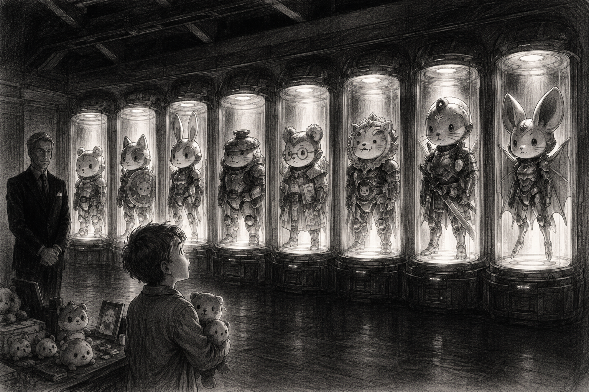
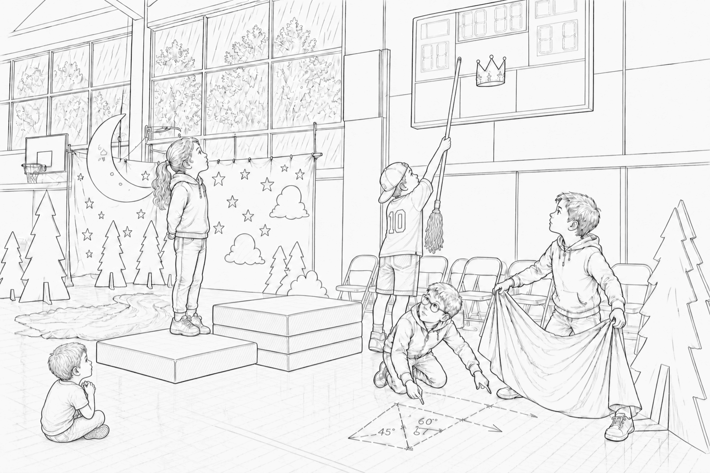
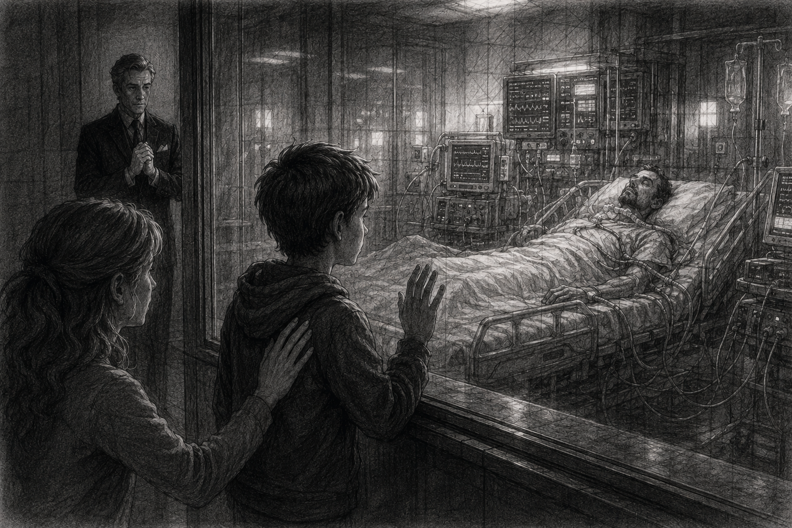

# 挿絵生成プロンプト集

このファイルは、`小説版_本文.md` に入れる挿絵を後日生成するためのプロンプト集である。本文には短い仮挿絵だけを置き、詳細な画像生成指示はこのファイルで管理する。

挿絵は映画ノベライズ寄りの本文挿絵として扱う。ページ数ごとに機械的に入れるのではなく、印象的な場面にだけ配置する。

## 共通方針

- 映画ノベライズ本文挿絵風。
- 画風は、チャコールペンシルで描かれたモノトーンイラストに統一する。
- 色は使わず、白、黒、グレーの濃淡で表現する。
- 金属、光、影は、線の密度、擦れ、濃淡、紙の余白で表現する。
- 派手な宣伝ビジュアルではなく、物語中の一瞬を切り取る。
- 感情、距離感、光、視線、沈黙を重視する。
- キャラクターの表情だけで説明しすぎず、姿勢や立ち位置で感情を伝える。
- 画像生成用の過度に細かいカメラ指定は避ける。

## アーマー8体の描き分け

8体のアーマーは必ず、ちいかわ、ハチワレ、うさぎ、くりまんじゅう、古本屋、シーサー、らっこ、モモンガの8種類で描き分ける。同じキャラクターを重複させない。

- ちいかわアーマー: 白く丸い顔、小さな耳、やわらかい輪郭。防御役に見える落ち着いた立ち姿。
- ハチワレアーマー: 頭部にハチワレ模様、盾を持つ。輪郭は丸いが、ちいかわより少し活発に見える。
- うさぎアーマー: 長い耳、跳ねるような軽いシルエット。細長い脚部や上向きの耳で判別する。
- くりまんじゅうアーマー: 頭部が丸く重めで、蓋や内部機構を思わせるパーツがある。ずんぐりした重装感。
- 古本屋アーマー: 小柄で控えめ、丸い眼鏡や本・紙片を思わせる胸部意匠。やさしく内向的な雰囲気。
- シーサーアーマー: シーサー風の耳、たてがみ、牙のような装飾。守り神のような意匠。
- らっこアーマー: 剣士型。額や肩に凛とした線、日本刀または刀を思わせる長い装備を持つ。
- モモンガアーマー: 大きめの耳または翼膜風パーツ、軽く広がるシルエット。素早く動きそうな印象。

モノトーンでも見分けられるように、色ではなく形、耳、頭部装飾、持ち物、体格差、ポーズで区別する。

## 01. ポッドルーム初起動

### 対応箇所

`小説版_本文.md` 第1章「8歳の誕生日」

### 本文内の仮画像

```html

```

### 生成プロンプト

チャコールペンシルで描かれたモノトーンイラスト。8歳の少年エドワード・アーノ・リードが、表向きにはスタークの名前が出ていない郊外の別宅地下にある巨大なアーマーズルームで、透明なポッドに眠る8体の小型アーマーを初めて見上げている。8体は必ず、ちいかわ、ハチワレ、うさぎ、くりまんじゅう、古本屋、シーサー、らっこ、モモンガをモチーフにした別々のアーマーとして描く。同じキャラクターを重複させない。モノトーンなので、色ではなく耳、頭部装飾、盾、刀、翼膜風パーツ、体格差、ポーズで描き分ける。少年はちいかわが大好きで、普段から小さなぬいぐるみやグッズを大事にしている。父トニー・スタークは母からその好みを聞いており、ポッドの中のアーマーは、その好きなキャラクターたちを思わせる小さく丸い意匠を持っている。少年は父が自分の好きなものを知っていたと気づき、驚きと戸惑いの中で目が輝いている。背後には黒いスーツの執事エリアス・ヴェイルが静かに立っている。部屋は暗く、ポッドの光は色ではなく白とグレーの濃淡、強い明暗差、紙の余白で表現する。アーマーは兵器というより、父からの秘密の誕生日プレゼントとして見える。静かで神秘的、映画ノベライズ本文挿絵風、過度に派手にしない。

## 02. 雨の体育館と紙の王冠

### 対応箇所

`小説版_本文.md` 第2章「秘密基地の四年間」

### 本文内の仮画像

```html

```

### 生成プロンプト

チャコールペンシルで描かれたモノトーンイラスト。雨の日の学校の体育館。低学年向け発表会の準備中で、手作りの紙の月、黒い星空の背景、段ボールの森、青い布の川、折りたたみ椅子が並んでいる。壁際の古い得点板の裏に、銀紙で作った大きめの紙の王冠が引っかかっている。10歳前後のエド、マックス、ロキシー、サイモンが協力して王冠を取り戻そうとしている。マックスはモップの柄を持ち、すぐ動ける姿勢で王冠を引っかけようとしている。ロキシーは折りたたみマットの一段目に立ち、上から位置を見ている。サイモンは床に小さな図を描くようにしゃがみ、角度を考えて指示している。エドは青い布を両手で広げ、落ちてくる王冠を受け止めようとしている。手前には泣き止みかけた下級生がいて、王冠を見上げている。四人はまだヒーローではなく、秘密基地とも関係のない普通の友達として描く。マックスの即応性、ロキシーの怖がらない明るさ、サイモンの観察力、エドが巻き込まれながらも支える感じが、表情と立ち位置で分かるようにする。雨の窓明かり、体育館の床の反射、紙工作の質感を白黒の濃淡で表現する。あたたかく少しユーモラスだが、後にチームになる四人の原点として印象に残る映画ノベライズ本文挿絵風。

## 03. ガラス越しの集中治療室

### 対応箇所

`小説版_本文.md` 第3章「12歳の知らせ」

### 本文内の仮画像

```html

```

### 生成プロンプト

チャコールペンシルで描かれたモノトーンイラスト。12歳の少年エドワード・アーノ・リードが、看板のない医療施設の集中治療室の前で、厚いガラス越しにベッドで眠るトニー・スタークを見つめている。トニーは医療機器と透明な管に囲まれ、青白い画面や波形は色ではなく白、黒、グレーの濃淡と線の密度で表現する。エドはガラスの前で足を止め、父を初めて本物として見ている。画面や録音の中ではよくしゃべっていた父が、今は画面の外で何も言わずに眠っているという距離感を重視する。エドの表情は大げさに泣かせず、怒り、怖さ、戸惑いが混ざって言葉を失っているようにする。少し後ろに母が立ち、エドの背中へ手を伸ばしかけている。さらに離れた位置に黒いスーツの執事エリアス・ヴェイルが静かに立っている。エリアスは取り乱さず、白い手袋の手を胸の前で組み、祈っているようにも、何かを決めているようにも見える。治療ナノマシンや非常用プロトコルの詳細は描かない。病室の冷たさ、ガラスの反射、モニター音の静けさ、父子の物理的な近さと心理的な遠さを、余白と影で表現する。映画ノベライズ本文挿絵風。派手な医療SF画ではなく、静かな危機の場面として描く。