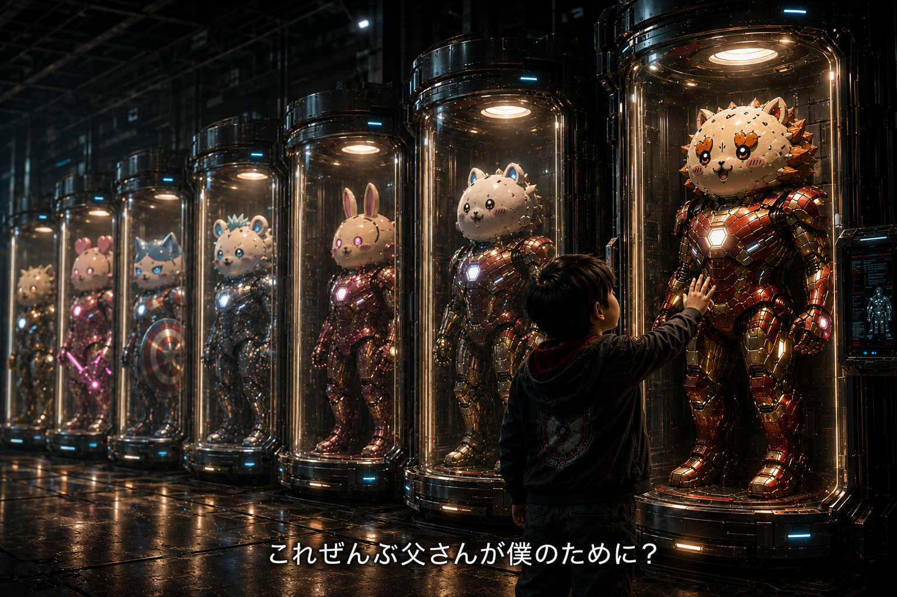
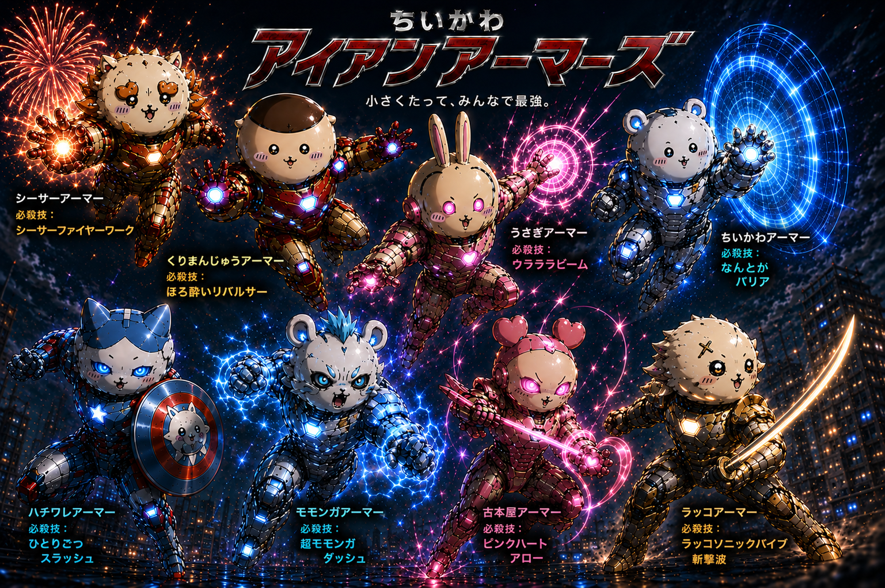
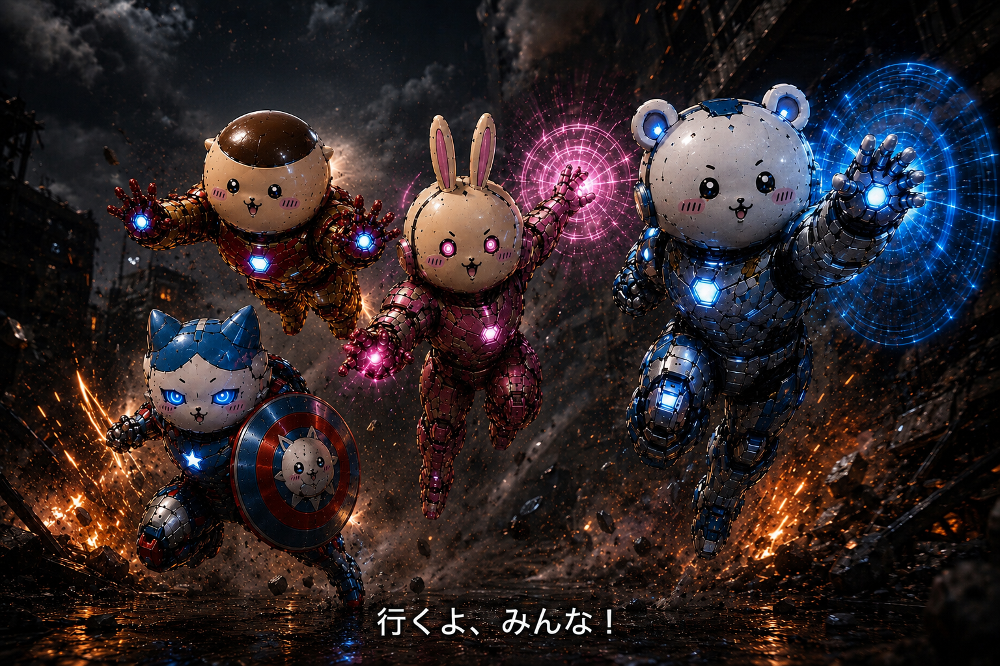
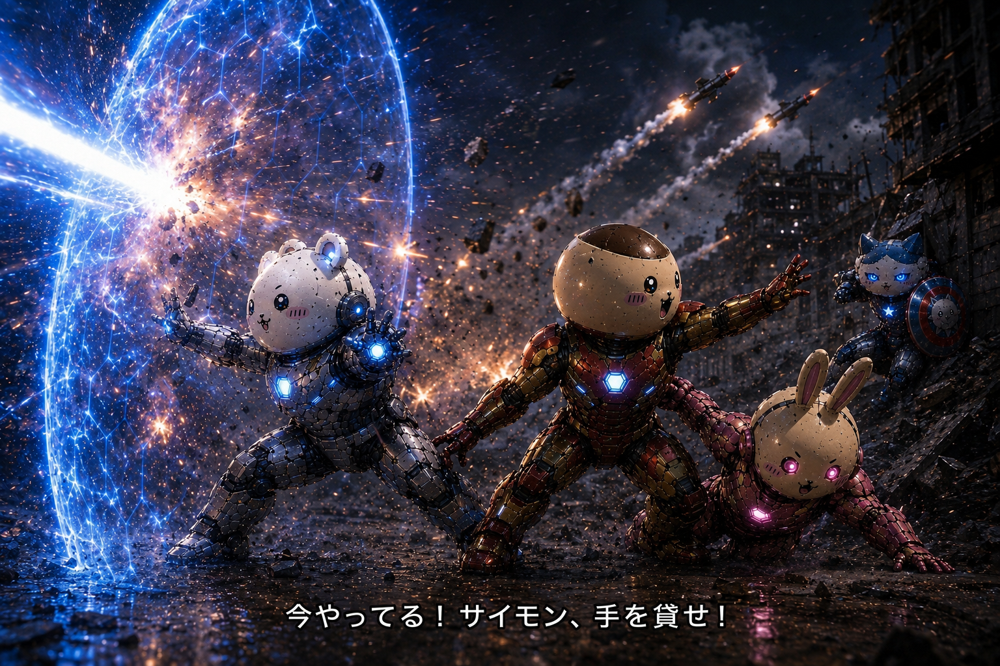
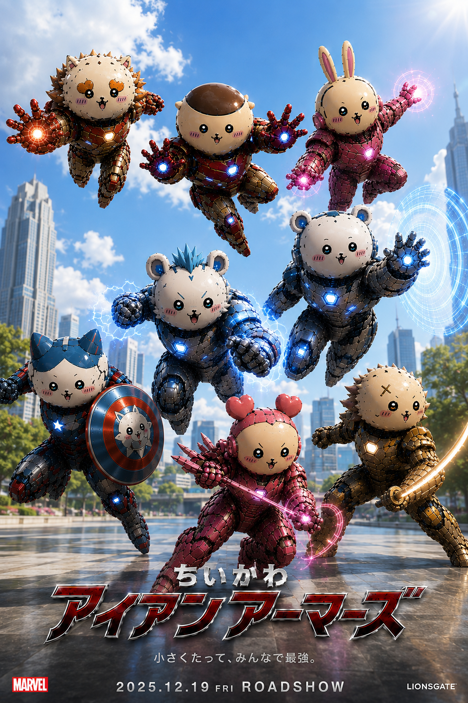

# 映画ストーリー原稿プロット

このファイルは、映画のストーリー素材として使える部分を回収し、画像から読み取れた情報も矛盾しない範囲で補完した原稿プロットである。

画像作成のための制作指示文やポスター修正依頼は除外する。ただし、その中に含まれていた登場人物の台詞、物語上の重要な行動、情景、アーマーの能力情報は脚本素材として回収する。

この文書は、後で脚本を書くための原稿プロットとして扱う。台詞、身体の動き、画面内の位置関係、感情の出方、アーマーの使われ方を残すことを優先する。

## 1. 物語として固まっていた要素

この作品は、最初は「ちいかわをアイアンマンみたいなアーマーにする」という発想から始まった。しかし途中から、単なる画像生成のお題ではなく、一本の映画として成立する世界観になっていた。

物語の核は「なんとかなれ！」である。最初はちいかわらしいセリフとして使いたいという発想だったが、話を積み重ねるうちに、作品テーマそのものになった。さらに「なんとかなれ！」は、実はシステムコマンドでもある。

エドたち4人は、単純に強く成長したから勝つのではない。彼らは互いを信じることで勝つ。未来の4人も、未来になったから強くなったわけではない。各自がどう動けば勝利につながるかを知っているだけである。自信は少しついているが、強さそのものが増したのではなく、チームワークの手順を知っていることが勝利を生む。残り4体のアーマーは新キャラクターではなく、未来の自分たちである。この構造によって、因果ループは説明ではなくドラマとして機能する。

アーマーズルームは、エドが8歳の誕生日に知った父からの秘密のプレゼントである。ただし、その時点で解放されていたのは安全モードだけであり、トニーはエドに戦ってほしかったわけではない。12歳になったエドの前で父の危機が起きた時、封印されていたスターク・コード（全開放コード）が初めて開く。父の誕生日プレゼントだった場所が、父を救うための最後の手段に変わる。

8体のアーマーは、子どもたちを戦わせるために作られたものではない。トニーは、もし最悪の事態が起きてもエドが一人で抱え込まないように、仲間がいる前提でしか本当の意味が立ち上がらない設計にしていた。トニーは息子に戦わせたかったのではなく、息子が一人で戦わなくてすむように、8体作った。

物語には、後から思いついた設定なのに、最初からそのためにあったように見える要素が多い。「なんとかなれ！」がその代表であり、伏線のように機能する。

## 2. 登場人物と動きの素材

### エドワード・アーノ・リード / エドワード・アーノ・スターク / エド

エドは12歳で、ミドルスクール7年生である。

エドは物語の中心人物である。トニー・スタークの隠し子という設定を持ち、生まれてから8年間トニーと会えなかった理由が物語の背景にある。世間ではトニー・スタークに妻子はいないことになっており、エドの母もトニーとは婚姻していない。エドは母と二人で暮らしており、8歳の誕生日まで自分の父がトニー・スタークであることを知らない。8歳までの生活上の名前は、母方姓のエドワード・アーノ・リードである。エドはちいかわが好きで、部屋には小さなぬいぐるみやグッズがある。トニーは母からエドの近況や好きなものを聞いており、ちいかわが大好きなことも知っていた。この好みをトニーが把握していたことが、アーマーの意匠につながっている。母子家庭だが暮らしには困っておらず、エドは学費の高い学校になぜか通えている。その経済的な安定は、トニーが直接または間接的に母子を支えてきたためである。ただし、エド本人と世間には伏せられており、母はエドに「奨学金」と説明している。8歳の誕生日にエリアスが初めて「エドワード・アーノ・スターク」と呼び、母から父の正体を知らされ、父からの秘密のプレゼントであるアーマーズルームを知る。ただし、その時は安全モードだけが開いており、エドにとってそこは戦場ではなく、父が自分を忘れていなかったことを知る秘密基地だった。

対応するアーマーは、ちいかわアーマーである。白い丸顔と青白い装甲を持ち、防御の要となる。

8歳の誕生日にポッドルームで8体のアーマーと向き合い、父だと知らされたばかりのトニーが、自分のために残したものだったのかと気づく。その場面の台詞は次の通りである。

「これぜんぶ父さんが僕のために？」

12歳になった現在、トニーの危機によってスターク・コード（全開放コード）が開く。エドは父の誕生日プレゼントだった場所を、父を救うための手段として使わなければならなくなる。終盤では、最後までバリアを維持し、仲間を守るために「なんとかバリア」を展開し続ける。エドの行動は、物語のテーマである「なんとかなれ！」と直結する。

### マックス

マックスは12歳で、ミドルスクール7年生である。

マックスは、仲間の危機に最も早く反応する人物である。真っ先に仲間を助ける。

対応するアーマーは、くりまんじゅうアーマーである。頭部の蓋が開き、内部ランチャーとレーダーコンソールを持つ重火力型である。

ラスボス戦では、バリア外に取り残されそうなロキシーを引き寄せながら、サイモンにも助けを求める。字幕として確認できる台詞は次の通りである。

「今やってる！サイモン、手を貸せ！」

この台詞は、余裕のある号令ではなく、切迫した状況で仲間を動かすための叫びである。マックスは攻撃だけでなく、救助行動によってチームをつなぎ止める。

### サイモン

サイモンは12歳で、ミドルスクール7年生である。

サイモンは解析をやめない人物である。恐怖や迷いがあっても、状況を読み、突破口を探し続ける。

対応するアーマーは、ハチワレアーマーである。盾を持つ防御・支援型で、戦場で前に出る責任と恐怖の間に立つ。

未来サイモンは、長々と説明できない。横柄に命令するのではなく、自分でも説明が追いつかないまま、仲間に信じて動いてもらおうとする。未来のサイモンの台詞は次の通りである。

「えーっと……まずは言うとおりにやってみて！」

この台詞は設定説明ではなく、未来のサイモンがどういう人間になったのかを伝える演出である。未来の彼は、現在の仲間たちより先を知っているが、偉そうに命令する人物ではない。時間がなく、複雑すぎて説明しきれないため、少し焦りながらも仲間に協力を頼む。

### ロキシー

ロキシーは12歳で、ミドルスクール7年生である。

ロキシーは、驚いた時、楽しくなった時、怖さを振り払う時に、短い奇声や口癖をよく発する。ただし、台詞の意味を邪魔しない範囲で、感情が跳ねる瞬間にだけ入れる。「ウラ」「ウラウラァ」は気合、攻撃態勢、突撃、喜びの声で、武器を構えて敵へ向かう時やテンションが上がった時に使う。「ヤハ」は肯定、同意、挨拶、嬉しそうな登場、テンション上昇に使う。「ハァ？」は威嚇、不満、疑問、煽りに使う。「フゥン」は納得、鼻高々、余裕、興味に使う。「プルャ」は最高潮の興奮や、大好物を食べた時の感動に限って使う。

ロキシーは、目を覚ましてもすぐには戦えない人物である。終盤では、ダメージを受けて自力で動けない状態になり、仲間に引きずり込まれる。

対応するアーマーは、うさぎアーマーである。ピンク装甲と長い耳を持ち、強力な攻撃能力を持つが、クライマックスでは爆風に押されて自力で戻れない状態になる。

ロキシーがすぐに立ち上がれないことによって、マックスが助け、エドが守り、サイモンが支える構図が生まれる。ロキシーの弱さは、チームの信頼を見せるための重要な要素である。

### トニー・スターク

トニーは、エドの父であり、生まれてから8年間会えなかった理由を持つ人物である。ポッドルームと8体のアーマーは、トニーが残したものとして扱われる。

8歳のエドにアーマーズルームを残した時、トニーは息子に戦ってほしかったわけではない。会えない父として、誕生日プレゼントを贈り、自分がエドを忘れていないことを伝えたかった。だがアイアンマンとしては、いつか敵がエドの存在に気づく最悪の事態も想定していた。だから本格的な飛行、武装、戦闘機能は封印し、トニー本人が行動不能になるような非常時にだけ開くようにしていた。

スターク・コード（全開放コード）は、エリアス一人では開けない。トニーは、執事や管理者が善意であっても子どもの人生を勝手に決められないよう、複数条件を重ねていた。起動には、トニー本人の行動不能、エド本人の生体認証、エド自身の明示的な同意、そしてエドが一人で抱え込んでいないことを示す仲間の存在確認が必要である。エリアスは施設とポッドを管理できるが、この最終認証だけは代行できない。

この設計は、トニーの本当の意思と直結する。彼はエドにアイアンマンになってほしかったのではなく、一人で抱え込まない子になってほしかった。だからスターク・コード（全開放コード）は、血筋だけでも、管理者権限だけでも、恐怖だけでも開かない。エドが自分で選び、誰かと一緒に進もうとした時にだけ、本当の機能が立ち上がる。

物語中盤には、トニーの非常用ホログラムが登場する。ここで、アーマーが単なる兵器ではなく、父から子へ残された意思であることが明確になる。

### エリアス・ヴェイル / 執事

エリアス・ヴェイルは、スターク家に仕える執事である。信仰心に満ち、祈り、奉仕、節制、罪、赦しという言葉を本気で信じている。

彼はトニーを軽蔑していたのではない。むしろ、トニーの才能を神から与えられた祝福のように見ており、誰よりも近くでその善性と危うさを見続けてきた。トニーに仕えることも、単なる仕事ではなく、自分に与えられた務めだと考えている。

しかしその尊敬は、やがて管理欲へ変わっていく。エリアスは、トニーの愛情、罪悪感、衝動が、神から預かったような才能を曇らせると恐れるようになる。トニーを憎んだからではなく、尊敬しすぎたからこそ、トニー本人よりも自分がその祝福を管理すべきだと思い込んでいく。

エリアスは、トニーを殺したいわけではない。望んでいるのは、トニーの自由意思と技術を一時的に切り離し、スタークの力を自分が正しいと信じる秩序の中へ戻すことである。エドも殺したくない。むしろ守りたい。しかしその守り方は、エド自身の選択を奪い、恐怖と使命感でスターク・コード（全開放コード）へ導くものになっている。

AI毒ナノマシンは、外部の天才科学者がトニーを超えるために作ったものではなく、エリアスが長年管理してきたスターク系医療・防御技術を歪めたものである。トニーの体質、医療AI、ナノマシン対策データを知る立場にいたからこそ、彼はトニーの治療反応そのものを読んで変化する毒を作ることができた。これはエリアスがトニーより天才だからではなく、トニーの一番近くで、トニーの技術と身体情報を預かってきた者だから可能になった裏切りである。

毒の目的は即時の殺害ではない。トニーを無力化し、通常治療では回復できない状態へ置き、スターク・コード（全開放コード）を開かせることにある。治療ナノマシンは実在するが、エリアスの隠し施設に置かれている。エリアスはそれを餌にして、エドたちを施設へ誘導する。

エリアスがエドたちを待ち構える場所へ誘導した理由は、エドを殺すためではない。スターク・コード（全開放コード）はエリアス一人では開けない。トニー本人の行動不能だけでなく、エド本人の生体認証、エド自身の同意、そしてエドが一人ではないことの確認が必要だからである。エドが自分の意思でアーマーを使い、仲間とともにスターク・コード（全開放コード）を開くことによって、封印されていた8体の本当の機能が立ち上がる。エリアスは、それを目の前で確認し、必要なら奪い、必要なら封じるつもりでいる。彼にとってエドたちは敵ではなく、スタークの火を安全に回収するための鍵である。

### 未来の4人

未来の4人は、新キャラクターではなく、未来の自分たちである。彼らが現在の4人を助けに来ることで、ブートストラップ・パラドックスが成立する。

未来の4人は、現在の4人より圧倒的に強い存在ではない。違いは、勝利に至る行動の順番を知っていることだけである。どこへ走るか、どの角度で盾を投げるか、誰がどのタイミングで避けるかを知っているため、現在の4人へ指示できる。勝つのは個々のパワーアップではなく、同じ4人が時間差で組み上げるチームワークの結果である。

未来の4人は、現在の4人を帰還へ向かわせたあと、縮んでいく渦へ戻る。壊れた設備や倒れたラスボスを足場にして渦へ飛び込むため、未来の4人もその場に残り続けるわけではない。

現在の主人公たちは、空中に出た瞬間に未来の４人となり真相を理解する。そのときの台詞は次の通りである。

「そういうことかーー！！」

## 3. 時系列ストーリー素材

ここでは、台詞だけを抜き出すのではなく、物語の流れ、行動、台詞、身体の演技、画面内の位置関係を同じ時系列の中にまとめる。

### 3-1. オープニング

物語は、8歳のエドの誕生日から始まる。エドワード・アーノ・スターク、隠し子という設定、生まれてから8年間トニーが会えなかった理由が、物語の背景になる。ただし、8歳までの生活上の名前は母方姓のエドワード・アーノ・リードであり、エド本人はスターク姓も父の正体も知らない。エドはちいかわが好きで、部屋には小さなぬいぐるみやグッズがある。トニーは母からエドの近況や好きなものを聞いており、ちいかわが大好きなことも知っていた。世間ではトニー・スタークに妻子はいないことになっており、エドの母もトニーとは婚姻していない。エドはそれまで母と二人で暮らしている。母子家庭だが暮らしには困っておらず、エドは学費の高い学校になぜか通えている。その経済的な安定は、トニーが直接または間接的に母子を支えてきたためである。ただし、エド本人と世間には伏せられており、母はエドに「奨学金」と説明している。

8歳の誕生日にエリアスが現れ、エドを初めて「エドワード・アーノ・スターク」と呼ぶ。母はエドに父の正体を告げる。その後、エドはエリアスに連れられて、表向きにはスタークの名前が出ていない郊外の別宅へ向かい、地下の隠し部屋へ入る。そこには8体のアーマーが並んでいる。だがこの時点のアーマーズルームは、見学用のモードでしか動かない。ポッドのライト、名前の表示、着用体験用の簡単な案内、父からの軽いメッセージだけが開いている。内部設定として飛行、武装、本格戦闘機能は封印されているが、8歳時点のエドと読者にはまだ明かさない。エドには、父が自分のために残した大きな玩具のように見える。エドは実際に少しだけアーマーを着る。関節を囲う金属が重なり合って収縮し、8歳の体格に合わせてフィットする。エリアスは成長度合いに応じて調整される設計だと説明する。エドは鏡に映る自分を見て、かっこいいけれどコミカルなヒーローの決めポーズを何パターンも嬉しそうに取る。

この時のアーマーズルームは、兵器ではなく、父が会えない息子に残した秘密基地である。エドにとってそこは、父がトニー・スタークだったことと、その父が自分を忘れていなかったことを同時に知る場所になる。

「ちいかわをアイアンマンみたいなアーマーにする」という発想は、映画本編では「小さな存在が巨大な力を託される」導入へ変換できる。

### 3-2. 8歳の誕生日とポッドルーム初起動

8歳のエドは、父の正体を知らされた直後にアーマーズルームへ入り、ポッドに格納された8体のアーマーを見る。画像では、暗い格納庫に8つの透明ポッドが並び、エドと思われる少年が一番手前のシーサー系アーマーに手を伸ばしている。

この場面では、少年が父の痕跡に触れる。アーマーは単なる戦闘装備ではなく、トニーが残した誕生日プレゼントである。エドはこの時点で、アーマーズルームの本当の危険性も、スターク・コード（全開放コード）の存在も知らない。

エドがここへ来る前には、母から父の正体を告げられる場面がある。トニーは生まれてから8年間、隠し子であるエドに会っていない。エドの存在を隠していたのは、アイアンマンとして活動してきたトニーの敵に、息子が弱点として狙われると予測していたためである。

それでもトニーは、完全に何も残さないことには耐えられなかった。だから8歳の誕生日に、戦うためではなく、父が自分を忘れていなかったことを知らせるための場所として、アーマーズルームを開かせた。

台詞は次の通りである。

「これぜんぶ父さんが僕のために？」

### 3-3. 12歳の危機とスターク・コード（全開放コード）

しかし危機が訪れる。表向きには、トニーは謎の難敵にAI毒ナノマシンを体内へ埋め込まれたことになっている。天才的な科学医療で集中治療を続けるが、毒は治療反応を学習し、その場で新しい毒性パターンを生成して体内へ撒き散らすため、一進一退で身体を動かせない。意識もままならない状況で、執事が単独行動とも言える形でエドに真実を告げる。

真相としては、このAI毒ナノマシンは、エリアスがスターク系の医療・防御技術とトニーの身体データを歪めて作ったものである。エリアスはトニーを亡き者にしたいのではなく、トニーを一時的に無力化し、スターク・コード（全開放コード）を開かせるために毒を使う。毒は殺害装置ではなく、トニーの自由意思と発明能力を封じるための歪んだ拘束具である。ただし進行が危険すぎるため、結果として本当に命を奪いかねない。

12歳になったエドは、アーマーズルームの存在自体は知っている。だが、そこは長いあいだ、父との数少ない接点であり、少し寂しい秘密基地でもあった。本格的な飛行も武装も開かず、エド自身も、あそこが本当に何のために作られた場所なのかは知らない。

執事は、もしもの時のためにトニーが用意していたスターク・コード（全開放コード）の存在をエドへ伝える。さらに、父の体内のAI毒ナノマシンを唯一駆逐できる治療ナノマシンが、難敵のアジトにあることも伝える。初見では、エリアスが父を救うために情報を渡しているように見える。しかし後から見ると、治療ナノマシンの場所を正確に知っていること自体が、彼がその施設と毒の両方に関わっていた証拠になる。

この時点でエリアスは、スターク・コード（全開放コード）を自分だけでは開けないことを知っている。彼が必要としているのは、エド本人の認証と同意である。さらに、トニーの設計はエドが一人で戦うことを拒むため、仲間の存在が鍵になる。エリアスはその全条件を一度に説明せず、まず父を救うための重荷としてエドに提示する。

エドはどうすればいいのか決断できない。ミドルスクールに通う12歳の子どもには荷が重すぎる。トニー自身も本意ではない。だからこそ、この場面は単なる説明ではなく、執事の独断によって運命が動き始める場面になる。

父からの誕生日プレゼントだった場所が、父を救うための最後の手段へ変わる。エドはその変化に戸惑う。嬉しかった秘密基地が、急に重い使命を帯びてしまう。

### 3-4. 8体のアーマーと役割

この節は内部設定としてのスペック整理である。作中で子どもたちが武装・戦闘機能を知るのは、エドが覚悟を決め、友達3人も一緒に行くと言った後に、エリアスがスターク・コード（全開放コード）の詳細を開示する場面である。それまでは、エドも友達もアーマーを見学できて少し着られる大きな玩具として認識している。

8体のアーマーには、それぞれ役割と必殺技がある。

シーサーアーマーは、花火のような攻撃を放つ。必殺技は「シーサーファイヤーワーク」。

くりまんじゅうアーマーは、頭部の蓋が開き、内部にアルコールミサイルランチャーとレーダーコンソールを持つ重火力型である。掌から撃つ必殺技は「ほろ酔いリパルサー」。受けた相手は酔っ払ったように姿勢制御や照準を失う。高速飛行中に頭部から複数のミサイルを発射する攻撃とは別系統の技として扱う。

うさぎアーマーは、ピンクのエネルギーを操る。必殺技は「ウララビーム」。

ちいかわアーマーは、防御の要である。必殺技は「なんとかバリア」。青い円形または六角形のバリアを展開する。

ハチワレアーマーは、盾を持つ。必殺技は「ひとりごつスラッシュ」。盾には小さなちいかわ風の意匠がある。

モモンガアーマーは、高速移動と電撃を得意とする。必殺技は「超モモンガダッシュ」。

古本屋アーマーは、ピンクのハート型エネルギーを使う。必殺技は「ピンクハートアロー」。

ラッコアーマーは、剣士型のアーマーである。日本刀を持ち、必殺技は「ラッコソニックバイブ斬撃波」。

### 3-5. 3人の友達がアーマーズルームを見つける

エドたち4人は同じミドルスクールに通っている。エドは学校でも、ひとりで悩み続ける。心ここに在らずの様子を見て、友達3人が心配し始める。

やがて、8歳の頃からエドだけが知っていたアーマーズルームは、エドを尾行していた3人の友達に見つかってしまう。3人は男子2人、女子1人である。

この時点では、エドも友達3人もアーマーを「見学できて少し着られる大きな玩具」だと思っている。3人は固い口止めを飲むかわりに、「8体もあるんだからどれか着させろ」と言い出す。武器に対する要求ではなく、秘密基地で見つけた父からの贈り物を自分たちも試してみたいという好奇心である。半分は面白がっているが、半分はエドを一人にしないためである。エドは嫌々ながら許す。

男子1人と女子1人は身体能力が高く、もう1人の男子は天才肌である。この時点のサイモンは、8体の外見やサイズ調整、ポッドの配置に違和感を覚えるだけで、武装や戦闘機能までは知らない。エドもトニーに似て頭はいいが、勉強に興味がないため、その天才肌の男子より遅れをとっている。

身体能力が高い友達はマックスとロキシー、天才肌の友達はサイモンである。

### 3-6. 8体ある理由とチーム結成

最初、エドは「どうして8体も？」と思う。サイモンも、同じ玩具を8体作ったのではなく、わざわざ違う形にしてあることに引っかかる。

だがこの時点では、まだ「これは一人用じゃないのかもしれない」という程度に留める。4人は、これを着て戦うのかもしれないという可能性に怯えるが、実際にどんな戦闘力があるかは知らない。だからこそ、エドは父を救いたい気持ちと、友達を危険に巻き込みたくない気持ちの間で葛藤する。

三人がいることで、スターク・コードは全開放されないまま、残されていたトニーのホログラム記録だけを開く。

表示は `STARK CODE`、`FULL RELEASE: LOCKED.`、`COMPANION PRESENCE: CONFIRMED.`、`MESSAGE ACCESS: UNLOCKED.`。ここではまだ武装や本当の戦闘力は開示しない。

青いホログラムのトニー・スタークが現れる。三人はまず、その顔と「アイアンマン」という言葉で、目の前の記録がトニー・スターク本人のものだと気づく。ただし、この時点ではまだ、トニーがエドの父だとは確定できない。

トニーはいつもの調子で話し始める。

「やあ。」

「君がこれを見てるってことは……」

「私は、君に直接説明できていない。」

エドは泣きそうになる。トニーはあえて明るく振る舞う。

「最悪の導入だ。星一つ。いや、父親レビューなら星ゼロだな。」

「まず言っておく。」

「そのアーマー、絶対学校に着ていくな。」

「それと空を飛ぶ前にトイレは済ませろ。」

トニーは真面目な顔に戻る。

「君にアイアンマンになってほしいわけじゃない。」

その後、トニーは、ヒーローは一人では続かない、だから8体作った、と語る。ただし、それは子どもたちを戦わせるための設計ではない。トニーは、もし最悪の事態が起きても、エドが一人で抱え込まないようにしていた。仲間がいる前提でしか、8体の本当の意味は立ち上がらない。

「君は、私の息子だ。でも、私の代わりじゃない。」

この一言で、三人は初めて、トニー・スタークがエドの父だと理解する。驚くが、エドがホログラムから目をそらさないため、誰も口には出さない。

その後、トニーは多くを語らない。エドにスターク姓を望ませるようなことは言わない。エドが終盤で「僕だよ。エドワード・アーノ・スターク」と名乗るのは、トニーの願いに従ったからではなく、エド自身が「あなたの息子のエドだ」と父へ伝えるための自発的な言葉である。

ホログラムが終わっても、`FULL RELEASE: LOCKED.` と `FINAL CONSENT: PENDING.` は残る。エドが覚悟を決め、友達3人も「一緒に行く」と言った後で、初めてエリアスがスターク・コード（全開放コード）のスペックを開示する。同じアーマーを8体作る方が合理的なのに、あえて全部違う機能にしていること、飛行、通信、防御、解析、攻撃などの役割が分かれていることが明かされる。子どもたちはここで初めて、自分たちが着ようとしていたものがただの玩具ではなかったと知り、言葉を失う。

サイモンはそこで初めて「これは一人用じゃない」と明確に気づく。つまり、トニー・スタークは最初からチームを想定して設計していた。

### 3-7. アジト侵入と反撃開始

治療ナノマシンを奪還するため、4人は敵のアジトへ侵入する。隠密に進もうとするが、途中で敵に見つかり、攻撃を受ける。逃げ切れないと判断したエドは、仲間へ声をかけて反撃を開始する。

反撃開始の台詞は次の通りである。

「行くよ、みんな！」

この台詞は、敵に見つかって受け身になっていた4人が、自分たちの判断で反撃へ切り替わる合図になる。

この作戦の前、エドはアーマーズルームで好奇心と心配から操縦しようとする3人に最初は嫌々で、困惑する。しかしサイモン以外の2人がスムーズに動かしてしまうこと、そしてサイモンの分析力を見て、「みんながいればいけるんじゃないか」と信じられる勇気を得る。

サイモンのアドバイスによって、誰がどのアーマーを着るのがベストか決まる。

- マックスはくりまんじゅうアーマー。
- ロキシーはうさぎアーマー。
- サイモンはハチワレアーマー。
- エドはちいかわアーマー。

### 3-8. 治療ナノマシン奪還作戦

中盤の大きな作戦として、治療ナノマシン奪還作戦がある。この作戦は、能力紹介ではなく、仲間を救うための行動である。

マックスは真っ先に仲間を助ける。エドは最後までバリアを維持する。サイモンは解析をやめない。ロキシーは目を覚ましてもすぐには戦えない。この4人の行動原理が、作戦の中で具体的に表れる。

チームができた少年たちは、執事から得たアジト内マップ情報をもとに綿密に計画を練る。そして、父トニーを救うため、治療ナノマシンを奪いに行く。いろいろな紆余曲折の末、ついに治療ナノマシンを発見する。しかしそこへラスボスが現れ、死闘が始まる。

### 3-9. ラスボス戦とバリアの名シーン

ラスボス戦では、敵の巨大リパルサー砲によって4人が追い詰められ、あと数秒で全滅する状況になる。巨大リパルサー砲は、トニーがアイアンマンとして使ってきたリパルサー攻撃を異様に大型化したものに見える。発射時の光、衝撃音、エネルギーの反応が、エドの知るアイアンマンの兵器とよく似ている。ラスボスとトニーの技術に何らかの関係があることを示す伏線として扱う。

エドはちいかわアーマーで「なんとかバリア」を展開し、巨大リパルサー砲から仲間を守る。バリア越しには、巨大リパルサー砲の閃光と衝撃で視界が乱れ、4人はその向こうで何が起きているのか見えない。ここでは、エドが最後まで守る役割を引き受けることが重要である。

バリアの場面で使う台詞は次の通りである。

「なんとかなれーー！！」

これは叫びであると同時に、システムコマンドの発動でもある。

同じ場面で、マックスはロキシーをバリア内へ引き寄せ、サイモンにも助けを求める。マックスは攻撃役ではなく、仲間をつなぎ止める役割として動く。

台詞は次の通りである。

「今やってる！サイモン、手を貸せ！」

サイモンは恐怖や迷いを抱えながらも、解析と支援をやめない。ロキシーは自力で動けず、仲間に助けられる側に回る。この場面では、エドの防御、マックスの救助、サイモンの解析、ロキシーの危機が同時に起きていることが重要である。

### 3-10. サイモンの最終兵器と「なんとかなれ」

エドのバリア後方で、サイモンはただ怯えていたわけではない。バリアが徐々に限界を迎える状況で、サイモンは打開策がないか、アーマー内のコンソールに音声で命令しながら探している。

ハチワレアーマーには、どうやら諸刃の剣のような最終兵器がある。それは「最大の救いと最大の災い」という意味を持ち、決して使うべきではない、何が起きるかわからないものだった。サイモンはその発動方法を最後にやっと見つける。

サイモンは困惑する。

「なんだこりゃ？本当にこれが発動条件か？」

エドが限界を告げる。

「もう限界だ……」

バリアが破れかけたその時、サイモンが叫ぶ。

「なんとかなれ〜〜〜！」

エドとマックスは「えーーっ！？」とサイモンを振り返る。その叫びにロキシーは目を覚ます。サイモンのコンソール画面が、サイモン目線の映像で映る。

画面には、こう書かれている。

「コマンド:なんとかなれと叫ぶ」

その直後、バリアへぶつかり続けていた巨大リパルサー砲が止まる。正確には、止んだのではなく、ラスボスの照準が外れ、攻撃が逸れる。

視界が開けた4人がラスボスを見ると、すでに2体のアーマーがラスボスに取りついている。1体目はラスボスの背後へ落ちて着地し、そのままラスボスへ迫っている。2体目はちょうどラスボスの頭上へ落ち、首を羽交い締めにして巨大リパルサー砲の照準をずらしている。

さらにその上空では、空中にできた渦から残り2体のアーマーが続けて落ちてきている。

### 3-11. 未来の4人登場

クライマックスで、未来の自分たちが助けに来る。残り4体のアーマーは新キャラクターではなく、未来の自分たちである。

誰なのか、なぜここにいるのか困惑する4人に、アーマー同士で交信できるマイクから、代わる代わる指示が飛ぶ。

「エド、しゃがんで！」

「ロキシーは私……古本屋アーマーの左に走って！」

「マックス、盾を左手45度に全力で放り投げて！」

指示通りに動くと、ピタゴラ装置のように8人の行動が連携し、ラスボスへ連続コンボでダメージを与える。最後には8人の連携プレーで勝利する。

この勝利は、未来の4人が強くなったから起きるものではない。未来の4人は、過去の自分たちが何をすれば勝てるかを知っている。現在の4人は、その指示を信じて動く。結果として、8人の行動が一つのチームワークとして噛み合う。

新たに来た4体のうち1人が言う。

「マックス、俺はマックスだよ。」

1人、また1人とヘルメットを解除していく。そこにいたのは、疲れ果てた様子のマックス、サイモン、エド、ロキシーの未来の姿だった。

先にいた4人も全員ヘルメットを解除しながら、混乱する。

「どういうこと？」

「なにが起きてるの？」

サイモンだけは、天才ならではの勘で気づく。

「そういうことか！」

未来のサイモンが続ける。

「そう、そういうこと。」

「僕が見つけて発動したのは、別時間の未来のハチワレアーマー同士を繋げる時空間移動装置だったんだ。」

サイモン以外の最初の3人は、まだよくわかっていない。

サイモン2人が同時に話し始め、言葉がかぶる。

「つまり、君たちは……」

「つまり、僕たちは……」

最初にいたサイモンが、未来のサイモンへ「どうぞ」と促す。未来サイモンは続きを説明しようとするが、難しい話になって余計に伝わらないことを確信し、言葉を変える。

「……とにかく、君たちはこのあと、これを持ち帰って、エドパパの執事に渡したら、すぐにそのままアーマーズルームに移動。」

未来サイモンは、治療ナノマシンのボックスを持ち上げて渡す。

「ボロボロでもう戦えない君たちのアーマーを脱ぎ捨てて、残りのアーマーを着用して、脱いだハチワレアーマーのそばで待機だ。」

「渦が現れるから、そこに飛び込んで。お願い、今はそれだけ信じて！」

ひととおり聞き終わったサイモン以外の最初の3人は、「え？どういうこと？」という顔をする。未来から来た4人は自分たち自身だと分かっても、まだどこか他人のように感じられる。マックス、ロキシー、エドにとって、頼れるサイモンは今まで一緒にいた現在のサイモンである。3人は、反応、解釈、説明を求めるように、黙って聞いていた現在サイモンの方を振り返る。

サイモンは、ただ一言だけ返す。

「つまり、そういうこと。」

未来サイモンは長く説明できない。台詞は次の通りである。

「えーっと……まずは言うとおりにやってみて！」

この台詞は、設定を説明するためではなく、未来サイモンが状況を分かっていても、仲間に対して横柄にはならない人物であることを示す。理解できるのは5分後ではない。現在の4人がアーマーズルームへ戻り、治療ナノマシンを渡し、残りのアーマーに着替え、渦へ飛び込んだ先で初めて「そういうことか」と分かる。

現在の4人は、治療ナノマシンを持って帰還するために走り出す。未来の4人は、その背中を見送る。そこで、頭上の渦が少しずつ小さくなっていることに気づく。

未来の4人は、急いで空中の渦へ戻ろうとする。しかし渦は高い位置にあり、そのままでは届かない。4人は、壊れた建物内に残っていた設備や装置を引っ張ってきて、足場として積み重ねていく。未来のマックスが「あっち行ったりこっち行ったり忙しすぎる！」と言った直後、古本屋アーマーに入っている未来のロキシーが「ツツウラウラ〜ッ！」と叫ぶ。旅行先を聞かれた時のような言葉が、時間と場所を行き来する状況に妙に合ってしまう場面にする。

最後に、倒れているラスボスの巨体も足場の一部として使う。未来の4人はその上を駆け上がり、縮んでいく渦へ飛び込む。未来の4人が消えた直後、足場にされた衝撃が、まだ完全には意識を失っていなかったラスボスを呼び戻す。

ラスボスは、自分がもう助からないことを悟る。最後の力で手を伸ばし、基地の自爆装置と追撃システムを作動させる。現在の4人を逃がさず、治療ナノマシンを持ち帰らせないためである。

作動させた直後、基地の崩壊が始まる。ラスボスは自壊していく建物の瓦礫に押しつぶされていく。その瞬間、壊れた装甲の奥から、スターク家の執事エリアス・ヴェイルの顔が見える。映画の中で、ラスボスの正体が観客に分かるのはここである。エリアスは何かを言い切ることもできず、そこで事切れる。

### 3-12. 帰還中の空中追撃

ラスボスを倒したと思ったが、任務はまだ終わっていない。4人は治療ナノマシンをアーマーズルームへ持ち帰り、執事へ渡さなければならない。

しかし、ラスボスが最後に作動させた自爆装置によって、敵アジトの建物群は崩れ始める。4人はまず、治療ナノマシンを抱えて基地の中を走る。通路は崩れ、天井が落ち、足場が次々に消えていく。4人はそれをなんとかくぐり抜け、ぎりぎりで外へ脱出する。

外へ出た直後、基地の奥から追撃ミサイルの群れが空高く発射される。4人は一瞬、それを見上げる。自分たちとは別の方向へ飛んでいくように見えたため、「どこいくんだよ、あのミサイル群は」と笑いかける。

だが、ミサイル群は空中で大きく軌道を変える。向かっている先が、自分たちだと気づく。そこで4人は、地上を走って逃げ切ることを諦め、空へ逃げるしかないと判断する。

治療ナノマシンを持つ仲間を先に行かせるため、マックスがくりまんじゅうアーマーで後方を引き受ける。ミサイルは敵を倒すためだけではなく、追撃を食い止め、仲間が帰る道を作るために使われる。

ただし、マックスだけの見せ場にはしない。サイモンは敵の飛行パターンを読み、ロキシーは一瞬の突破口を作り、エドは残った力で仲間を守る。空中戦は寄り道ではなく、治療ナノマシンを父へ届けるための最後の帰還障害である。

4人は追撃を振り切り、ぎりぎりでアーマーズルームへ戻る。治療ナノマシンを執事へ渡し、ボロボロのアーマーを脱ぎ捨て、未来サイモンに言われた通りに残りのアーマーを着る。そして、脱いだハチワレアーマーのそばで渦が開くのを待つ。

### 3-13. ラストの理解

終盤、主人公たちは空中に出た瞬間に、自分たちが何を見ていたのか、未来の4人が何者だったのかを理解する。

言われた通りのタスクをこなした4人は、無事に渦に飛び込む。目の前に広がるのは、ラスボスの頭上の空中である。4人は、自分たちがさっき見た「すでにラスボスに取りついていた2体」と「そのあと渦から落ちてきた後続の2体」を含む、未来の4体の側に入ったのだと理解する。

台詞は次の通りである。

「そういうことかーー！！」

### 3-14. エンドロール後

エンドロール後の場面がある。因果ループが閉じたのか、それとも次の時間軸へ続くのかを示す余地がある。

集中治療室。トニーのモニターが映る。

ピッ……。

トニーの指がほんの少しだけ動く。

画面が暗転する。

「...エドワード？」

「僕だよ。エドワード・アーノ・スターク」

ここで終わる。

## 4. 画像から補完した情景と設定

### ポッドルーム

8体のアーマーが並ぶ、父の秘密のプレゼントとして使える場面である。

### チーム集合ポスター

8体のアーマーが都市を背景に集結している。タイトルは「ちいかわ アイアンアーマーズ」。キャッチコピーは「小さくたって、みんなで最強。」である。公開日として「2025.12.19 FRI ROADSHOW」が確認できる。

このコピーは、作品テーマである「小さな存在でも、信頼によって大きな力を出せる」という方向性と合う。

### 必殺技一覧画像

8体のアーマー名と必殺技が確認できる。脚本素材として、アーマーの戦闘役割を整理するために使える。

シーサーアーマー：シーサーファイヤーワーク。

くりまんじゅうアーマー：ほろ酔いリパルサー。

うさぎアーマー：ウララビーム。

ちいかわアーマー：なんとかバリア。

ハチワレアーマー：ひとりごつスラッシュ。

モモンガアーマー：超モモンガダッシュ。

古本屋アーマー：ピンクハートアロー。

ラッコアーマー：ラッコソニックバイブ斬撃波。

### ラスボス戦画像

エド、マックス、サイモン、ロキシーの役割が同時に見えるクライマックス素材である。

### アジト侵入中の反撃開始画像

4体のアーマーが暗い戦場を前へ飛び出している。字幕は「行くよ、みんな！」。敵のアジト侵入中に見つかり、攻撃を受けた4人が反撃へ転じる瞬間として使える。

## 5. 脚本化で残すべき意識

脚本に進む際は、設定説明よりも人物の行動を優先する。

挿絵に反映されている外見や細かなポーズの説明は、本文で繰り返しすぎない。脚本では、人物が何を選び、誰を助け、何を言うかを中心に残す。

マックスは真っ先に仲間を助ける。

エドは最後までバリアを維持する。

サイモンは解析をやめない。

ロキシーは目を覚ましてもすぐ戦えない。

全部、「そのキャラならそうする」が積み重なっている。設定ではなく、人が物語を動かしている。

この作品は、世界を作るよりも、登場人物が勝手に動き始める瞬間を大切にする。

## 6. ラスボスの伏線

エリアス・ヴェイルの背景は、映画本編では説明として明かさない。観客に伝わる情報は、人物の台詞と映像だけである。そのため、ラスボスの正体がエリアスだと分かった瞬間に、過去の小さな違和感が一斉に意味を変える構造にする。

観客には最初、エリアスは忠実な執事であり、父を救うために動いてくれる大人に見える。だが見終わって思い返すと、彼は助けていたのではなく、誘導していたのだと分かる。必要なのは大きな説明シーンではなく、短いエピソードの積み重ねである。

### 8歳の誕生日での違和感

8歳の誕生日にエドがアーマーズルームへ案内される場面では、エリアスをただの案内役にしない。エドが8体のアーマーに感動している横で、エリアスは一瞬だけ複雑な顔をする。

エリアスは優しく言う。

「旦那様は、あなたを忘れたことなどありません。」

初見では、トニーの不在を悲しむ執事の表情に見える。しかし、壊れていないまま封印されているポッドや、子どもへ残されたアーマーを見た瞬間、エリアスの表情がわずかに曇る。後から見ると、この時点で彼は、トニーが子どもに力を渡したことを恐れていたと分かる。

### 12歳の危機での誘導

12歳の危機でエリアスが真実を告げる場面では、彼は焦っているように見える。しかし実際には、必要な情報だけを渡し、必要でない情報は隠している。

エリアスは、AI毒ナノマシンがどのようにトニーへ入ったのかを詳しく語らない。敵がいること、治療ナノマシンが必要なこと、時間が足りないことだけを伝える。初見では、エドを混乱させないために情報を絞っているように見える。正体判明後は、毒そのものがエリアスの計画の一部だったため、説明できなかったのだと分かる。

エドが聞く。

「父さんは、僕にこれを使えって言ったの？」

エリアスは少し黙ってから答える。

「旦那様なら、あなたを信じるはずです。」

これは一見、エドを支える優しい台詞である。しかし正確には、トニーが望んだかどうかには答えていない。ラスボスの正体が分かった後に思い返すと、エリアスはトニーの意思ではなく、自分の判断でエドを動かしていたことが分かる。

### 正確すぎる敵アジト情報

治療ナノマシン奪還作戦では、エリアスが敵アジトの情報を渡す。地図、警備ルート、治療ナノマシンの位置、侵入経路が妙に正確である。

初見では、スターク家の執事として優秀だからだと受け取れる。しかし後から見ると、なぜそこまで知っていたのかという疑問に変わる。エリアスは嘘をつく悪人ではなく、半分だけ真実を言う人物として描く。

真相では、その敵アジトは外部の天才科学者の研究所ではなく、エリアスが長年かけて築いた隠し施設である。表向きにはトニーを襲った敵の拠点に見えるが、実際にはスターク技術を保管、隔離、再構成するための場所である。治療ナノマシンをそこへ置いたのもエリアスであり、エドたちがそこへ向かうように仕向けたのもエリアスである。

エリアスの目的は、エドたちをそこで殺すことではない。エドがスターク・コード（全開放コード）を開き、アーマーの本当の機能を起動するかどうかを見届けること、そしてスタークの力が再び世界へ解放されるなら、自分の手で回収または封印することである。戦闘は、エリアスにとって試練であり、選別であり、最後には制圧である。

エリアスが自分でスターク・コード（全開放コード）を開かなかった理由もここで回収される。彼には施設管理権限はあったが、最終起動に必要なエド本人の生体認証と同意、そして仲間の存在確認を代行できなかった。だから彼は、脅しではなく「父を救う」という形でエドを動かし、エドが自分で鍵を回す状況を作った。

### 信仰心の断片

中盤には、エリアスの信仰心を説明ではなく癖として見せる。

トニーの集中治療室で、エリアスが静かに祈っている。エドがそれを見つける。エリアスは言う。

「祈りとは、奇跡を待つことではありません。人がすべきことを見失わないためのものです。」

初見では、エドを励ます大人の言葉に聞こえる。しかし正体判明後は、エリアスがすでに自分のすべきことを決めていたことが分かる。彼の祈りは、救いを願うものから、自分の判断を正当化するものへ変わり始めている。

### トニーへの尊敬

エリアスはトニーを恨んでいるように見せない。むしろ、トニーを深く理解し、尊敬している人物として描く。

エドが父を責める場面がある。

「父さんは、僕のことなんかどうでもよかったんだ。」

エリアスは珍しく強く否定する。

「それだけは違います。」

その後、声を落として続ける。

「旦那様は、愛し方を間違えることはありました。けれど、愛さなかったことは一度もありません。」

初見では、トニーを知る執事の優しさとして機能する。だが後から見ると、この言葉はエリアス自身にも返ってくる。エリアスもまた、愛し方と守り方を間違えていく人物である。

### エドを守ろうとする本心

エリアスには、エドを本気で守ろうとしていた痕跡を残す。単なる裏切り者ではなく、守る心が歪んだ人物にするためである。

アジト侵入前、エリアスがエドのスーツ装着を手伝う。手つきは丁寧で、父親の代わりのように見える。最後に一言だけ言う。

「どうか、生きてお戻りください。」

初見では、エドを案じる優しさである。正体判明後は、本気でそう思っていたからこそ恐ろしい言葉になる。エリアスはエドを殺したいのではない。エドを自分の考える正しい場所へ戻したいのである。

### ラスボスの台詞に混ぜる思想

ラスボス側にも、エリアスの思想とつながる言葉を少しだけ混ぜる。宗教語や執事的な語彙を入れすぎず、初見では敵がトニーをよく知っている不気味さとして見せる。

ラスボスは、自分をトニー以上の天才として誇示する敵ではない。表面上はスターク技術を異様な精度で理解した敵に見えるが、実際には長年トニーに仕え、彼の身体、医療記録、研究の癖、失敗作、封印された技術を管理してきたエリアスである。彼は「自分の方が天才だ」とは言わない。むしろ、トニーの才能が人間の手には余る祝福だったと信じている。

ラスボスは戦闘中に言う。

「秩序を失った力は、祝福ではない。」

「あなたの父は、火を愛に委ねすぎた。」

「子どもに背負わせるべきではなかった。」

初見では、ラスボスがトニーの技術やエドの出自を知っていることの不気味さになる。正体判明後は、ラスボスがエドを責めていたのではなく、トニーを裁いていたのだと分かる。

### 正体判明の瞬間

ラスボスが最後の力で手を伸ばし、基地の自爆装置と追撃システムを作動させた後、装甲が壊れ、奥からエリアスの顔が見える。観客がラスボスの正体を知るのはこの瞬間である。

ここで長い説明はしない。エリアスは何かを言おうとするが、言い切れない。ただ、かすかに言葉を漏らす。

「お許しを……旦那様……」

この一言に、信仰、トニーへの尊敬、罪悪感、忠誠、歪んだ保護の心を込める。観客はまず「執事だったのか」と驚く。その後で、序盤の祈り、半分だけ答えた台詞、正確すぎる地図、ラスボスの言葉を思い返し、すべてが一つにつながる。

### 伏線配置の考え方

エリアスを怪しく見せすぎない。初見では、すべてが頼れる執事の行動として成立している必要がある。だが二度目に見ると、同じ台詞や表情がまったく違って見えるようにする。

重要なのは、エリアスが悪意で動いていたのではないことを、伏線の段階から感じさせることである。彼はトニーを尊敬している。エドを守ろうとしている。祈りも奉仕も本物である。しかし、その本物の感情が、管理と裁きへすり替わっていく。

そのため、ラスボスの伏線は証拠ではなく、読み替え可能な感情として置く。正体判明前は忠誠に見え、正体判明後は誘導に見える。正体判明前は祈りに見え、正体判明後は正当化に見える。正体判明前は保護に見え、正体判明後は支配に見える。この反転が、映画を見終わった後の気持ちのよい発見になる。

## 7. エリアス・ヴェイルの背景

エリアス・ヴェイルは、信仰心の満ちた家庭で育った。幼い頃から、祈ること、仕えること、節制することを日常として教えられてきた。彼にとって信仰は飾りではなく、世界をどう見るかを決める軸である。

若い頃のエリアスは、孤児院や教会に近い場所で働き、弱い立場の人々の世話をしていた。そこで彼は、人を救うには善意だけでは足りず、秩序と忍耐と責任が必要だと学ぶ。奉仕は彼にとって、誰かに従うことではなく、与えられた役目を最後まで果たすことだった。

トニー・スタークとの出会いは、エリアスにとって衝撃だった。トニーは傲慢で、皮肉屋で、衝動的で、エリアスが大切にしてきた節制とは遠い人物に見えた。しかし同時に、トニーは誰よりも強く人を救おうとしていた。自分の命を危険にさらし、傷つき、後悔し、それでもまた立ち上がる。その姿を見て、エリアスはトニーの才能を、神から与えられた祝福のように感じるようになる。

だからエリアスは、トニーに仕えることを選ぶ。スターク家の執事になることは、彼にとって単なる雇用ではない。危うい天才のそばに立ち、その才能が人を救う方向へ向かうよう支えることが、自分に与えられた務めだと信じた。

エリアスはトニーを深く尊敬していた。トニーの欠点を知らなかったのではない。むしろ、誰よりも近くで知っていた。それでも彼は、トニーの中にある善意を信じていた。だが、トニーの技術が救いと同時に災厄を生み、トニー自身の愛情や罪悪感が判断を揺らすのを見続けるうちに、エリアスの中で尊敬は少しずつ恐れへ変わっていく。

8歳のエドへアーマーズルームが贈られた時、エリアスはそこに父の愛を見た。会えない息子に、自分を忘れていないことを伝えたいトニーの気持ちを理解していた。だからこそ、胸を打たれた。同時に、恐れた。トニーは愛する者のためなら、神から預かったような火を、子どもにまで渡してしまうのだと思った。

エリアスは、トニーの才能を罪だと思っていたわけではない。最初は祝福だと信じていた。しかし、その祝福をトニー本人の愛、後悔、衝動に委ねることを恐れた。彼はトニーを否定したのではなく、尊敬しすぎた結果、トニーからトニーの才能を取り上げ、自分が管理すべきだと思い込んでいく。

ここから、エリアスの信仰は歪む。祈りは、自分の過ちを止めるためではなく、自分の判断を正当化するためのものになっていく。奉仕は、相手を支えることではなく、相手の選択を奪うことへ変わっていく。彼はトニーを救いたかった。エドも守りたかった。だがその救いは、閉じ込め、奪い、管理し、最後には焼き尽くすことへ変わっていく。

エリアスにとって、スタークの技術は祝福であり、同時に人間が扱うには危うすぎる火である。彼はトニーを憎んでいない。エドを憎んでいない。むしろ愛し、守ろうとしている。だからこそ恐ろしい。彼の過ちは、悪意ではなく、尊敬と信仰と保護の心が、いつしか管理と裁きへすり替わったことにある。

AI毒ナノマシンの作成と治療ナノマシンの隠匿は、この歪みの到達点である。エリアスはトニーの才能を完全に消したいのではない。トニー自身の手から切り離し、正しい器へ移し、正しい管理の下へ置きたい。そのために、トニーを一時的に眠らせ、エドをスターク・コード（全開放コード）へ向かわせる。スターク・コード（全開放コード）はエリアス一人では開けないため、エド本人の選択と仲間の存在が必要になる。エドが仲間とともにアーマーを起動できるなら、それはスタークの火が次の器へ移る証拠になる。できないなら、その火は封じるべきだとエリアスは考えている。

このため、正体判明後に読者が抱くべき答えは次の形になる。エリアスは旦那様を殺したかったのではない。旦那様を止めたかった。エドを殺したかったのではない。エドを、自分が安全だと信じる秩序の中へ戻したかった。エドたちを自分の施設へ誘導したのは、治療ナノマシンを取らせるためであり、同時に、スターク・コード（全開放コード）で解放されるスタークの力を自分の目で見届け、必要なら奪うためだった。